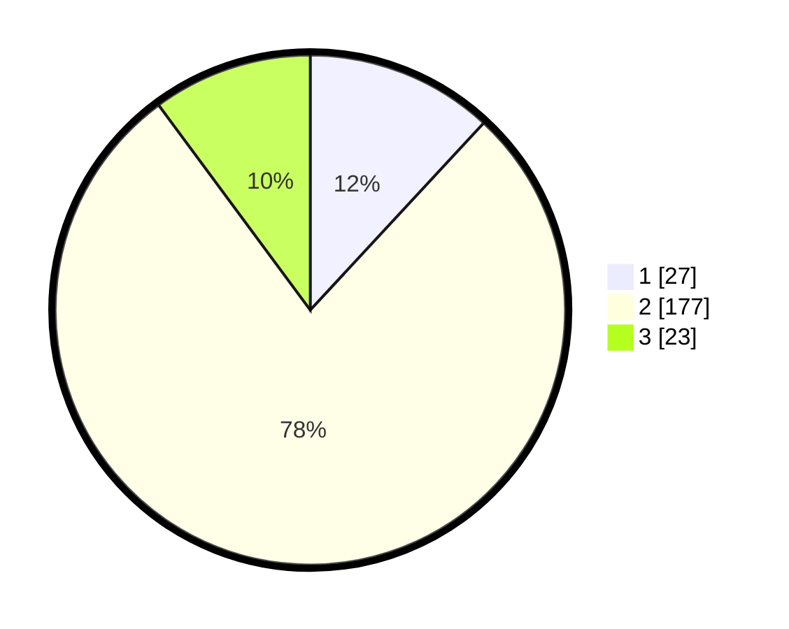

# Hasil

## Grafik

## Tabel

| No. | Nama Paslon    | Suara | Suara (raw) | Persentase |
|:--- |:-------------- | -----:| -----------:| ----------:|
| 1   | ANIES MUHAIMIN | 27    | [27][p-1]   | 11,89      |
| 2   | PRABOWO GIBRAN | 177   | [177][p-2]  | 77,97      |
| 3   | GANJAR MAHFUD  | 23    | [23][p-3]   | 10,13      |

[p-1]: https://github.com/gigit-pemilu/pemilu-2024-32-jawa-barat/blob/main/pilpres/hitung-suara/sub/32-jawa-barat/sub/15-karawang/sub/09-tirtajaya/sub/2001-sabajaya/sub/005-tps/sub/paslon-1.txt
[p-2]: https://github.com/gigit-pemilu/pemilu-2024-32-jawa-barat/blob/main/pilpres/hitung-suara/sub/32-jawa-barat/sub/15-karawang/sub/09-tirtajaya/sub/2001-sabajaya/sub/005-tps/sub/paslon-2.txt
[p-3]: https://github.com/gigit-pemilu/pemilu-2024-32-jawa-barat/blob/main/pilpres/hitung-suara/sub/32-jawa-barat/sub/15-karawang/sub/09-tirtajaya/sub/2001-sabajaya/sub/005-tps/sub/paslon-3.txt

## Foto C Plano

https://sirekap-obj-formc.kpu.go.id/dba8/pemilu/ppwp/32/15/09/20/01/3215092001005-20240223-030720--9a9c60bf-e8a7-441a-b1f4-1a99dc677f8a.jpg

https://sirekap-obj-formc.kpu.go.id/dba8/pemilu/ppwp/32/15/09/20/01/3215092001005-20240223-011105--9dd53d15-172a-4f2f-b2bb-4e3e102d5dd2.jpg

https://sirekap-obj-formc.kpu.go.id/dba8/pemilu/ppwp/32/15/09/20/01/3215092001005-20240223-011301--b9e15602-73c9-4536-89ca-10b1080373ce.jpg

## Metadata

| Key        | Value               |
| ---------- | ------------------- |
| Time Stamp | 2024-02-24 22:31:28 |

