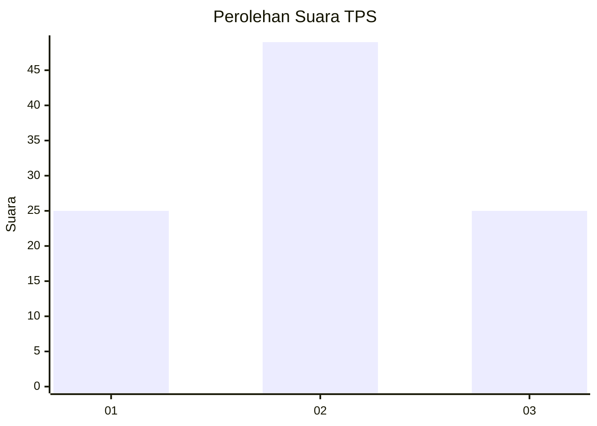
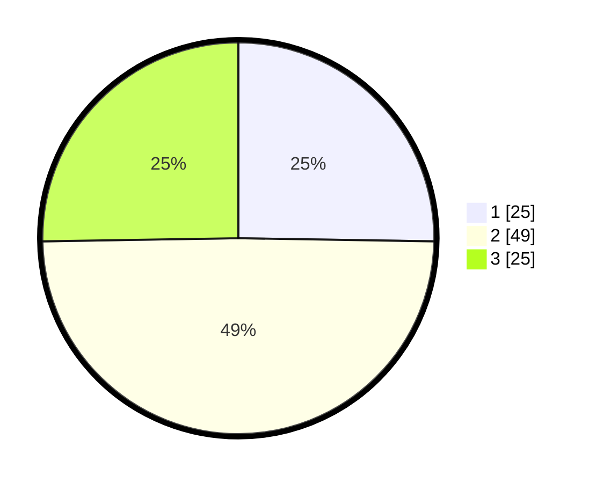

# Hasil

## Grafik

## Tabel

| No. | Nama Paslon    | Suara | Suara (raw) | Persentase |
|:--- |:-------------- | -----:| -----------:| ----------:|
| 1   | ANIES MUHAIMIN | 25    | [25][p-1]   | 25,25      |
| 2   | PRABOWO GIBRAN | 49    | [49][p-2]   | 49,49      |
| 3   | GANJAR MAHFUD  | 25    | [25][p-3]   | 25,25      |

[p-1]: https://github.com/gigit-pemilu/pemilu-2024/blob/main/pilpres/hitung-suara/sub/32-jawa-barat/sub/15-karawang/sub/09-tirtajaya/sub/2008-srijaya/sub/002-tps/sub/paslon-1.txt
[p-2]: https://github.com/gigit-pemilu/pemilu-2024/blob/main/pilpres/hitung-suara/sub/32-jawa-barat/sub/15-karawang/sub/09-tirtajaya/sub/2008-srijaya/sub/002-tps/sub/paslon-2.txt
[p-3]: https://github.com/gigit-pemilu/pemilu-2024/blob/main/pilpres/hitung-suara/sub/32-jawa-barat/sub/15-karawang/sub/09-tirtajaya/sub/2008-srijaya/sub/002-tps/sub/paslon-3.txt

## Foto C Plano

https://sirekap-obj-formc.kpu.go.id/3ce9/pemilu/ppwp/32/15/09/20/08/3215092008002-20240221-142328--1e6d5de5-359d-43c0-95f4-9e3d8ad87133.jpg

https://sirekap-obj-formc.kpu.go.id/3ce9/pemilu/ppwp/32/15/09/20/08/3215092008002-20240221-142600--4f226d3e-11c2-4596-9be2-016b7287fe3e.jpg

https://sirekap-obj-formc.kpu.go.id/3ce9/pemilu/ppwp/32/15/09/20/08/3215092008002-20240221-142814--3a824961-f323-4e5a-8200-6d754f8d6606.jpg

## Metadata

| Key        | Value               |
| ---------- | ------------------- |
| Time Stamp | 2024-02-21 15:00:00 |

## DATA PEMILIH TETAP

Jumlah pemilih dalam DPT: **272**.
 * L: **233**.
 * P: **835**.

## DATA PENGGUNA HAK PILIH

Jumlah pengguna hak pilih dalam DPT: **240**.
 * L: **207**.
 * P: **903**.

Jumlah pengguna hak pilih dalam DPTb: **800**.
 * L: **888**.
 * P: **800**.

Jumlah pengguna hak pilih dalam DPK: **0**.
 * L: **0**.
 * P: **0**.

Jumlah pengguna hak pilih: **220**.
 * L: **607**.
 * P: **603**.

## JUMLAH SUARA SAH DAN TIDAK SAH

JUMLAH SELURUH SUARA SAH: **206**.

JUMLAH SUARA TIDAK SAH: **9**.

JUMLAH SELURUH SUARA SAH DAN SUARA TIDAK SAH: **210**.

