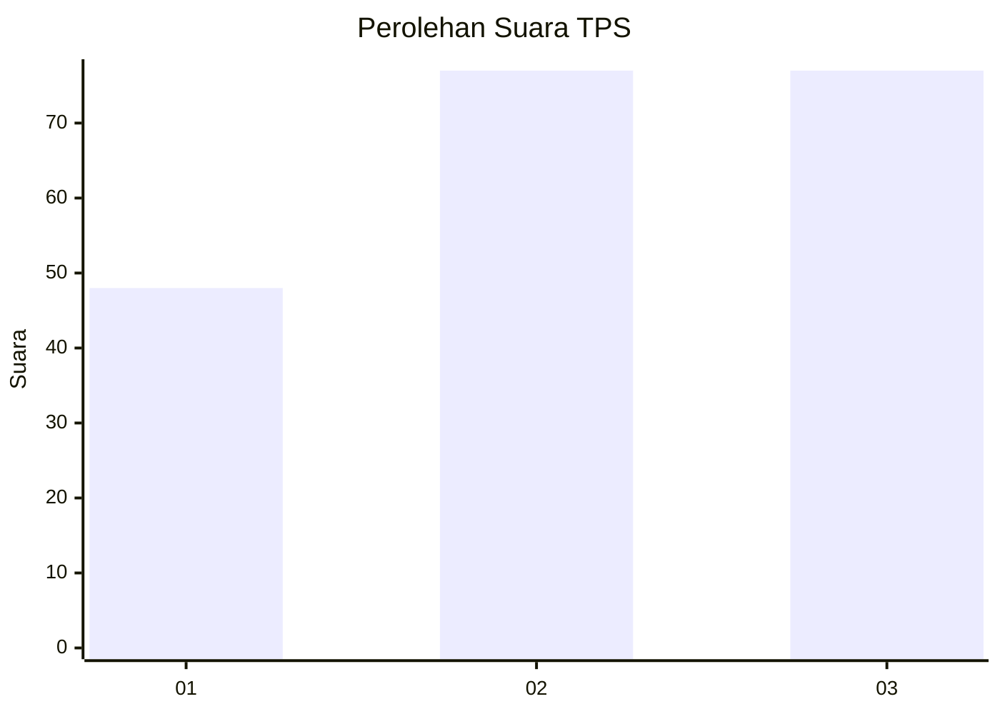
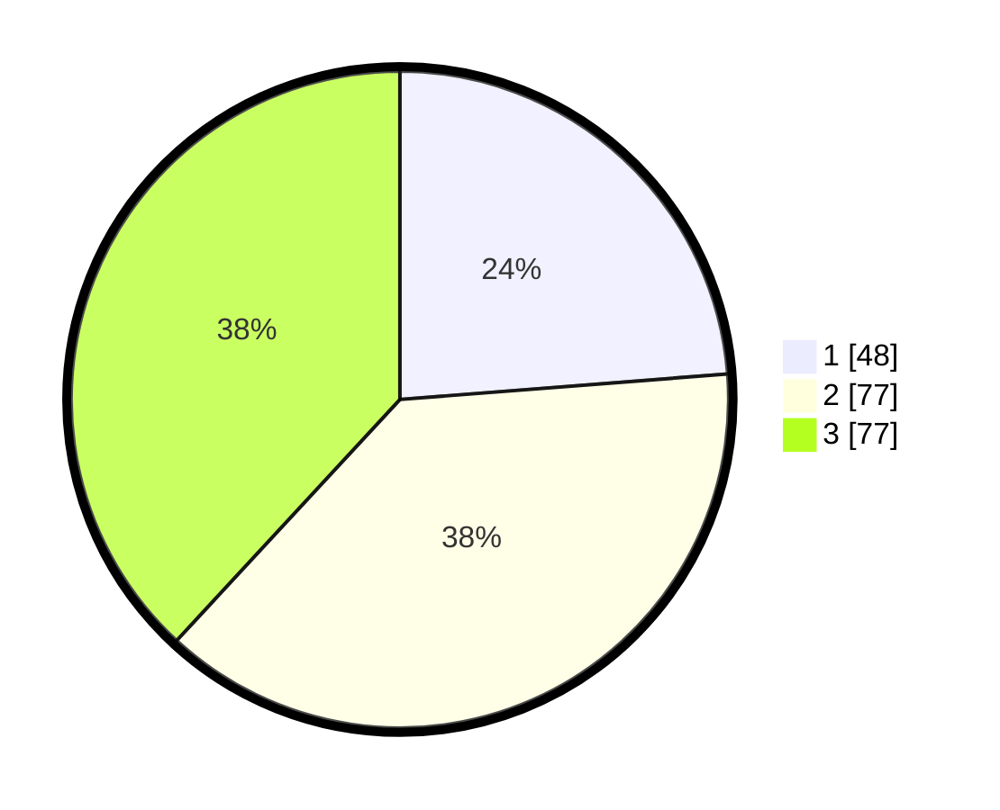

# Hasil

## Grafik

## Tabel

| No. | Nama Paslon    | Suara | Suara (raw) | Persentase |
|:--- |:-------------- | -----:| -----------:| ----------:|
| 1   | ANIES MUHAIMIN | 48    | [48][p-1]   | 23,76      |
| 2   | PRABOWO GIBRAN | 77    | [77][p-2]   | 38,12      |
| 3   | GANJAR MAHFUD  | 77    | [77][p-3]   | 38,12      |

[p-1]: https://github.com/gigit-pemilu/pemilu-2024-32-jawa-barat/blob/main/pilpres/hitung-suara/sub/32-jawa-barat/sub/15-karawang/sub/09-tirtajaya/sub/2010-bolang/sub/011-tps/sub/paslon-1.txt
[p-2]: https://github.com/gigit-pemilu/pemilu-2024-32-jawa-barat/blob/main/pilpres/hitung-suara/sub/32-jawa-barat/sub/15-karawang/sub/09-tirtajaya/sub/2010-bolang/sub/011-tps/sub/paslon-2.txt
[p-3]: https://github.com/gigit-pemilu/pemilu-2024-32-jawa-barat/blob/main/pilpres/hitung-suara/sub/32-jawa-barat/sub/15-karawang/sub/09-tirtajaya/sub/2010-bolang/sub/011-tps/sub/paslon-3.txt

## Foto C Plano

https://sirekap-obj-formc.kpu.go.id/2103/pemilu/ppwp/32/15/09/20/10/3215092010011-20240221-113731--f93addfe-6cd8-40af-a0d9-2da9a17264fd.jpg

https://sirekap-obj-formc.kpu.go.id/2103/pemilu/ppwp/32/15/09/20/10/3215092010011-20240221-113801--45cbd772-1c63-4135-b6fb-26bb7570920b.jpg

https://sirekap-obj-formc.kpu.go.id/2103/pemilu/ppwp/32/15/09/20/10/3215092010011-20240221-113906--63423ebd-30fa-4521-8fa5-cdaec525b42b.jpg

## Metadata

| Key        | Value               |
| ---------- | ------------------- |
| Time Stamp | 2024-02-21 12:00:00 |

## DATA PEMILIH TETAP

Jumlah pemilih dalam DPT: **77**.
 * L: **7**.
 * P: **77**.

## DATA PENGGUNA HAK PILIH

Jumlah pengguna hak pilih dalam DPT: **711**.
 * L: **0**.
 * P: **777**.

Jumlah pengguna hak pilih dalam DPTb: **0**.
 * L: **770**.
 * P: **0**.

Jumlah pengguna hak pilih dalam DPK: **0**.
 * L: **777**.
 * P: **2**.

Jumlah pengguna hak pilih: **211**.
 * L: **775**.
 * P: **711**.

## JUMLAH SUARA SAH DAN TIDAK SAH

JUMLAH SELURUH SUARA SAH: **221**.

JUMLAH SUARA TIDAK SAH: **3**.

JUMLAH SELURUH SUARA SAH DAN SUARA TIDAK SAH: **224**.

