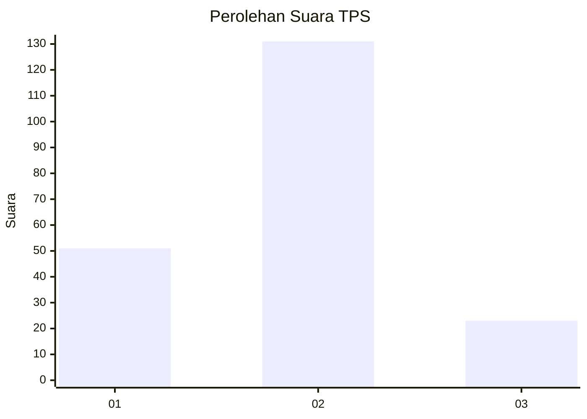
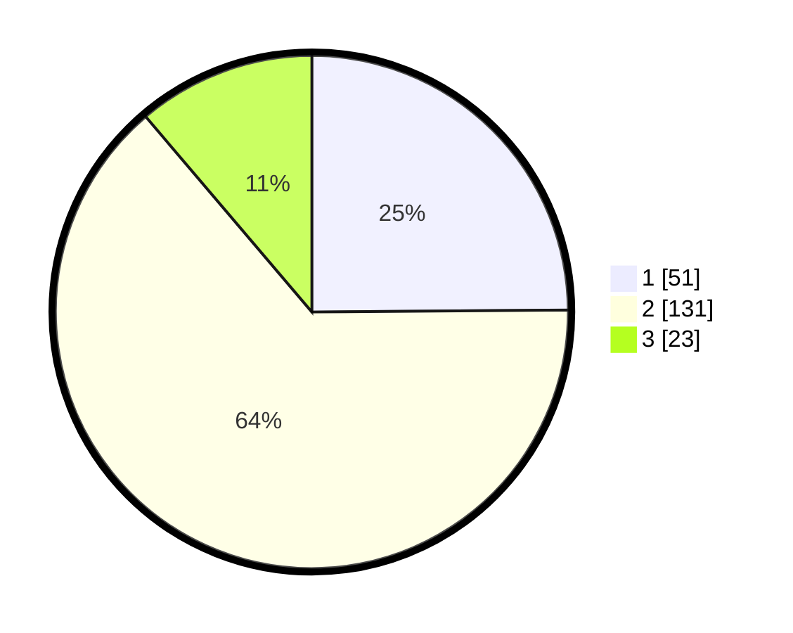

# Hasil

## Grafik

## Tabel

| No. | Nama Paslon    | Suara | Suara (raw) | Persentase |
|:--- |:-------------- | -----:| -----------:| ----------:|
| 1   | ANIES MUHAIMIN | 51    | [51][p-1]   | 24,88      |
| 2   | PRABOWO GIBRAN | 131   | [131][p-2]  | 63,90      |
| 3   | GANJAR MAHFUD  | 23    | [23][p-3]   | 11,22      |

[p-1]: https://github.com/gigit-pemilu/pemilu-2024/blob/main/pilpres/hitung-suara/sub/32-jawa-barat/sub/15-karawang/sub/10-pedes/sub/2001-payungsari/sub/001-tps/sub/paslon-1.txt
[p-2]: https://github.com/gigit-pemilu/pemilu-2024/blob/main/pilpres/hitung-suara/sub/32-jawa-barat/sub/15-karawang/sub/10-pedes/sub/2001-payungsari/sub/001-tps/sub/paslon-2.txt
[p-3]: https://github.com/gigit-pemilu/pemilu-2024/blob/main/pilpres/hitung-suara/sub/32-jawa-barat/sub/15-karawang/sub/10-pedes/sub/2001-payungsari/sub/001-tps/sub/paslon-3.txt

## Foto C Plano

https://sirekap-obj-formc.kpu.go.id/b83f/pemilu/ppwp/32/15/10/20/01/3215102001001-20240215-041358--e1a77271-104d-4bd6-ac88-810285ccf453.jpg

https://sirekap-obj-formc.kpu.go.id/b83f/pemilu/ppwp/32/15/10/20/01/3215102001001-20240215-041404--5955b19a-26b4-4c0e-9526-3b9050038292.jpg

https://sirekap-obj-formc.kpu.go.id/b83f/pemilu/ppwp/32/15/10/20/01/3215102001001-20240215-035306--4f0b45f3-4fa6-4c45-8257-23b17ec29e7e.jpg

## Metadata

| Key        | Value               |
| ---------- | ------------------- |
| Time Stamp | 2024-02-16 16:25:10 |

