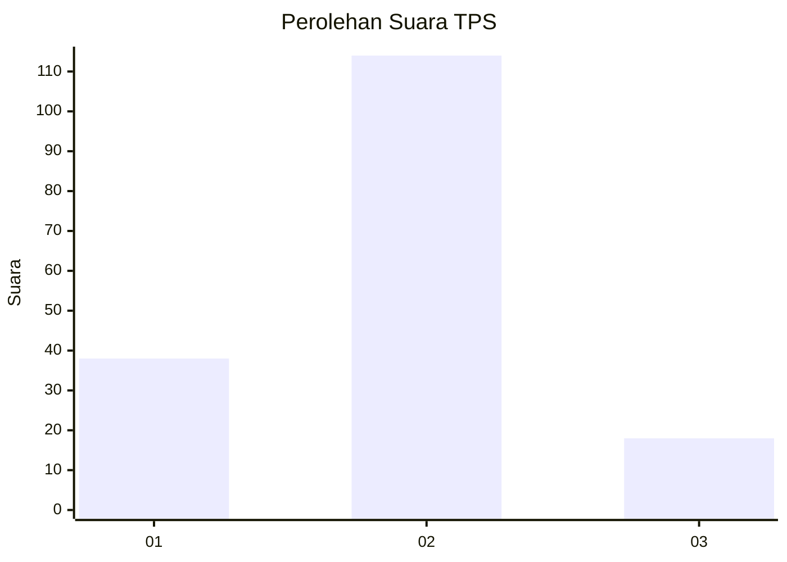

# Hasil

## Grafik

## Tabel

| No. | Nama Paslon    | Suara | Suara (raw) | Persentase |
|:--- |:-------------- | -----:| -----------:| ----------:|
| 1   | ANIES MUHAIMIN | 38    | [38][p-1]   | 22,35      |
| 2   | PRABOWO GIBRAN | 114   | [114][p-2]  | 67,06      |
| 3   | GANJAR MAHFUD  | 18    | [18][p-3]   | 10,59      |

[p-1]: https://github.com/gigit-pemilu/pemilu-2024/blob/main/pilpres/hitung-suara/sub/32-jawa-barat/sub/15-karawang/sub/10-pedes/sub/2007-kertamulya/sub/012-tps/sub/paslon-1.txt
[p-2]: https://github.com/gigit-pemilu/pemilu-2024/blob/main/pilpres/hitung-suara/sub/32-jawa-barat/sub/15-karawang/sub/10-pedes/sub/2007-kertamulya/sub/012-tps/sub/paslon-2.txt
[p-3]: https://github.com/gigit-pemilu/pemilu-2024/blob/main/pilpres/hitung-suara/sub/32-jawa-barat/sub/15-karawang/sub/10-pedes/sub/2007-kertamulya/sub/012-tps/sub/paslon-3.txt

## Foto C Plano

https://sirekap-obj-formc.kpu.go.id/eed6/pemilu/ppwp/32/15/10/20/07/3215102007012-20240215-021722--e2695841-f8d5-4033-90de-685f9c70a422.jpg

https://sirekap-obj-formc.kpu.go.id/eed6/pemilu/ppwp/32/15/10/20/07/3215102007012-20240215-021926--048b1f09-f8c3-4989-96ad-f10673224b85.jpg

https://sirekap-obj-formc.kpu.go.id/eed6/pemilu/ppwp/32/15/10/20/07/3215102007012-20240215-022024--e28c70c5-5106-4ac8-bfe0-4da7e7a89b1e.jpg

## Metadata

| Key        | Value               |
| ---------- | ------------------- |
| Time Stamp | 2024-02-19 06:16:00 |

## DATA PEMILIH TETAP

Jumlah pemilih dalam DPT: **240**.
 * L: **819**.
 * P: **621**.

## DATA PENGGUNA HAK PILIH

Jumlah pengguna hak pilih dalam DPT: **181**.
 * L: **591**.
 * P: **590**.

Jumlah pengguna hak pilih dalam DPTb: **523**.
 * L: **575**.
 * P: **173**.

Jumlah pengguna hak pilih dalam DPK: **553**.
 * L: **775**.
 * P: **175**.

Jumlah pengguna hak pilih: **186**.
 * L: **592**.
 * P: **794**.

## JUMLAH SUARA SAH DAN TIDAK SAH

JUMLAH SELURUH SUARA SAH: **170**.

JUMLAH SUARA TIDAK SAH: **11**.

JUMLAH SELURUH SUARA SAH DAN SUARA TIDAK SAH: **181**.

