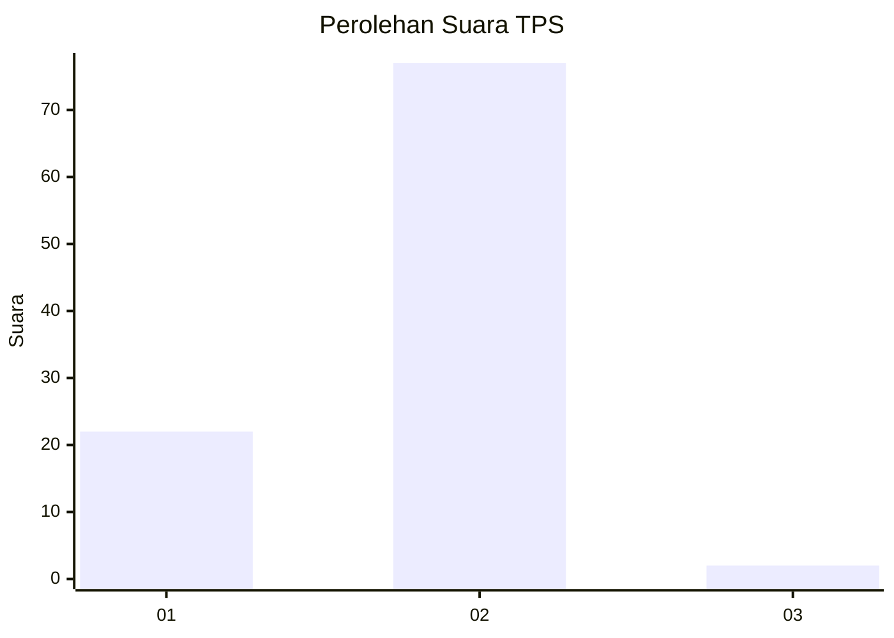
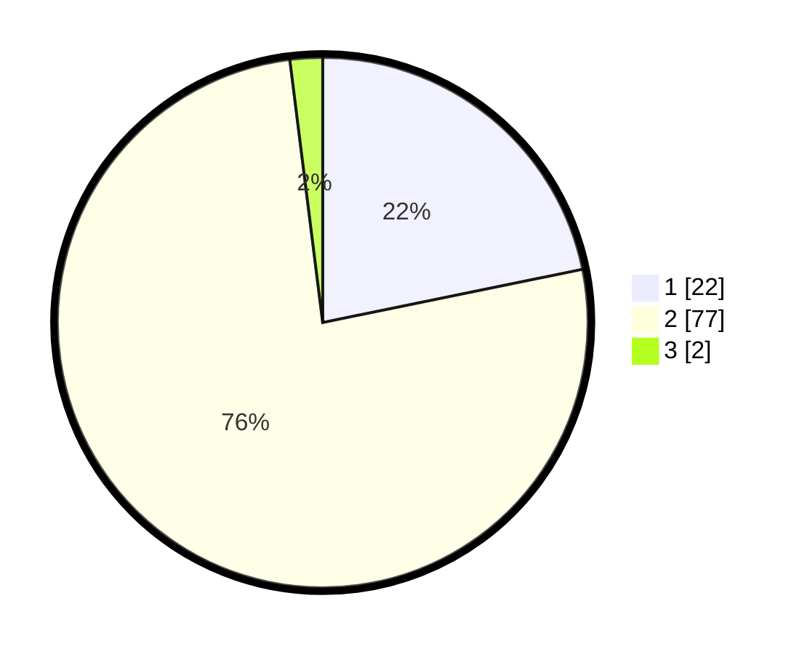

# Hasil

## Grafik

## Tabel

| No. | Nama Paslon    | Suara | Suara (raw) | Persentase |
|:--- |:-------------- | -----:| -----------:| ----------:|
| 1   | ANIES MUHAIMIN | 22    | [22][p-1]   | 21,78      |
| 2   | PRABOWO GIBRAN | 77    | [77][p-2]   | 76,24      |
| 3   | GANJAR MAHFUD  | 2     | [2][p-3]    | 1,98       |

[p-1]: https://github.com/gigit-pemilu/pemilu-2024/blob/main/pilpres/hitung-suara/sub/32-jawa-barat/sub/15-karawang/sub/11-cibuaya/sub/2004-sukasari/sub/003-tps/sub/paslon-1.txt
[p-2]: https://github.com/gigit-pemilu/pemilu-2024/blob/main/pilpres/hitung-suara/sub/32-jawa-barat/sub/15-karawang/sub/11-cibuaya/sub/2004-sukasari/sub/003-tps/sub/paslon-2.txt
[p-3]: https://github.com/gigit-pemilu/pemilu-2024/blob/main/pilpres/hitung-suara/sub/32-jawa-barat/sub/15-karawang/sub/11-cibuaya/sub/2004-sukasari/sub/003-tps/sub/paslon-3.txt

## Foto C Plano

https://sirekap-obj-formc.kpu.go.id/f298/pemilu/ppwp/32/15/11/20/04/3215112004003-20240220-113232--d8f579a9-c418-4fa5-a850-b76b9ac466a7.jpg

https://sirekap-obj-formc.kpu.go.id/f298/pemilu/ppwp/32/15/11/20/04/3215112004003-20240220-113533--f4182440-e4c9-4970-9329-e422363c59b5.jpg

https://sirekap-obj-formc.kpu.go.id/f298/pemilu/ppwp/32/15/11/20/04/3215112004003-20240220-113654--9f507212-75ed-4bc9-b1bb-b7e929c48b3c.jpg

## Metadata

| Key        | Value               |
| ---------- | ------------------- |
| Time Stamp | 2024-02-20 12:00:00 |

## DATA PEMILIH TETAP

Jumlah pemilih dalam DPT: **502**.
 * L: **252**.
 * P: **552**.

## DATA PENGGUNA HAK PILIH

Jumlah pengguna hak pilih dalam DPT: **526**.
 * L: **54**.
 * P: **522**.

Jumlah pengguna hak pilih dalam DPTb: **0**.
 * L: **88**.
 * P: **80**.

Jumlah pengguna hak pilih dalam DPK: **2**.
 * L: **84**.
 * P: **882**.

Jumlah pengguna hak pilih: **255**.
 * L: **432**.
 * P: **427**.

## JUMLAH SUARA SAH DAN TIDAK SAH

JUMLAH SELURUH SUARA SAH: **199**.

JUMLAH SUARA TIDAK SAH: **0**.

JUMLAH SELURUH SUARA SAH DAN SUARA TIDAK SAH: **199**.

