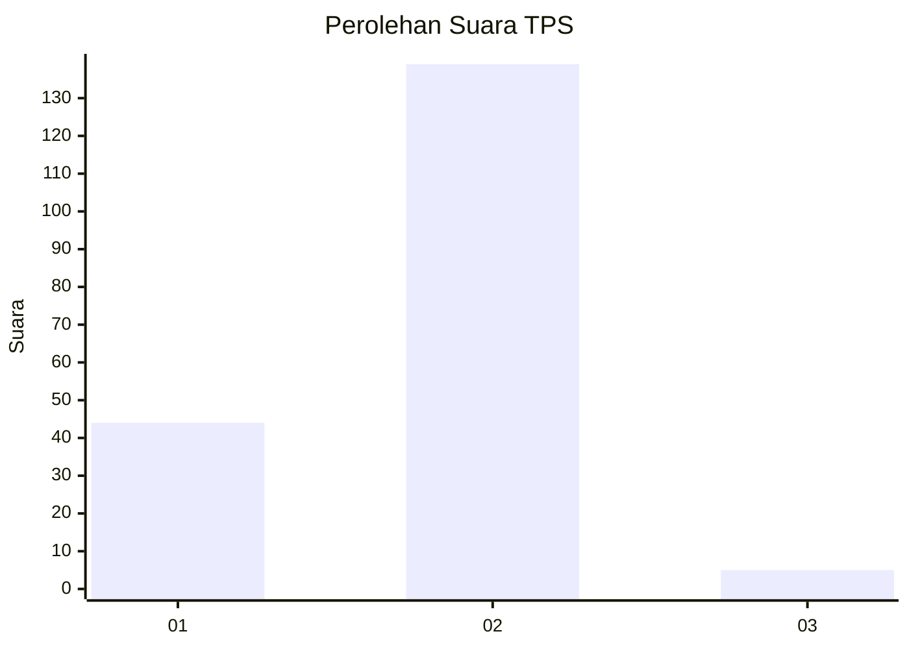
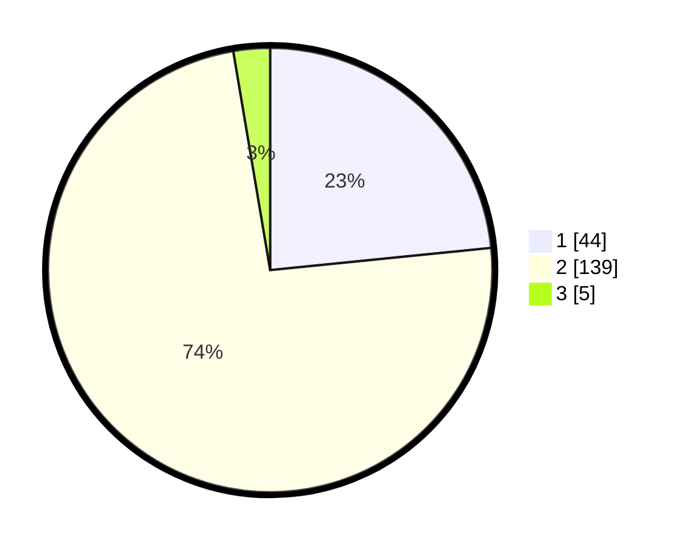

# Hasil

## Grafik

## Tabel

| No. | Nama Paslon    | Suara | Suara (raw) | Persentase |
|:--- |:-------------- | -----:| -----------:| ----------:|
| 1   | ANIES MUHAIMIN | 44    | [44][p-1]   | 23,40      |
| 2   | PRABOWO GIBRAN | 139   | [139][p-2]  | 73,94      |
| 3   | GANJAR MAHFUD  | 5     | [5][p-3]    | 2,66       |

[p-1]: https://github.com/gigit-pemilu/pemilu-2024-32-jawa-barat/blob/main/pilpres/hitung-suara/sub/32-jawa-barat/sub/15-karawang/sub/12-pakisjaya/sub/2001-tanjungmekar/sub/001-tps/sub/paslon-1.txt
[p-2]: https://github.com/gigit-pemilu/pemilu-2024-32-jawa-barat/blob/main/pilpres/hitung-suara/sub/32-jawa-barat/sub/15-karawang/sub/12-pakisjaya/sub/2001-tanjungmekar/sub/001-tps/sub/paslon-2.txt
[p-3]: https://github.com/gigit-pemilu/pemilu-2024-32-jawa-barat/blob/main/pilpres/hitung-suara/sub/32-jawa-barat/sub/15-karawang/sub/12-pakisjaya/sub/2001-tanjungmekar/sub/001-tps/sub/paslon-3.txt

## Foto C Plano

https://sirekap-obj-formc.kpu.go.id/c875/pemilu/ppwp/32/15/12/20/01/3215122001001-20240224-161811--067e442f-c743-4b0f-a0b0-b0b951782ed5.jpg

https://sirekap-obj-formc.kpu.go.id/c875/pemilu/ppwp/32/15/12/20/01/3215122001001-20240224-161938--0f44394f-96a9-4f64-9ef7-4347c76bf934.jpg

https://sirekap-obj-formc.kpu.go.id/c875/pemilu/ppwp/32/15/12/20/01/3215122001001-20240224-162032--d37dd3b2-5b32-4d2c-a3d5-2dcb3df5a019.jpg

## Metadata

| Key        | Value               |
| ---------- | ------------------- |
| Time Stamp | 2024-02-25 21:00:00 |

## DATA PEMILIH TETAP

Jumlah pemilih dalam DPT: **351**.
 * L: **127**.
 * P: **222**.

## DATA PENGGUNA HAK PILIH

Jumlah pengguna hak pilih dalam DPT: **235**.
 * L: **22**.
 * P: **803**.

Jumlah pengguna hak pilih dalam DPTb: **8**.
 * L: **0**.
 * P: **80**.

Jumlah pengguna hak pilih dalam DPK: **7**.
 * L: **758**.
 * P: **508**.

Jumlah pengguna hak pilih: **237**.
 * L: **222**.
 * P: **227**.

## JUMLAH SUARA SAH DAN TIDAK SAH

JUMLAH SELURUH SUARA SAH: **198**.

JUMLAH SUARA TIDAK SAH: **9**.

JUMLAH SELURUH SUARA SAH DAN SUARA TIDAK SAH: **207**.

