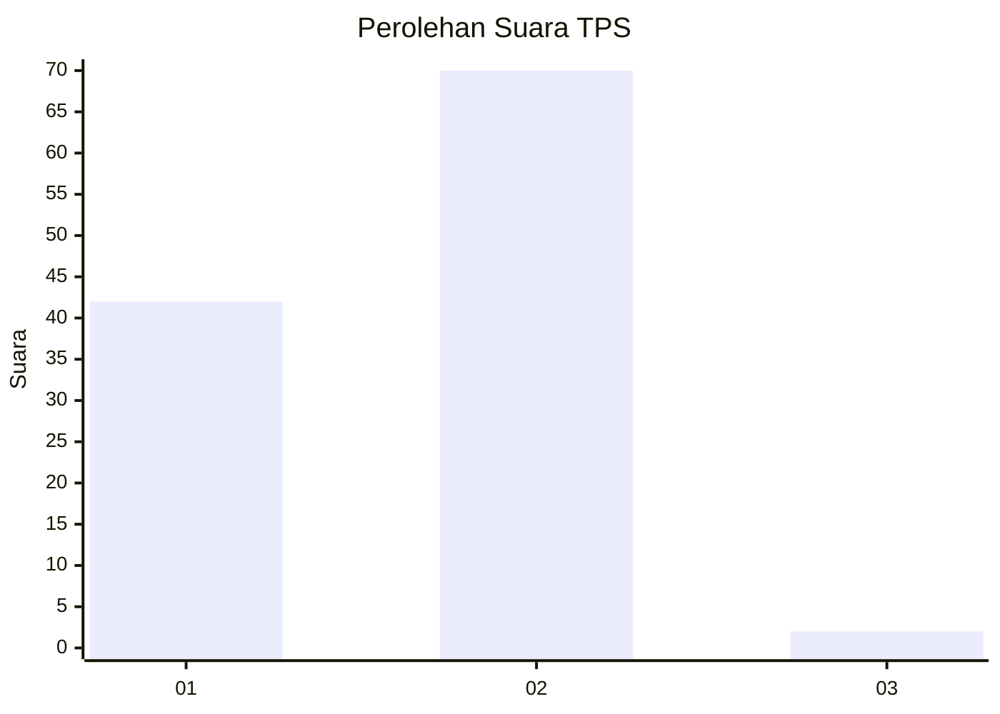
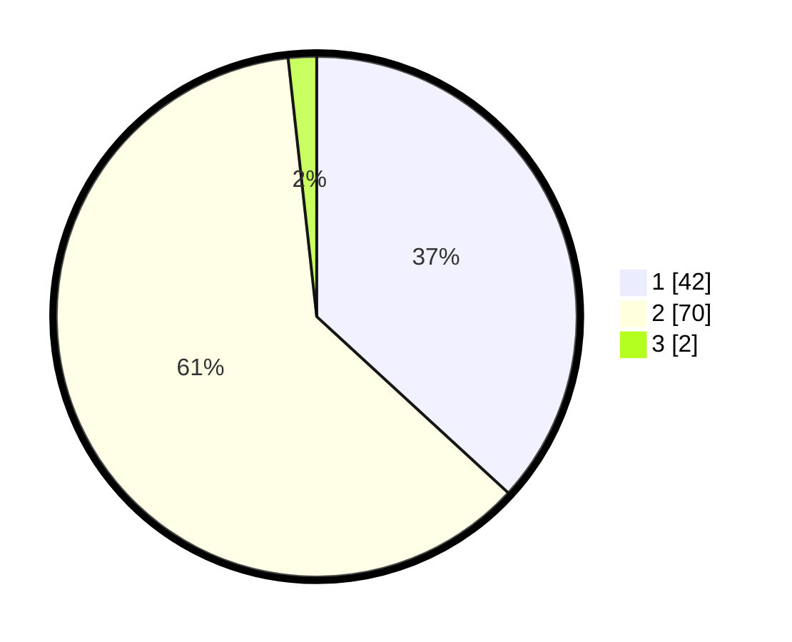

# Hasil

## Grafik

## Tabel

| No. | Nama Paslon    | Suara | Suara (raw) | Persentase |
|:--- |:-------------- | -----:| -----------:| ----------:|
| 1   | ANIES MUHAIMIN | 42    | [42][p-1]   | 36,84      |
| 2   | PRABOWO GIBRAN | 70    | [70][p-2]   | 61,40      |
| 3   | GANJAR MAHFUD  | 2     | [2][p-3]    | 1,75       |

[p-1]: https://github.com/gigit-pemilu/pemilu-2024-32-jawa-barat/blob/main/pilpres/hitung-suara/sub/32-jawa-barat/sub/15-karawang/sub/12-pakisjaya/sub/2001-tanjungmekar/sub/003-tps/sub/paslon-1.txt
[p-2]: https://github.com/gigit-pemilu/pemilu-2024-32-jawa-barat/blob/main/pilpres/hitung-suara/sub/32-jawa-barat/sub/15-karawang/sub/12-pakisjaya/sub/2001-tanjungmekar/sub/003-tps/sub/paslon-2.txt
[p-3]: https://github.com/gigit-pemilu/pemilu-2024-32-jawa-barat/blob/main/pilpres/hitung-suara/sub/32-jawa-barat/sub/15-karawang/sub/12-pakisjaya/sub/2001-tanjungmekar/sub/003-tps/sub/paslon-3.txt

## Foto C Plano

https://sirekap-obj-formc.kpu.go.id/7fc7/pemilu/ppwp/32/15/12/20/01/3215122001003-20240224-162027--e155971f-26f1-4566-85e2-739924bbc1bb.jpg

https://sirekap-obj-formc.kpu.go.id/7fc7/pemilu/ppwp/32/15/12/20/01/3215122001003-20240224-162218--885a0d3c-6993-45e5-b421-8cb5ca38037c.jpg

https://sirekap-obj-formc.kpu.go.id/7fc7/pemilu/ppwp/32/15/12/20/01/3215122001003-20240224-162405--b711a13f-bf7c-4819-8d28-35d2e489ee63.jpg

## Metadata

| Key        | Value               |
| ---------- | ------------------- |
| Time Stamp | 2024-02-24 22:31:28 |

## DATA PEMILIH TETAP

Jumlah pemilih dalam DPT: **104**.
 * L: **54**.
 * P: **53**.

## DATA PENGGUNA HAK PILIH

Jumlah pengguna hak pilih dalam DPT: **490**.
 * L: **980**.
 * P: **420**.

Jumlah pengguna hak pilih dalam DPTb: **0**.
 * L: **0**.
 * P: **0**.

Jumlah pengguna hak pilih dalam DPK: **0**.
 * L: **200**.
 * P: **600**.

Jumlah pengguna hak pilih: **805**.
 * L: **204**.
 * P: **308**.

## JUMLAH SUARA SAH DAN TIDAK SAH

JUMLAH SELURUH SUARA SAH: **58**.

JUMLAH SUARA TIDAK SAH: **221**.

JUMLAH SELURUH SUARA SAH DAN SUARA TIDAK SAH: **92**.

