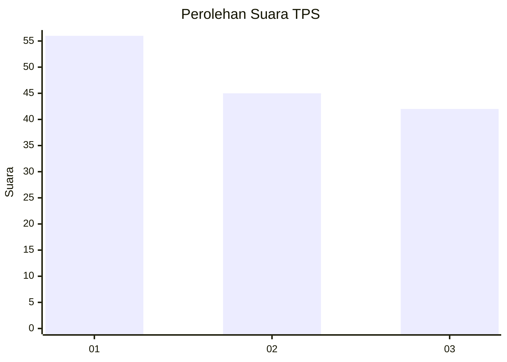
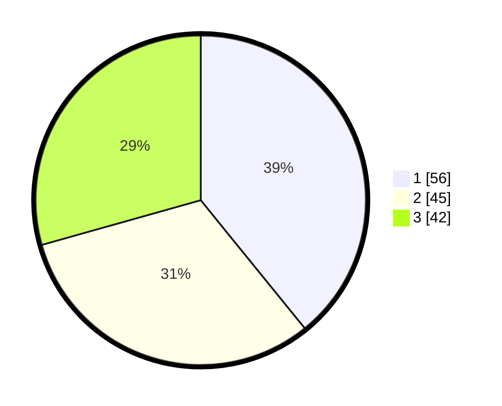

# Hasil

## Grafik

## Tabel

| No. | Nama Paslon    | Suara | Suara (raw) | Persentase |
|:--- |:-------------- | -----:| -----------:| ----------:|
| 1   | ANIES MUHAIMIN | 56    | [56][p-1]   | 39,16      |
| 2   | PRABOWO GIBRAN | 45    | [45][p-2]   | 31,47      |
| 3   | GANJAR MAHFUD  | 42    | [42][p-3]   | 29,37      |

[p-1]: https://github.com/gigit-pemilu/pemilu-2024/blob/main/pilpres/hitung-suara/sub/32-jawa-barat/sub/15-karawang/sub/12-pakisjaya/sub/2001-tanjungmekar/sub/005-tps/sub/paslon-1.txt
[p-2]: https://github.com/gigit-pemilu/pemilu-2024/blob/main/pilpres/hitung-suara/sub/32-jawa-barat/sub/15-karawang/sub/12-pakisjaya/sub/2001-tanjungmekar/sub/005-tps/sub/paslon-2.txt
[p-3]: https://github.com/gigit-pemilu/pemilu-2024/blob/main/pilpres/hitung-suara/sub/32-jawa-barat/sub/15-karawang/sub/12-pakisjaya/sub/2001-tanjungmekar/sub/005-tps/sub/paslon-3.txt

## Foto C Plano

https://sirekap-obj-formc.kpu.go.id/b7dd/pemilu/ppwp/32/15/12/20/01/3215122001005-20240224-161111--29a282ee-6a32-455f-9042-30b6f7dd22fb.jpg

https://sirekap-obj-formc.kpu.go.id/b7dd/pemilu/ppwp/32/15/12/20/01/3215122001005-20240224-161153--210b212d-abdb-40a7-a255-2702182d9d33.jpg

https://sirekap-obj-formc.kpu.go.id/b7dd/pemilu/ppwp/32/15/12/20/01/3215122001005-20240224-161330--67a187b9-551c-4d31-b9f5-b089fa412851.jpg

## Metadata

| Key        | Value               |
| ---------- | ------------------- |
| Time Stamp | 2024-02-24 22:31:28 |

## DATA PEMILIH TETAP

Jumlah pemilih dalam DPT: **278**.
 * L: **138**.
 * P: **140**.

## DATA PENGGUNA HAK PILIH

Jumlah pengguna hak pilih dalam DPT: **262**.
 * L: **105**.
 * P: **223**.

Jumlah pengguna hak pilih dalam DPTb: **440**.
 * L: **220**.
 * P: **44**.

Jumlah pengguna hak pilih dalam DPK: **447**.
 * L: **222**.
 * P: **44**.

Jumlah pengguna hak pilih: **442**.
 * L: **122**.
 * P: **244**.

## JUMLAH SUARA SAH DAN TIDAK SAH

JUMLAH SELURUH SUARA SAH: **263**.

JUMLAH SUARA TIDAK SAH: **9**.

JUMLAH SELURUH SUARA SAH DAN SUARA TIDAK SAH: **222**.

