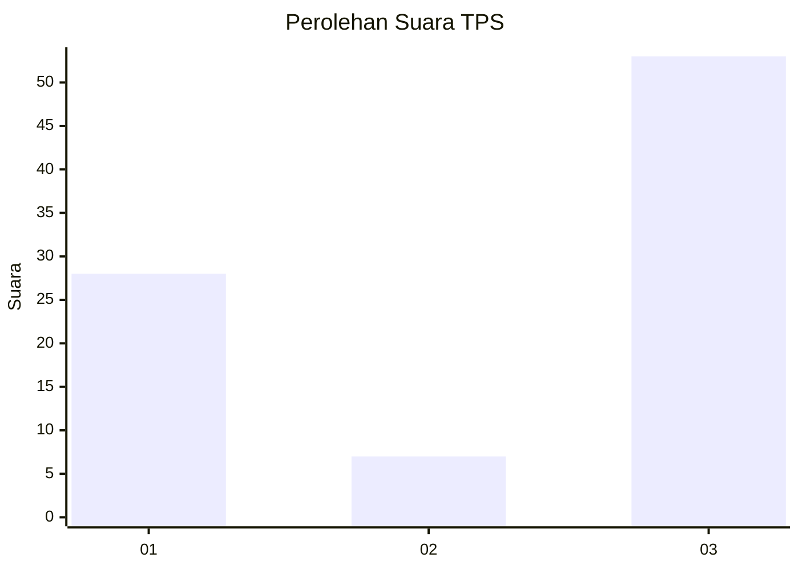
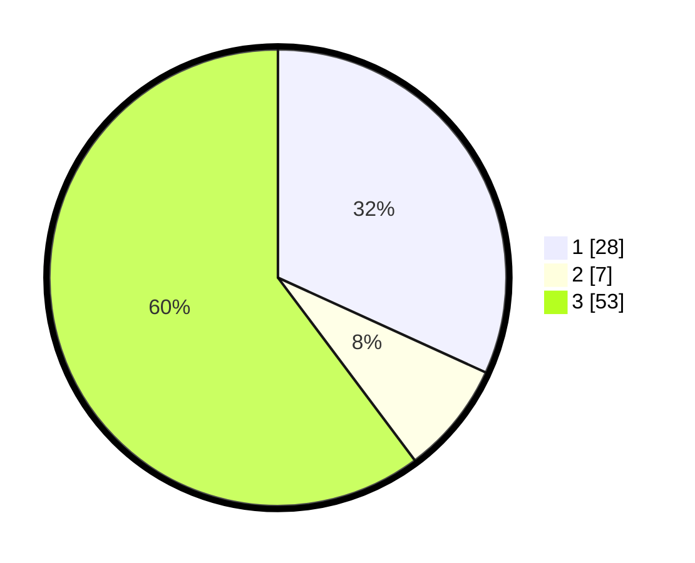

# Hasil

## Grafik

## Tabel

| No. | Nama Paslon    | Suara | Suara (raw) | Persentase |
|:--- |:-------------- | -----:| -----------:| ----------:|
| 1   | ANIES MUHAIMIN | 28    | [28][p-1]   | 31,82      |
| 2   | PRABOWO GIBRAN | 7     | [7][p-2]    | 7,95       |
| 3   | GANJAR MAHFUD  | 53    | [53][p-3]   | 60,23      |

[p-1]: https://github.com/gigit-pemilu/pemilu-2024/blob/main/pilpres/hitung-suara/sub/32-jawa-barat/sub/15-karawang/sub/12-pakisjaya/sub/2001-tanjungmekar/sub/010-tps/sub/paslon-1.txt
[p-2]: https://github.com/gigit-pemilu/pemilu-2024/blob/main/pilpres/hitung-suara/sub/32-jawa-barat/sub/15-karawang/sub/12-pakisjaya/sub/2001-tanjungmekar/sub/010-tps/sub/paslon-2.txt
[p-3]: https://github.com/gigit-pemilu/pemilu-2024/blob/main/pilpres/hitung-suara/sub/32-jawa-barat/sub/15-karawang/sub/12-pakisjaya/sub/2001-tanjungmekar/sub/010-tps/sub/paslon-3.txt

## Foto C Plano

https://sirekap-obj-formc.kpu.go.id/67e0/pemilu/ppwp/32/15/12/20/01/3215122001010-20240224-155211--5c610973-46d7-49be-8965-4ab76a313b3f.jpg

https://sirekap-obj-formc.kpu.go.id/67e0/pemilu/ppwp/32/15/12/20/01/3215122001010-20240224-160343--3c6df8a2-468f-40e1-abf0-9c673d779980.jpg

https://sirekap-obj-formc.kpu.go.id/67e0/pemilu/ppwp/32/15/12/20/01/3215122001010-20240224-161211--4f903574-869f-4e34-9659-6d091302f1a9.jpg

## Metadata

| Key        | Value               |
| ---------- | ------------------- |
| Time Stamp | 2024-02-24 22:31:28 |

## DATA PEMILIH TETAP

Jumlah pemilih dalam DPT: **224**.
 * L: **414**.
 * P: **170**.

## DATA PENGGUNA HAK PILIH

Jumlah pengguna hak pilih dalam DPT: **185**.
 * L: **891**.
 * P: **879**.

Jumlah pengguna hak pilih dalam DPTb: **888**.
 * L: **88**.
 * P: **888**.

Jumlah pengguna hak pilih dalam DPK: **886**.
 * L: **882**.
 * P: **884**.

Jumlah pengguna hak pilih: **464**.
 * L: **284**.
 * P: **304**.

## JUMLAH SUARA SAH DAN TIDAK SAH

JUMLAH SELURUH SUARA SAH: **141**.

JUMLAH SUARA TIDAK SAH: **261**.

JUMLAH SELURUH SUARA SAH DAN SUARA TIDAK SAH: **692**.

