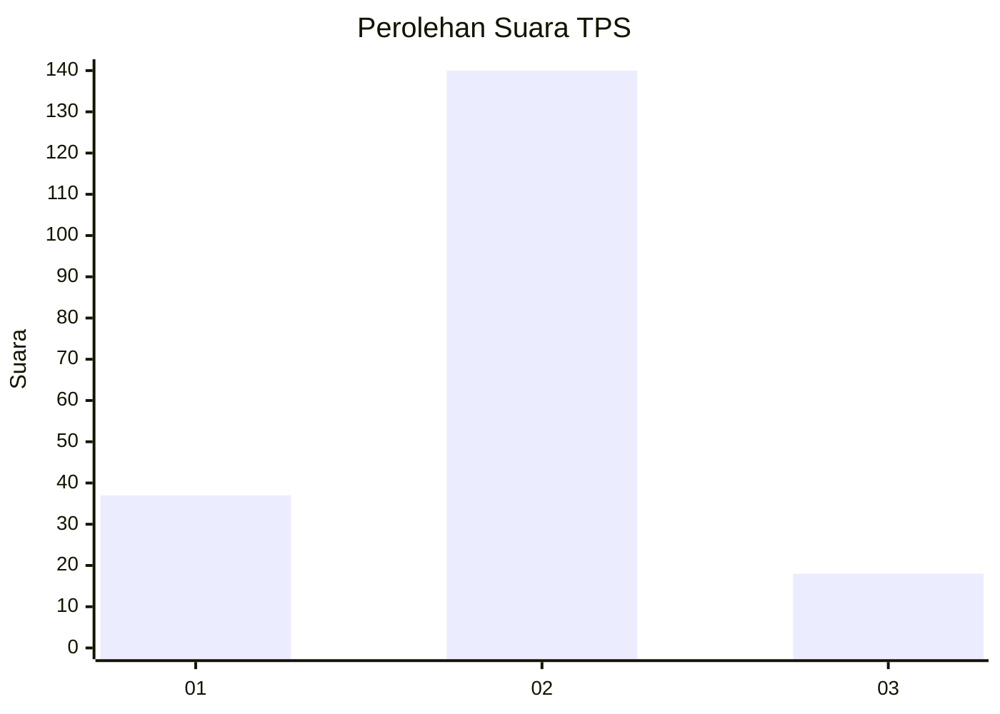
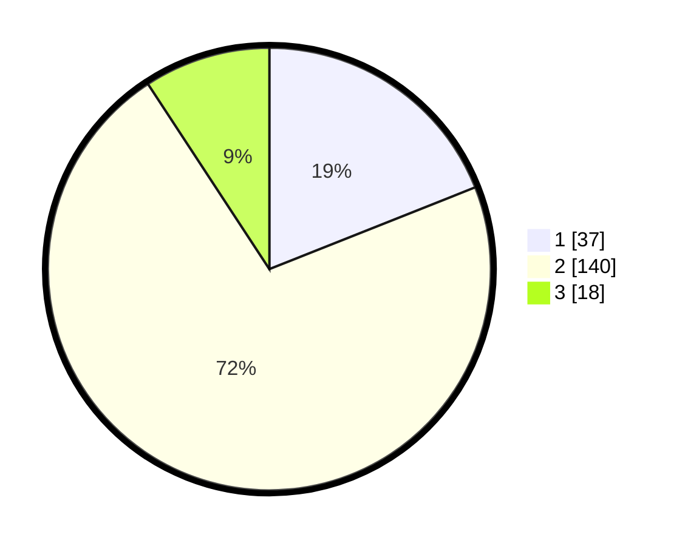

# Hasil

## Grafik

## Tabel

| No. | Nama Paslon    | Suara | Suara (raw) | Persentase |
|:--- |:-------------- | -----:| -----------:| ----------:|
| 1   | ANIES MUHAIMIN | 37    | [37][p-1]   | 18,97      |
| 2   | PRABOWO GIBRAN | 140   | [140][p-2]  | 71,79      |
| 3   | GANJAR MAHFUD  | 18    | [18][p-3]   | 9,23       |

[p-1]: https://github.com/gigit-pemilu/pemilu-2024/blob/main/pilpres/hitung-suara/sub/32-jawa-barat/sub/15-karawang/sub/12-pakisjaya/sub/2008-tanjungpakis/sub/001-tps/sub/paslon-1.txt
[p-2]: https://github.com/gigit-pemilu/pemilu-2024/blob/main/pilpres/hitung-suara/sub/32-jawa-barat/sub/15-karawang/sub/12-pakisjaya/sub/2008-tanjungpakis/sub/001-tps/sub/paslon-2.txt
[p-3]: https://github.com/gigit-pemilu/pemilu-2024/blob/main/pilpres/hitung-suara/sub/32-jawa-barat/sub/15-karawang/sub/12-pakisjaya/sub/2008-tanjungpakis/sub/001-tps/sub/paslon-3.txt

## Foto C Plano

https://sirekap-obj-formc.kpu.go.id/8699/pemilu/ppwp/32/15/12/20/08/3215122008001-20240224-125732--a263dae5-f434-4a81-9101-d5e84f89734e.jpg

https://sirekap-obj-formc.kpu.go.id/8699/pemilu/ppwp/32/15/12/20/08/3215122008001-20240224-125818--16d1bd90-9365-4eb1-a9e9-35321fd65df0.jpg

https://sirekap-obj-formc.kpu.go.id/8699/pemilu/ppwp/32/15/12/20/08/3215122008001-20240224-130322--0dce5b75-9a05-4f56-a478-046c1e7f275a.jpg

## Metadata

| Key        | Value               |
| ---------- | ------------------- |
| Time Stamp | 2024-02-24 22:31:28 |

## DATA PEMILIH TETAP

Jumlah pemilih dalam DPT: **411**.
 * L: **928**.
 * P: **261**.

## DATA PENGGUNA HAK PILIH

Jumlah pengguna hak pilih dalam DPT: **245**.
 * L: **107**.
 * P: **55**.

Jumlah pengguna hak pilih dalam DPTb: **555**.
 * L: **0**.
 * P: **2**.

Jumlah pengguna hak pilih dalam DPK: **222**.
 * L: **20**.
 * P: **222**.

Jumlah pengguna hak pilih: **0**.
 * L: **121**.
 * P: **20**.

## JUMLAH SUARA SAH DAN TIDAK SAH

JUMLAH SELURUH SUARA SAH: **195**.

JUMLAH SUARA TIDAK SAH: **7**.

JUMLAH SELURUH SUARA SAH DAN SUARA TIDAK SAH: **202**.

