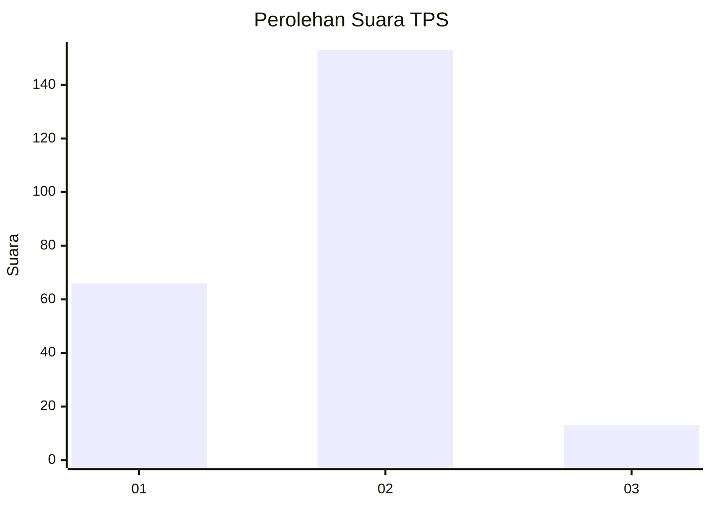
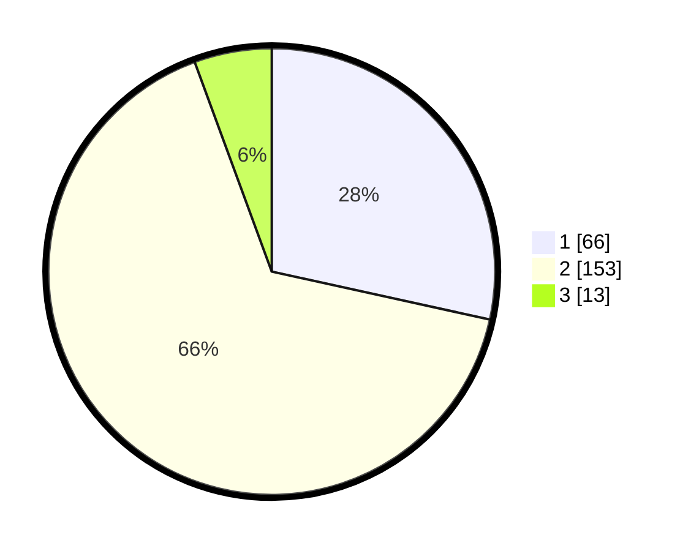

# Hasil

## Grafik

## Tabel

| No. | Nama Paslon    | Suara | Suara (raw) | Persentase |
|:--- |:-------------- | -----:| -----------:| ----------:|
| 1   | ANIES MUHAIMIN | 66    | [66][p-1]   | 28,45      |
| 2   | PRABOWO GIBRAN | 153   | [153][p-2]  | 65,95      |
| 3   | GANJAR MAHFUD  | 13    | [13][p-3]   | 5,60       |

[p-1]: https://github.com/gigit-pemilu/pemilu-2024/blob/main/pilpres/hitung-suara/sub/32-jawa-barat/sub/15-karawang/sub/14-jatisari/sub/2001-mekarsari/sub/003-tps/sub/paslon-1.txt
[p-2]: https://github.com/gigit-pemilu/pemilu-2024/blob/main/pilpres/hitung-suara/sub/32-jawa-barat/sub/15-karawang/sub/14-jatisari/sub/2001-mekarsari/sub/003-tps/sub/paslon-2.txt
[p-3]: https://github.com/gigit-pemilu/pemilu-2024/blob/main/pilpres/hitung-suara/sub/32-jawa-barat/sub/15-karawang/sub/14-jatisari/sub/2001-mekarsari/sub/003-tps/sub/paslon-3.txt

## Foto C Plano

https://sirekap-obj-formc.kpu.go.id/43cd/pemilu/ppwp/32/15/14/20/01/3215142001003-20240214-194009--9ac0ec7e-11d8-4b35-bedc-65414d85b8bf.jpg

https://sirekap-obj-formc.kpu.go.id/43cd/pemilu/ppwp/32/15/14/20/01/3215142001003-20240214-194203--b59a170f-7a2b-45c6-a758-d1618bce6845.jpg

https://sirekap-obj-formc.kpu.go.id/43cd/pemilu/ppwp/32/15/14/20/01/3215142001003-20240214-194339--b4c773ab-b709-4581-9ef9-d12bbe4d4ac9.jpg

## Metadata

| Key        | Value               |
| ---------- | ------------------- |
| Time Stamp | 2024-02-25 15:00:00 |

