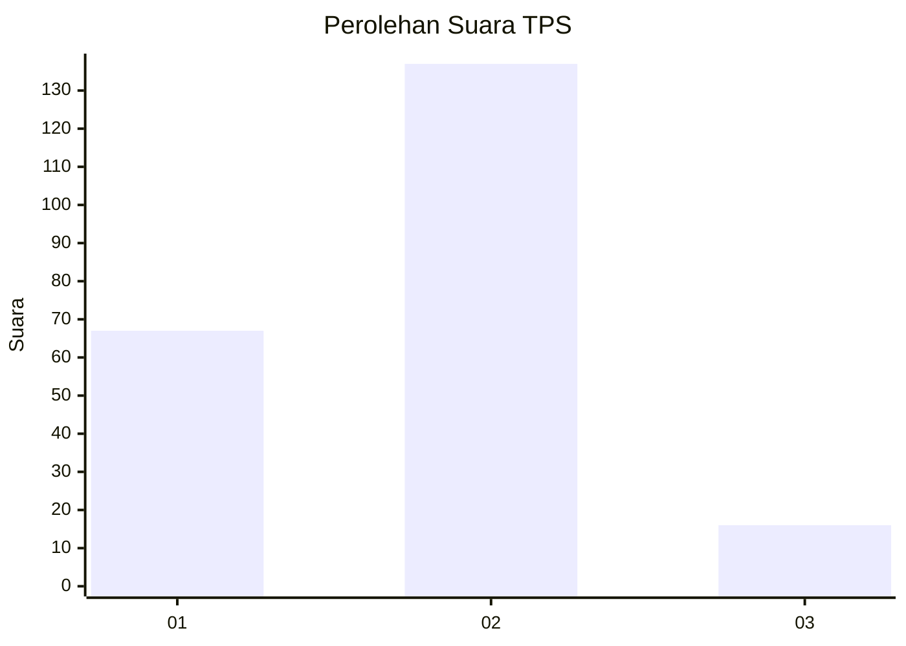
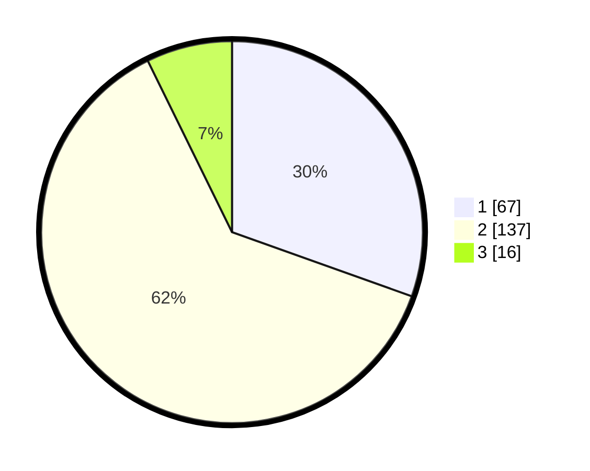

# Hasil

## Grafik

## Tabel

| No. | Nama Paslon    | Suara | Suara (raw) | Persentase |
|:--- |:-------------- | -----:| -----------:| ----------:|
| 1   | ANIES MUHAIMIN | 67    | [67][p-1]   | 30,45      |
| 2   | PRABOWO GIBRAN | 137   | [137][p-2]  | 62,27      |
| 3   | GANJAR MAHFUD  | 16    | [16][p-3]   | 7,27       |

[p-1]: https://github.com/gigit-pemilu/pemilu-2024/blob/main/pilpres/hitung-suara/sub/32-jawa-barat/sub/15-karawang/sub/14-jatisari/sub/2001-mekarsari/sub/004-tps/sub/paslon-1.txt
[p-2]: https://github.com/gigit-pemilu/pemilu-2024/blob/main/pilpres/hitung-suara/sub/32-jawa-barat/sub/15-karawang/sub/14-jatisari/sub/2001-mekarsari/sub/004-tps/sub/paslon-2.txt
[p-3]: https://github.com/gigit-pemilu/pemilu-2024/blob/main/pilpres/hitung-suara/sub/32-jawa-barat/sub/15-karawang/sub/14-jatisari/sub/2001-mekarsari/sub/004-tps/sub/paslon-3.txt

## Foto C Plano

https://sirekap-obj-formc.kpu.go.id/444f/pemilu/ppwp/32/15/14/20/01/3215142001004-20240214-200844--09b632fa-c5de-4972-acec-ca0d7b6b9f99.jpg

https://sirekap-obj-formc.kpu.go.id/444f/pemilu/ppwp/32/15/14/20/01/3215142001004-20240214-201001--b4483987-8b15-4d16-858a-984ceedaf278.jpg

https://sirekap-obj-formc.kpu.go.id/444f/pemilu/ppwp/32/15/14/20/01/3215142001004-20240214-201044--62026baa-6e99-478e-9b2f-d4fd97161e68.jpg

## Metadata

| Key        | Value               |
| ---------- | ------------------- |
| Time Stamp | 2024-02-24 22:31:28 |

