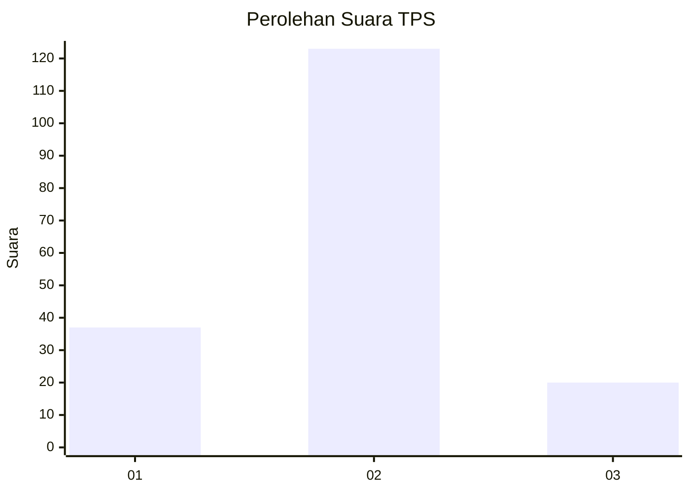
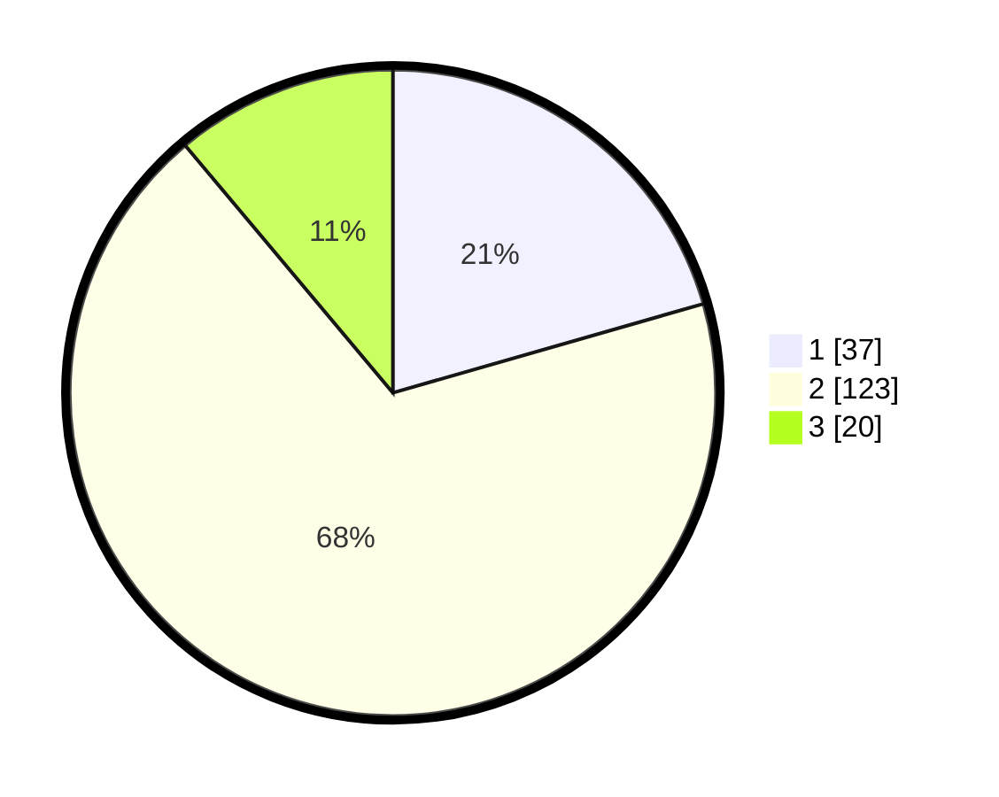

# Hasil

## Grafik

## Tabel

| No. | Nama Paslon    | Suara | Suara (raw) | Persentase |
|:--- |:-------------- | -----:| -----------:| ----------:|
| 1   | ANIES MUHAIMIN | 37    | [37][p-1]   | 20,56      |
| 2   | PRABOWO GIBRAN | 123   | [123][p-2]  | 68,33      |
| 3   | GANJAR MAHFUD  | 20    | [20][p-3]   | 11,11      |

[p-1]: https://github.com/gigit-pemilu/pemilu-2024/blob/main/pilpres/hitung-suara/sub/32-jawa-barat/sub/15-karawang/sub/15-cilamaya-wetan/sub/2002-cilamaya/sub/006-tps/sub/paslon-1.txt
[p-2]: https://github.com/gigit-pemilu/pemilu-2024/blob/main/pilpres/hitung-suara/sub/32-jawa-barat/sub/15-karawang/sub/15-cilamaya-wetan/sub/2002-cilamaya/sub/006-tps/sub/paslon-2.txt
[p-3]: https://github.com/gigit-pemilu/pemilu-2024/blob/main/pilpres/hitung-suara/sub/32-jawa-barat/sub/15-karawang/sub/15-cilamaya-wetan/sub/2002-cilamaya/sub/006-tps/sub/paslon-3.txt

## Foto C Plano

https://sirekap-obj-formc.kpu.go.id/ec2b/pemilu/ppwp/32/15/15/20/02/3215152002006-20240223-220244--b05d0e49-0f98-4373-9b08-0569bc21c442.jpg

https://sirekap-obj-formc.kpu.go.id/ec2b/pemilu/ppwp/32/15/15/20/02/3215152002006-20240223-220316--13c80538-7df6-4881-ae4c-3a06846a87e9.jpg

https://sirekap-obj-formc.kpu.go.id/ec2b/pemilu/ppwp/32/15/15/20/02/3215152002006-20240223-220344--1fa80d8c-3b7d-4428-87c2-433a4dae2d74.jpg

## Metadata

| Key        | Value               |
| ---------- | ------------------- |
| Time Stamp | 2024-02-25 18:00:00 |

## DATA PEMILIH TETAP

Jumlah pemilih dalam DPT: **758**.
 * L: **777**.
 * P: **815**.

## DATA PENGGUNA HAK PILIH

Jumlah pengguna hak pilih dalam DPT: **292**.
 * L: **807**.
 * P: **84**.

Jumlah pengguna hak pilih dalam DPTb: **888**.
 * L: **8**.
 * P: **808**.

Jumlah pengguna hak pilih dalam DPK: **80**.
 * L: **88**.
 * P: **80**.

Jumlah pengguna hak pilih: **193**.
 * L: **809**.
 * P: **824**.

## JUMLAH SUARA SAH DAN TIDAK SAH

JUMLAH SELURUH SUARA SAH: **180**.

JUMLAH SUARA TIDAK SAH: **13**.

JUMLAH SELURUH SUARA SAH DAN SUARA TIDAK SAH: **193**.

