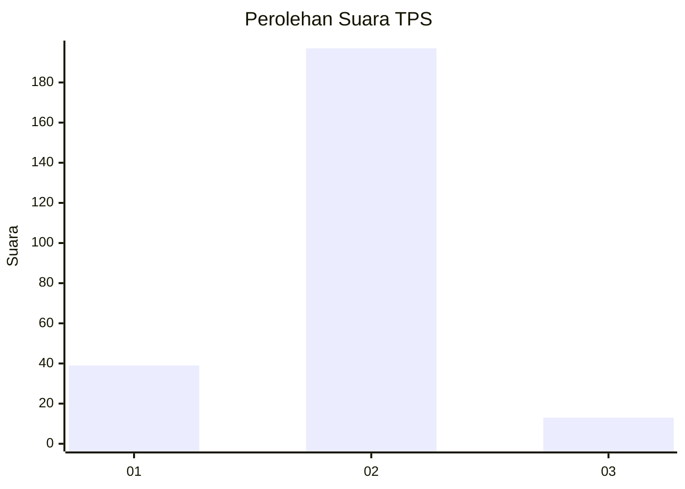
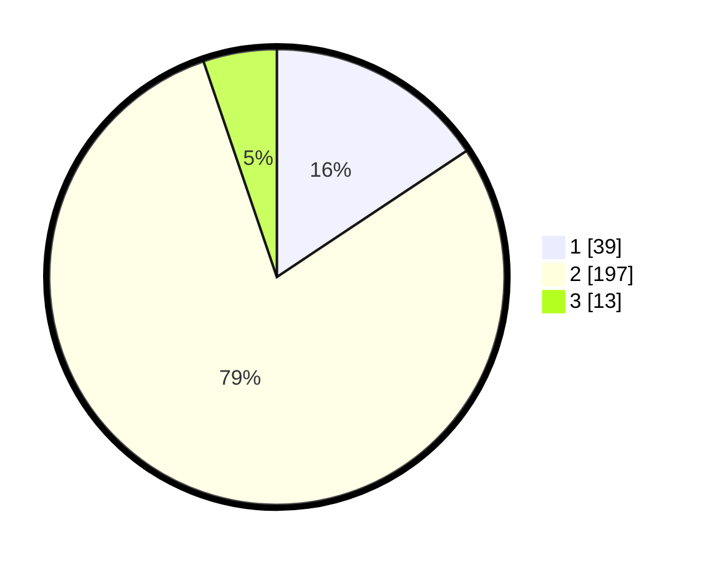

# Hasil

## Grafik

## Tabel

| No. | Nama Paslon    | Suara | Suara (raw) | Persentase |
|:--- |:-------------- | -----:| -----------:| ----------:|
| 1   | ANIES MUHAIMIN | 39    | [39][p-1]   | 15,66      |
| 2   | PRABOWO GIBRAN | 197   | [197][p-2]  | 79,12      |
| 3   | GANJAR MAHFUD  | 13    | [13][p-3]   | 5,22       |

[p-1]: https://github.com/gigit-pemilu/pemilu-2024/blob/main/pilpres/hitung-suara/sub/32-jawa-barat/sub/15-karawang/sub/16-tirtamulya/sub/2001-citarik/sub/002-tps/sub/paslon-1.txt
[p-2]: https://github.com/gigit-pemilu/pemilu-2024/blob/main/pilpres/hitung-suara/sub/32-jawa-barat/sub/15-karawang/sub/16-tirtamulya/sub/2001-citarik/sub/002-tps/sub/paslon-2.txt
[p-3]: https://github.com/gigit-pemilu/pemilu-2024/blob/main/pilpres/hitung-suara/sub/32-jawa-barat/sub/15-karawang/sub/16-tirtamulya/sub/2001-citarik/sub/002-tps/sub/paslon-3.txt

## Foto C Plano

https://sirekap-obj-formc.kpu.go.id/3685/pemilu/ppwp/32/15/16/20/01/3215162001002-20240215-012823--2da6109c-9340-4089-baa9-8c5b224ef003.jpg

https://sirekap-obj-formc.kpu.go.id/3685/pemilu/ppwp/32/15/16/20/01/3215162001002-20240215-012918--67f89b68-ceb9-4104-8df7-4d7bef56ce5a.jpg

https://sirekap-obj-formc.kpu.go.id/3685/pemilu/ppwp/32/15/16/20/01/3215162001002-20240215-013009--c444422b-8ab9-4bf6-b487-52c161ba726d.jpg

## Metadata

| Key        | Value               |
| ---------- | ------------------- |
| Time Stamp | 2024-02-16 16:25:10 |

