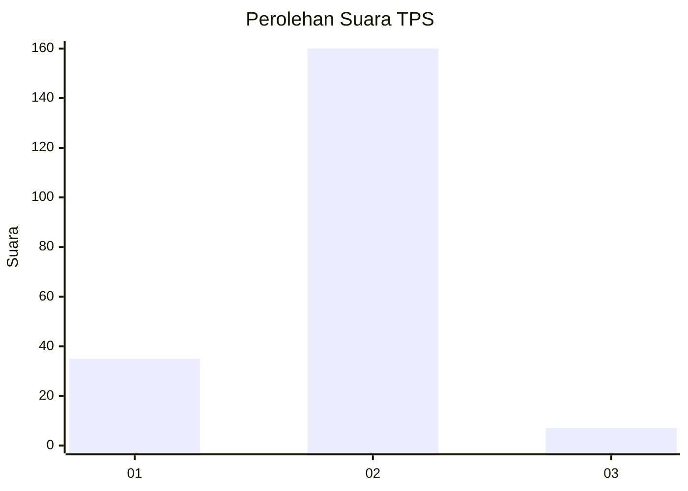
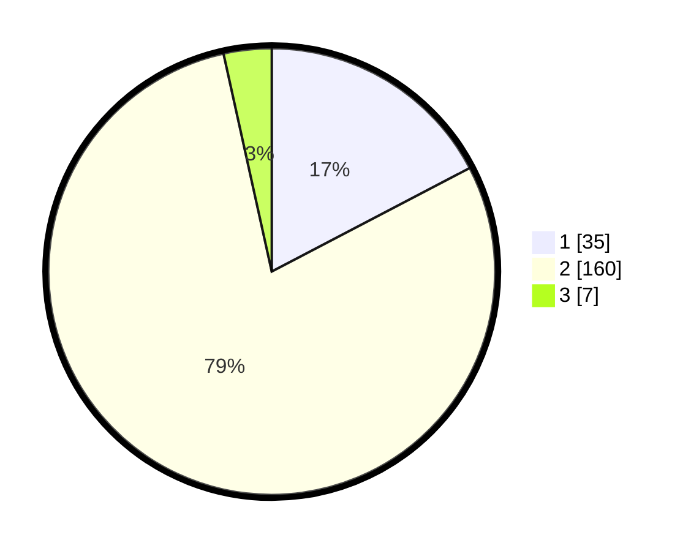

# Hasil

## Grafik

## Tabel

| No. | Nama Paslon    | Suara | Suara (raw) | Persentase |
|:--- |:-------------- | -----:| -----------:| ----------:|
| 1   | ANIES MUHAIMIN | 35    | [35][p-1]   | 17,33      |
| 2   | PRABOWO GIBRAN | 160   | [160][p-2]  | 79,21      |
| 3   | GANJAR MAHFUD  | 7     | [7][p-3]    | 3,47       |

[p-1]: https://github.com/gigit-pemilu/pemilu-2024/blob/main/pilpres/hitung-suara/sub/32-jawa-barat/sub/15-karawang/sub/16-tirtamulya/sub/2007-cipondoh/sub/002-tps/sub/paslon-1.txt
[p-2]: https://github.com/gigit-pemilu/pemilu-2024/blob/main/pilpres/hitung-suara/sub/32-jawa-barat/sub/15-karawang/sub/16-tirtamulya/sub/2007-cipondoh/sub/002-tps/sub/paslon-2.txt
[p-3]: https://github.com/gigit-pemilu/pemilu-2024/blob/main/pilpres/hitung-suara/sub/32-jawa-barat/sub/15-karawang/sub/16-tirtamulya/sub/2007-cipondoh/sub/002-tps/sub/paslon-3.txt

## Foto C Plano

https://sirekap-obj-formc.kpu.go.id/e956/pemilu/ppwp/32/15/16/20/07/3215162007002-20240219-122650--b1f56af4-36e8-4f79-80c3-c9c5fb24b634.jpg

https://sirekap-obj-formc.kpu.go.id/e956/pemilu/ppwp/32/15/16/20/07/3215162007002-20240219-125137--ed8d5a3c-f6af-415f-bbbd-87e35c0e8fd4.jpg

https://sirekap-obj-formc.kpu.go.id/e956/pemilu/ppwp/32/15/16/20/07/3215162007002-20240219-125318--0b24ddd4-0837-4f74-8bcb-0815951b2162.jpg

## Metadata

| Key        | Value               |
| ---------- | ------------------- |
| Time Stamp | 2024-02-19 13:00:00 |

