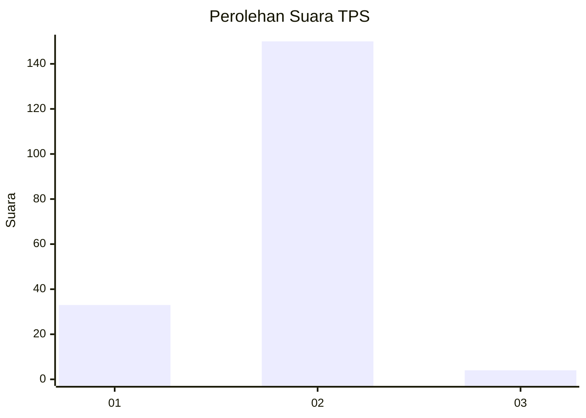
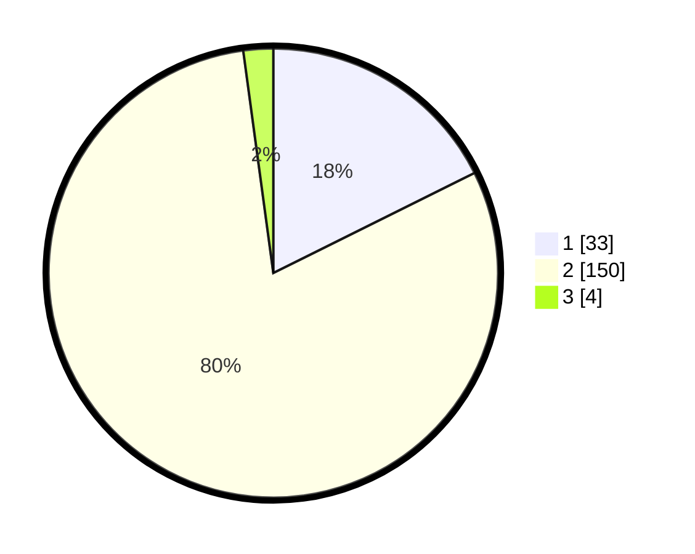

# Hasil

## Grafik

## Tabel

| No. | Nama Paslon    | Suara | Suara (raw) | Persentase |
|:--- |:-------------- | -----:| -----------:| ----------:|
| 1   | ANIES MUHAIMIN | 33    | [33][p-1]   | 17,65      |
| 2   | PRABOWO GIBRAN | 150   | [150][p-2]  | 80,21      |
| 3   | GANJAR MAHFUD  | 4     | [4][p-3]    | 2,14       |

[p-1]: https://github.com/gigit-pemilu/pemilu-2024-32-jawa-barat/blob/main/pilpres/hitung-suara/sub/32-jawa-barat/sub/15-karawang/sub/17-telagasari/sub/2001-telagamulya/sub/003-tps/sub/paslon-1.txt
[p-2]: https://github.com/gigit-pemilu/pemilu-2024-32-jawa-barat/blob/main/pilpres/hitung-suara/sub/32-jawa-barat/sub/15-karawang/sub/17-telagasari/sub/2001-telagamulya/sub/003-tps/sub/paslon-2.txt
[p-3]: https://github.com/gigit-pemilu/pemilu-2024-32-jawa-barat/blob/main/pilpres/hitung-suara/sub/32-jawa-barat/sub/15-karawang/sub/17-telagasari/sub/2001-telagamulya/sub/003-tps/sub/paslon-3.txt

## Foto C Plano

https://sirekap-obj-formc.kpu.go.id/6931/pemilu/ppwp/32/15/17/20/01/3215172001003-20240220-151332--3901dce1-e8e3-45cb-9e53-876ba5066659.jpg

https://sirekap-obj-formc.kpu.go.id/6931/pemilu/ppwp/32/15/17/20/01/3215172001003-20240220-151504--9ee4d7b8-ec4b-4eec-9355-5a4ed5cd4bcc.jpg

https://sirekap-obj-formc.kpu.go.id/6931/pemilu/ppwp/32/15/17/20/01/3215172001003-20240220-151612--199899bc-93cc-4bbe-b40b-50044e9d4f2a.jpg

## Metadata

| Key        | Value               |
| ---------- | ------------------- |
| Time Stamp | 2024-02-24 22:31:28 |

