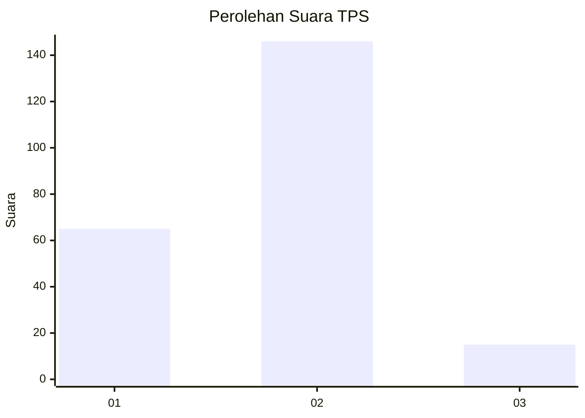
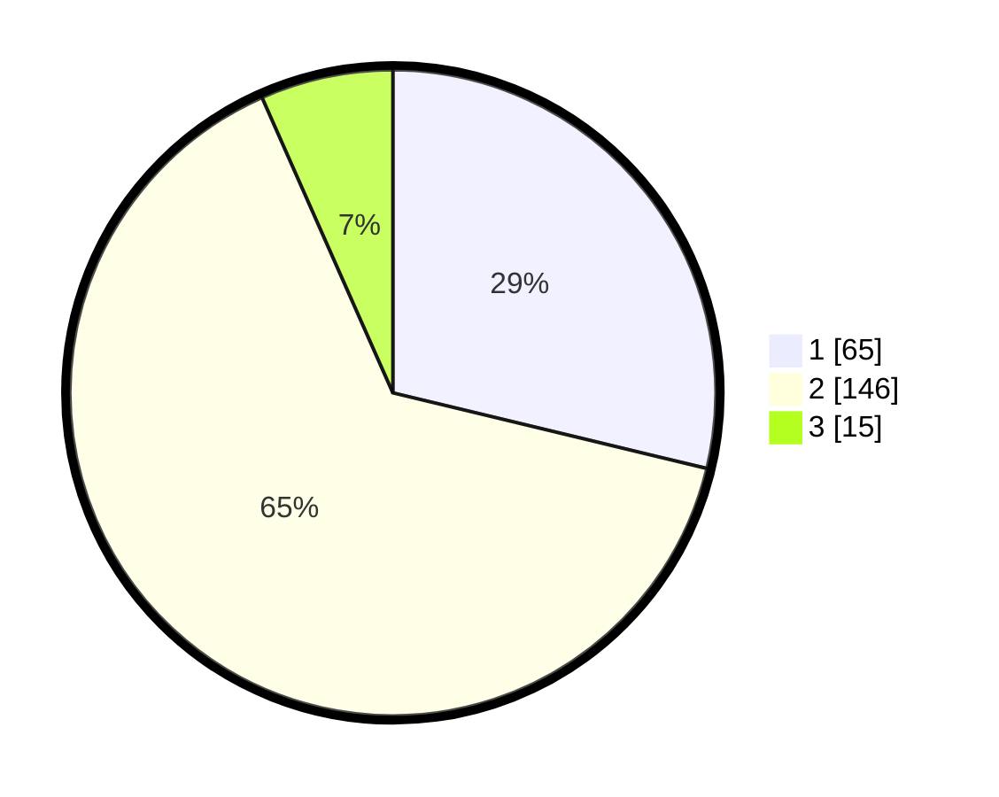

# Hasil

## Grafik

## Tabel

| No. | Nama Paslon    | Suara | Suara (raw) | Persentase |
|:--- |:-------------- | -----:| -----------:| ----------:|
| 1   | ANIES MUHAIMIN | 65    | [65][p-1]   | 28,76      |
| 2   | PRABOWO GIBRAN | 146   | [146][p-2]  | 64,60      |
| 3   | GANJAR MAHFUD  | 15    | [15][p-3]   | 6,64       |

[p-1]: https://github.com/gigit-pemilu/pemilu-2024-32-jawa-barat/blob/main/pilpres/hitung-suara/sub/32-jawa-barat/sub/15-karawang/sub/17-telagasari/sub/2001-telagamulya/sub/004-tps/sub/paslon-1.txt
[p-2]: https://github.com/gigit-pemilu/pemilu-2024-32-jawa-barat/blob/main/pilpres/hitung-suara/sub/32-jawa-barat/sub/15-karawang/sub/17-telagasari/sub/2001-telagamulya/sub/004-tps/sub/paslon-2.txt
[p-3]: https://github.com/gigit-pemilu/pemilu-2024-32-jawa-barat/blob/main/pilpres/hitung-suara/sub/32-jawa-barat/sub/15-karawang/sub/17-telagasari/sub/2001-telagamulya/sub/004-tps/sub/paslon-3.txt

## Foto C Plano

https://sirekap-obj-formc.kpu.go.id/44d3/pemilu/ppwp/32/15/17/20/01/3215172001004-20240215-021552--1194e24f-204f-430a-88ab-cd91601f93c1.jpg

https://sirekap-obj-formc.kpu.go.id/44d3/pemilu/ppwp/32/15/17/20/01/3215172001004-20240215-013354--a3128db2-0ddd-408f-93d4-a144ec8f45f0.jpg

https://sirekap-obj-formc.kpu.go.id/44d3/pemilu/ppwp/32/15/17/20/01/3215172001004-20240215-021945--5161c24e-96e8-4e51-9215-82903b782ecc.jpg

## Metadata

| Key        | Value               |
| ---------- | ------------------- |
| Time Stamp | 2024-02-17 11:00:02 |

