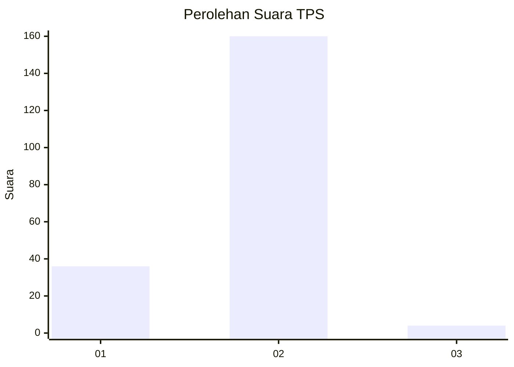
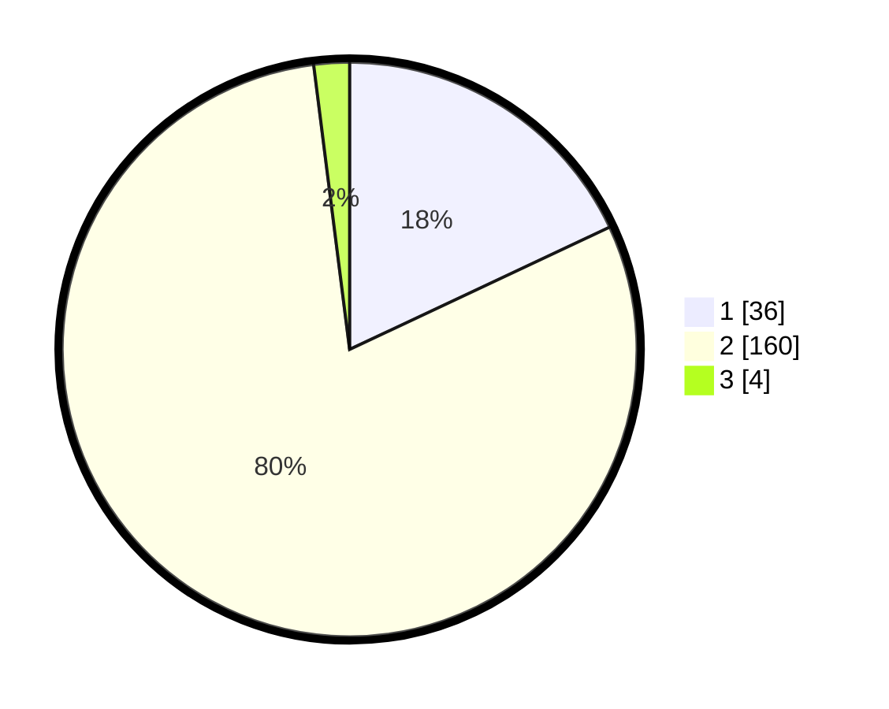

# Hasil

## Grafik

## Tabel

| No. | Nama Paslon    | Suara | Suara (raw) | Persentase |
|:--- |:-------------- | -----:| -----------:| ----------:|
| 1   | ANIES MUHAIMIN | 36    | [36][p-1]   | 18,00      |
| 2   | PRABOWO GIBRAN | 160   | [160][p-2]  | 80,00      |
| 3   | GANJAR MAHFUD  | 4     | [4][p-3]    | 2,00       |

[p-1]: https://github.com/gigit-pemilu/pemilu-2024/blob/main/pilpres/hitung-suara/sub/32-jawa-barat/sub/15-karawang/sub/18-rawamerta/sub/2001-sukamerta/sub/001-tps/sub/paslon-1.txt
[p-2]: https://github.com/gigit-pemilu/pemilu-2024/blob/main/pilpres/hitung-suara/sub/32-jawa-barat/sub/15-karawang/sub/18-rawamerta/sub/2001-sukamerta/sub/001-tps/sub/paslon-2.txt
[p-3]: https://github.com/gigit-pemilu/pemilu-2024/blob/main/pilpres/hitung-suara/sub/32-jawa-barat/sub/15-karawang/sub/18-rawamerta/sub/2001-sukamerta/sub/001-tps/sub/paslon-3.txt

## Foto C Plano

https://sirekap-obj-formc.kpu.go.id/4659/pemilu/ppwp/32/15/18/20/01/3215182001001-20240215-002330--75045ccd-5825-4e64-b246-273521e21abc.jpg

https://sirekap-obj-formc.kpu.go.id/4659/pemilu/ppwp/32/15/18/20/01/3215182001001-20240215-002508--1a140bac-7ad5-4a7a-b741-a17db9369b08.jpg

https://sirekap-obj-formc.kpu.go.id/4659/pemilu/ppwp/32/15/18/20/01/3215182001001-20240215-002624--72ae9570-87c6-46dc-8e39-f5a695592dbe.jpg

## Metadata

| Key        | Value               |
| ---------- | ------------------- |
| Time Stamp | 2024-02-16 16:25:10 |

