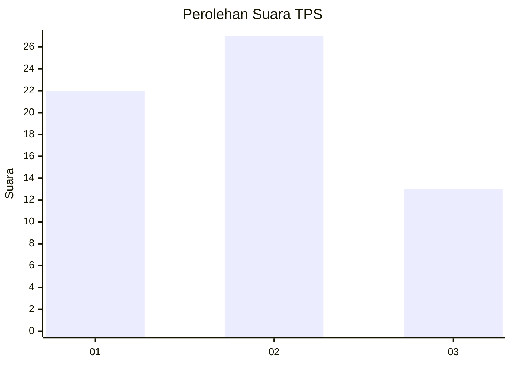
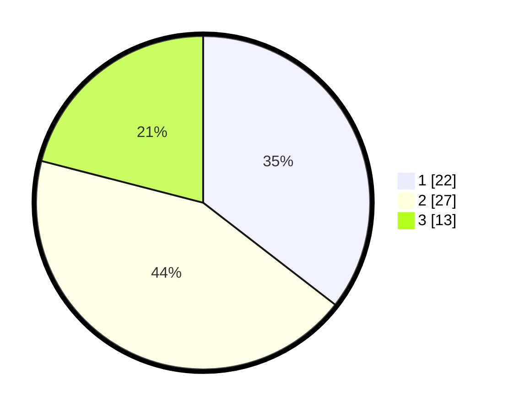

# Hasil

## Grafik

## Tabel

| No. | Nama Paslon    | Suara | Suara (raw) | Persentase |
|:--- |:-------------- | -----:| -----------:| ----------:|
| 1   | ANIES MUHAIMIN | 22    | [22][p-1]   | 35,48      |
| 2   | PRABOWO GIBRAN | 27    | [27][p-2]   | 43,55      |
| 3   | GANJAR MAHFUD  | 13    | [13][p-3]   | 20,97      |

[p-1]: https://github.com/gigit-pemilu/pemilu-2024-32-jawa-barat/blob/main/pilpres/hitung-suara/sub/32-jawa-barat/sub/15-karawang/sub/18-rawamerta/sub/2001-sukamerta/sub/011-tps/sub/paslon-1.txt
[p-2]: https://github.com/gigit-pemilu/pemilu-2024-32-jawa-barat/blob/main/pilpres/hitung-suara/sub/32-jawa-barat/sub/15-karawang/sub/18-rawamerta/sub/2001-sukamerta/sub/011-tps/sub/paslon-2.txt
[p-3]: https://github.com/gigit-pemilu/pemilu-2024-32-jawa-barat/blob/main/pilpres/hitung-suara/sub/32-jawa-barat/sub/15-karawang/sub/18-rawamerta/sub/2001-sukamerta/sub/011-tps/sub/paslon-3.txt

## Foto C Plano

https://sirekap-obj-formc.kpu.go.id/e0d6/pemilu/ppwp/32/15/18/20/01/3215182001011-20240222-162521--7f0c2511-ab15-4f57-8658-a8fd52be9d9e.jpg

https://sirekap-obj-formc.kpu.go.id/e0d6/pemilu/ppwp/32/15/18/20/01/3215182001011-20240222-162436--dec305f6-a086-4aad-ac0b-46b594eebc48.jpg

https://sirekap-obj-formc.kpu.go.id/e0d6/pemilu/ppwp/32/15/18/20/01/3215182001011-20240222-162345--be8d76bb-b2bf-4fce-a362-20173ffa0347.jpg

## Metadata

| Key        | Value               |
| ---------- | ------------------- |
| Time Stamp | 2024-02-22 17:00:00 |

## DATA PEMILIH TETAP

Jumlah pemilih dalam DPT: **0**.
 * L: **122**.
 * P: **0**.

## DATA PENGGUNA HAK PILIH

Jumlah pengguna hak pilih dalam DPT: **777**.
 * L: **120**.
 * P: **35**.

Jumlah pengguna hak pilih dalam DPTb: **550**.
 * L: **20**.
 * P: **50**.

Jumlah pengguna hak pilih dalam DPK: **557**.
 * L: **20**.
 * P: **0**.

Jumlah pengguna hak pilih: **0**.
 * L: **112**.
 * P: **0**.

## JUMLAH SUARA SAH DAN TIDAK SAH

JUMLAH SELURUH SUARA SAH: **555**.

JUMLAH SUARA TIDAK SAH: **4**.

JUMLAH SELURUH SUARA SAH DAN SUARA TIDAK SAH: **240**.

