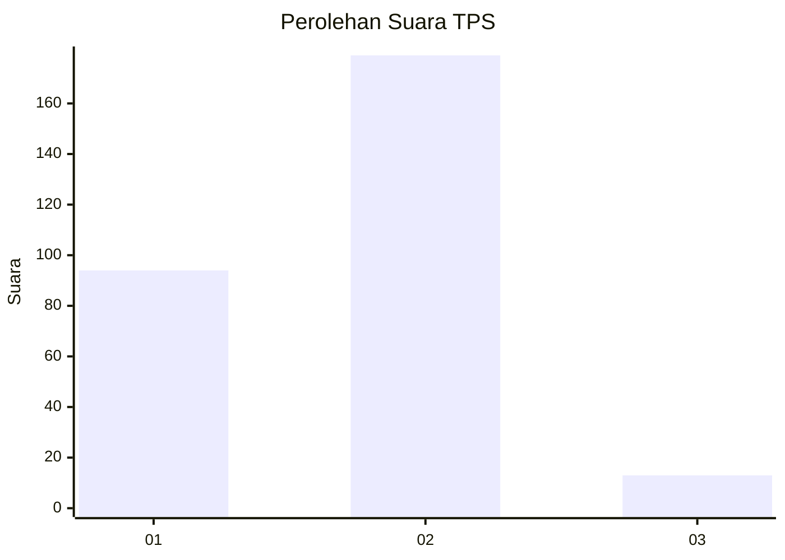
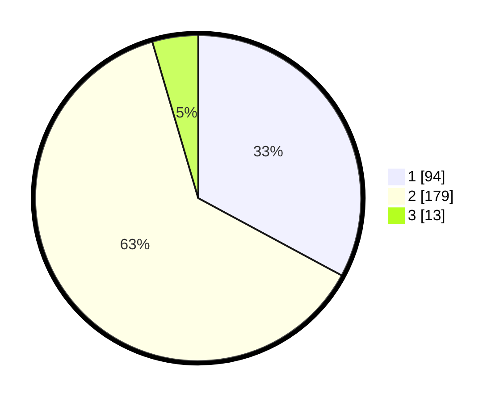

# Hasil

## Grafik

## Tabel

| No. | Nama Paslon    | Suara | Suara (raw) | Persentase |
|:--- |:-------------- | -----:| -----------:| ----------:|
| 1   | ANIES MUHAIMIN | 94    | [94][p-1]   | 32,87      |
| 2   | PRABOWO GIBRAN | 179   | [179][p-2]  | 62,59      |
| 3   | GANJAR MAHFUD  | 13    | [13][p-3]   | 4,55       |

[p-1]: https://github.com/gigit-pemilu/pemilu-2024-32-jawa-barat/blob/main/pilpres/hitung-suara/sub/32-jawa-barat/sub/15-karawang/sub/18-rawamerta/sub/2003-panyingkiran/sub/015-tps/sub/paslon-1.txt
[p-2]: https://github.com/gigit-pemilu/pemilu-2024-32-jawa-barat/blob/main/pilpres/hitung-suara/sub/32-jawa-barat/sub/15-karawang/sub/18-rawamerta/sub/2003-panyingkiran/sub/015-tps/sub/paslon-2.txt
[p-3]: https://github.com/gigit-pemilu/pemilu-2024-32-jawa-barat/blob/main/pilpres/hitung-suara/sub/32-jawa-barat/sub/15-karawang/sub/18-rawamerta/sub/2003-panyingkiran/sub/015-tps/sub/paslon-3.txt

## Foto C Plano

https://sirekap-obj-formc.kpu.go.id/e3ef/pemilu/ppwp/32/15/18/20/03/3215182003015-20240221-164243--270469f8-2920-4a49-a207-af9fe85a133c.jpg

https://sirekap-obj-formc.kpu.go.id/e3ef/pemilu/ppwp/32/15/18/20/03/3215182003015-20240221-164523--8c3901ae-ce94-4f79-a0c3-0a9b94bb218f.jpg

https://sirekap-obj-formc.kpu.go.id/e3ef/pemilu/ppwp/32/15/18/20/03/3215182003015-20240221-164619--56f170d5-34e7-4383-8968-164ef052e025.jpg

## Metadata

| Key        | Value               |
| ---------- | ------------------- |
| Time Stamp | 2024-02-24 22:31:28 |

