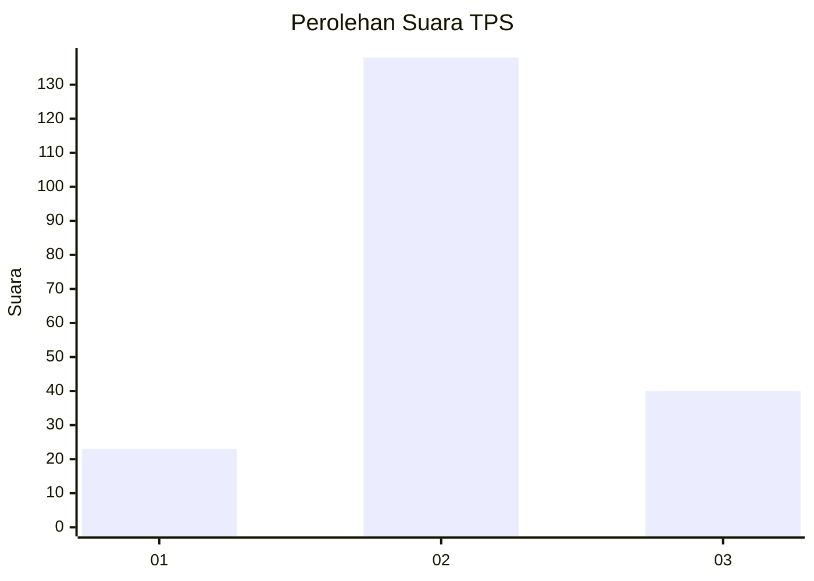
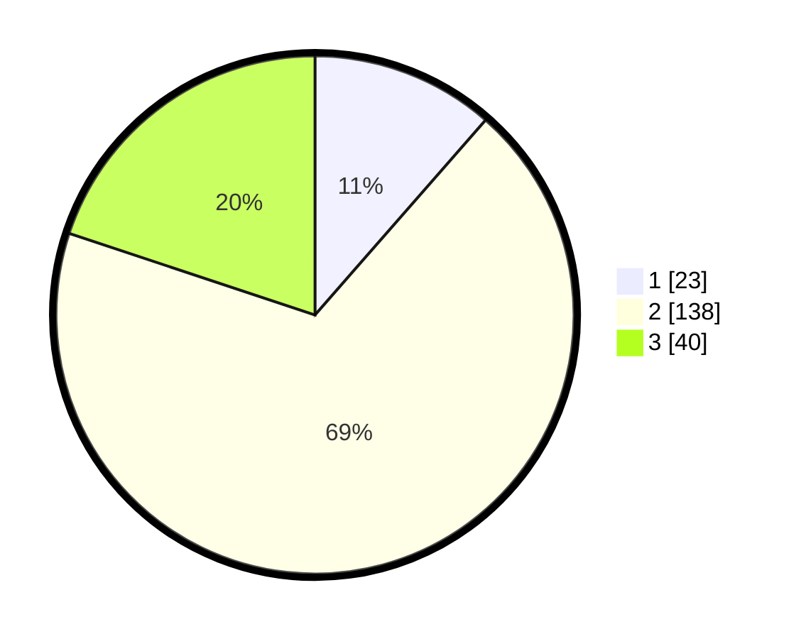

# Hasil

## Grafik

## Tabel

| No. | Nama Paslon    | Suara | Suara (raw) | Persentase |
|:--- |:-------------- | -----:| -----------:| ----------:|
| 1   | ANIES MUHAIMIN | 23    | [23][p-1]   | 11,44      |
| 2   | PRABOWO GIBRAN | 138   | [138][p-2]  | 68,66      |
| 3   | GANJAR MAHFUD  | 40    | [40][p-3]   | 19,90      |

[p-1]: https://github.com/gigit-pemilu/pemilu-2024/blob/main/pilpres/hitung-suara/sub/32-jawa-barat/sub/15-karawang/sub/19-lemahabang/sub/2001-karyamukti/sub/001-tps/sub/paslon-1.txt
[p-2]: https://github.com/gigit-pemilu/pemilu-2024/blob/main/pilpres/hitung-suara/sub/32-jawa-barat/sub/15-karawang/sub/19-lemahabang/sub/2001-karyamukti/sub/001-tps/sub/paslon-2.txt
[p-3]: https://github.com/gigit-pemilu/pemilu-2024/blob/main/pilpres/hitung-suara/sub/32-jawa-barat/sub/15-karawang/sub/19-lemahabang/sub/2001-karyamukti/sub/001-tps/sub/paslon-3.txt

## Foto C Plano

https://sirekap-obj-formc.kpu.go.id/5060/pemilu/ppwp/32/15/19/20/01/3215192001001-20240214-212209--f8226702-64fe-4560-beed-dfbba20b9210.jpg

https://sirekap-obj-formc.kpu.go.id/5060/pemilu/ppwp/32/15/19/20/01/3215192001001-20240214-212320--3356456e-8ad2-4c81-84d2-603f05210fe7.jpg

https://sirekap-obj-formc.kpu.go.id/5060/pemilu/ppwp/32/15/19/20/01/3215192001001-20240214-212446--ef30333a-2fcf-4389-b636-791fa178a353.jpg

## Metadata

| Key        | Value               |
| ---------- | ------------------- |
| Time Stamp | 2024-02-25 12:00:00 |

