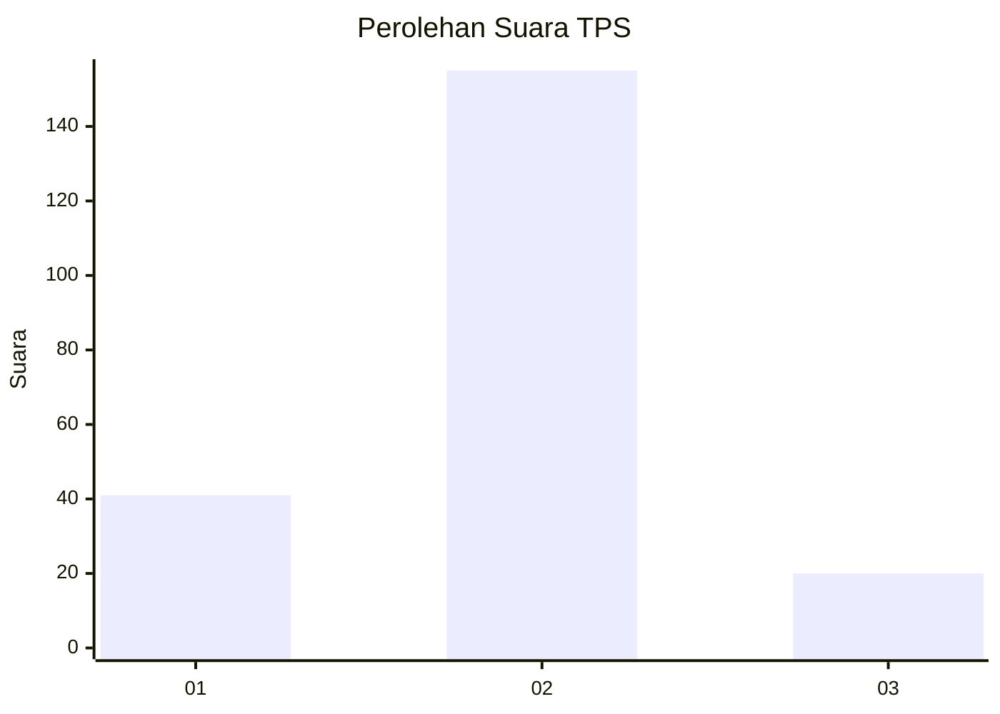
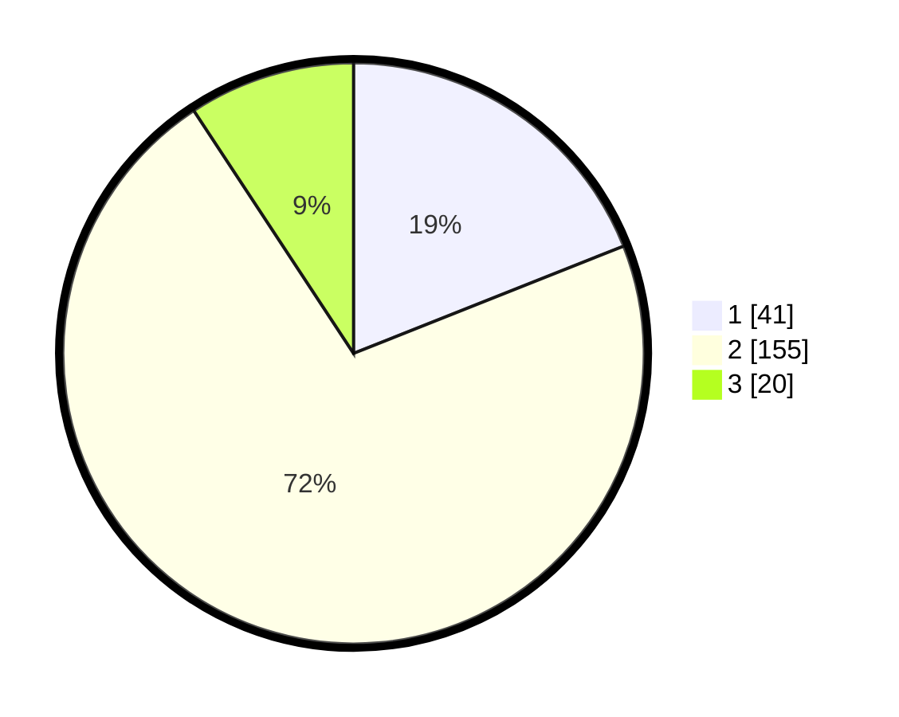

# Hasil

## Grafik

## Tabel

| No. | Nama Paslon    | Suara | Suara (raw) | Persentase |
|:--- |:-------------- | -----:| -----------:| ----------:|
| 1   | ANIES MUHAIMIN | 41    | [41][p-1]   | 18,98      |
| 2   | PRABOWO GIBRAN | 155   | [155][p-2]  | 71,76      |
| 3   | GANJAR MAHFUD  | 20    | [20][p-3]   | 9,26       |

[p-1]: https://github.com/gigit-pemilu/pemilu-2024/blob/main/pilpres/hitung-suara/sub/32-jawa-barat/sub/15-karawang/sub/19-lemahabang/sub/2001-karyamukti/sub/003-tps/sub/paslon-1.txt
[p-2]: https://github.com/gigit-pemilu/pemilu-2024/blob/main/pilpres/hitung-suara/sub/32-jawa-barat/sub/15-karawang/sub/19-lemahabang/sub/2001-karyamukti/sub/003-tps/sub/paslon-2.txt
[p-3]: https://github.com/gigit-pemilu/pemilu-2024/blob/main/pilpres/hitung-suara/sub/32-jawa-barat/sub/15-karawang/sub/19-lemahabang/sub/2001-karyamukti/sub/003-tps/sub/paslon-3.txt

## Foto C Plano

https://sirekap-obj-formc.kpu.go.id/16c3/pemilu/ppwp/32/15/19/20/01/3215192001003-20240214-203031--765deac6-725a-4059-b9ad-6ebcb64cb775.jpg

https://sirekap-obj-formc.kpu.go.id/16c3/pemilu/ppwp/32/15/19/20/01/3215192001003-20240214-202654--8e597e1f-416a-4daf-a571-11ff9a08d413.jpg

https://sirekap-obj-formc.kpu.go.id/16c3/pemilu/ppwp/32/15/19/20/01/3215192001003-20240214-203133--7ffef62f-d7f3-4233-a5b9-14d4fd0a84e8.jpg

## Metadata

| Key        | Value               |
| ---------- | ------------------- |
| Time Stamp | 2024-02-24 22:31:28 |

