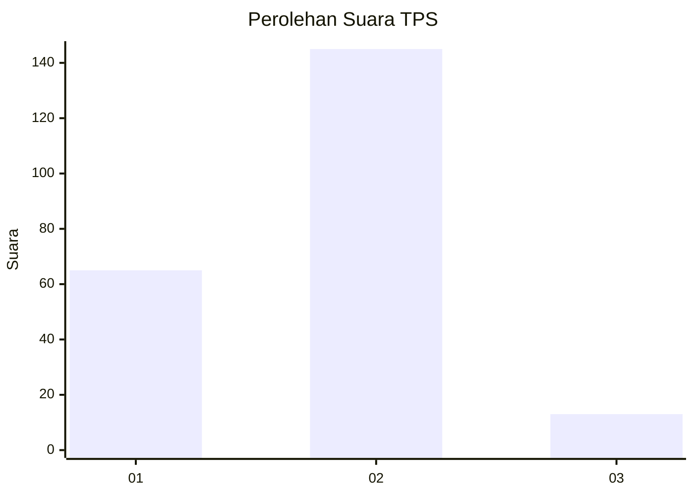
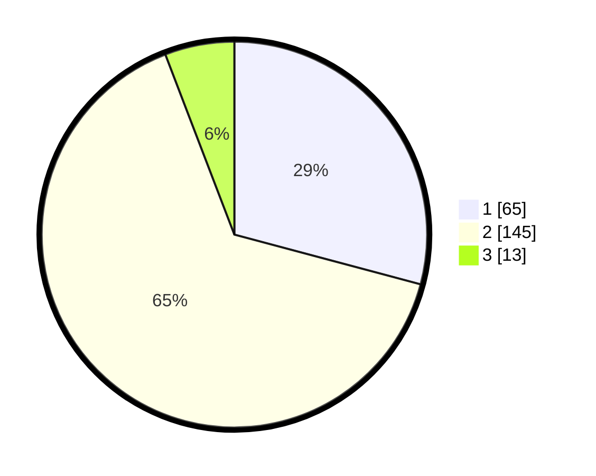

# Hasil

## Grafik

## Tabel

| No. | Nama Paslon    | Suara | Suara (raw) | Persentase |
|:--- |:-------------- | -----:| -----------:| ----------:|
| 1   | ANIES MUHAIMIN | 65    | [65][p-1]   | 29,15      |
| 2   | PRABOWO GIBRAN | 145   | [145][p-2]  | 65,02      |
| 3   | GANJAR MAHFUD  | 13    | [13][p-3]   | 5,83       |

[p-1]: https://github.com/gigit-pemilu/pemilu-2024-32-jawa-barat/blob/main/pilpres/hitung-suara/sub/32-jawa-barat/sub/15-karawang/sub/19-lemahabang/sub/2001-karyamukti/sub/008-tps/sub/paslon-1.txt
[p-2]: https://github.com/gigit-pemilu/pemilu-2024-32-jawa-barat/blob/main/pilpres/hitung-suara/sub/32-jawa-barat/sub/15-karawang/sub/19-lemahabang/sub/2001-karyamukti/sub/008-tps/sub/paslon-2.txt
[p-3]: https://github.com/gigit-pemilu/pemilu-2024-32-jawa-barat/blob/main/pilpres/hitung-suara/sub/32-jawa-barat/sub/15-karawang/sub/19-lemahabang/sub/2001-karyamukti/sub/008-tps/sub/paslon-3.txt

## Foto C Plano

https://sirekap-obj-formc.kpu.go.id/2bb3/pemilu/ppwp/32/15/19/20/01/3215192001008-20240214-230211--358fbef9-350d-49f3-9275-85b2e4de4fb5.jpg

https://sirekap-obj-formc.kpu.go.id/2bb3/pemilu/ppwp/32/15/19/20/01/3215192001008-20240214-230425--bf4f1139-af51-4ad2-8871-7ce0fed1ff59.jpg

https://sirekap-obj-formc.kpu.go.id/2bb3/pemilu/ppwp/32/15/19/20/01/3215192001008-20240214-230636--7aab903b-288c-45f2-81cc-94fc4064041f.jpg

## Metadata

| Key        | Value               |
| ---------- | ------------------- |
| Time Stamp | 2024-02-25 15:00:00 |

