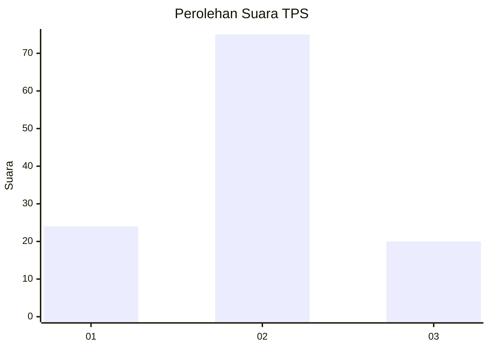
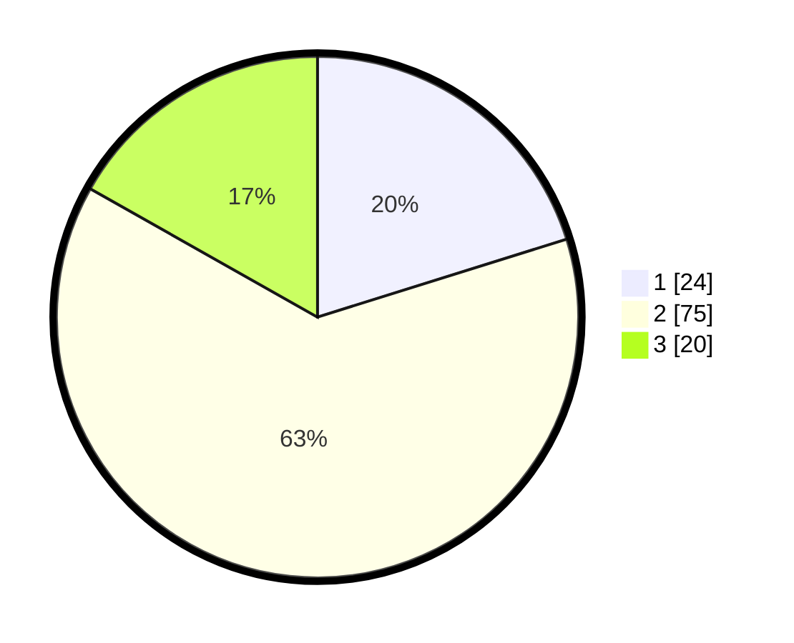

# Hasil

## Grafik

## Tabel

| No. | Nama Paslon    | Suara | Suara (raw) | Persentase |
|:--- |:-------------- | -----:| -----------:| ----------:|
| 1   | ANIES MUHAIMIN | 24    | [24][p-1]   | 20,17      |
| 2   | PRABOWO GIBRAN | 75    | [75][p-2]   | 63,03      |
| 3   | GANJAR MAHFUD  | 20    | [20][p-3]   | 16,81      |

[p-1]: https://github.com/gigit-pemilu/pemilu-2024-32-jawa-barat/blob/main/pilpres/hitung-suara/sub/32-jawa-barat/sub/15-karawang/sub/22-jayakerta/sub/2003-makmurjaya/sub/011-tps/sub/paslon-1.txt
[p-2]: https://github.com/gigit-pemilu/pemilu-2024-32-jawa-barat/blob/main/pilpres/hitung-suara/sub/32-jawa-barat/sub/15-karawang/sub/22-jayakerta/sub/2003-makmurjaya/sub/011-tps/sub/paslon-2.txt
[p-3]: https://github.com/gigit-pemilu/pemilu-2024-32-jawa-barat/blob/main/pilpres/hitung-suara/sub/32-jawa-barat/sub/15-karawang/sub/22-jayakerta/sub/2003-makmurjaya/sub/011-tps/sub/paslon-3.txt

## Foto C Plano

https://sirekap-obj-formc.kpu.go.id/1325/pemilu/ppwp/32/15/22/20/03/3215222003011-20240221-112546--f893321b-fbab-4f1e-b12a-0ea53ee8d410.jpg

https://sirekap-obj-formc.kpu.go.id/1325/pemilu/ppwp/32/15/22/20/03/3215222003011-20240221-112617--1755d247-02e7-40f2-8813-96610d433384.jpg

https://sirekap-obj-formc.kpu.go.id/1325/pemilu/ppwp/32/15/22/20/03/3215222003011-20240221-112642--3217d483-f90e-4eb9-a146-6c2e9de30012.jpg

## Metadata

| Key        | Value               |
| ---------- | ------------------- |
| Time Stamp | 2024-02-21 12:00:00 |

## DATA PEMILIH TETAP

Jumlah pemilih dalam DPT: **737**.
 * L: **135**.
 * P: **335**.

## DATA PENGGUNA HAK PILIH

Jumlah pengguna hak pilih dalam DPT: **255**.
 * L: **885**.
 * P: **839**.

Jumlah pengguna hak pilih dalam DPTb: **265**.
 * L: **602**.
 * P: **400**.

Jumlah pengguna hak pilih dalam DPK: **833**.
 * L: **841**.
 * P: **82**.

Jumlah pengguna hak pilih: **502**.
 * L: **117**.
 * P: **805**.

## JUMLAH SUARA SAH DAN TIDAK SAH

JUMLAH SELURUH SUARA SAH: **225**.

JUMLAH SUARA TIDAK SAH: **4**.

JUMLAH SELURUH SUARA SAH DAN SUARA TIDAK SAH: **272**.

