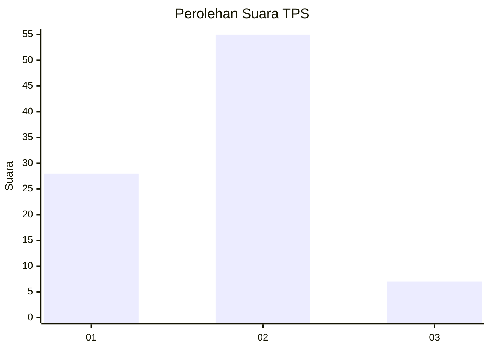
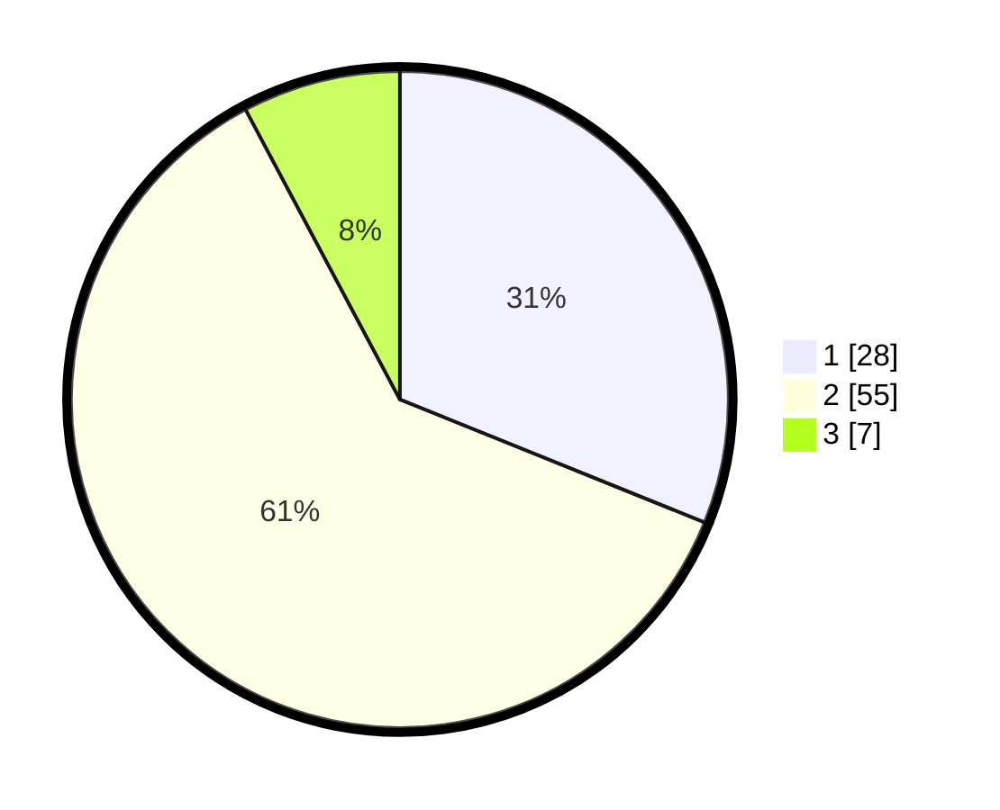

# Hasil

## Grafik

## Tabel

| No. | Nama Paslon    | Suara | Suara (raw) | Persentase |
|:--- |:-------------- | -----:| -----------:| ----------:|
| 1   | ANIES MUHAIMIN | 28    | [28][p-1]   | 31,11      |
| 2   | PRABOWO GIBRAN | 55    | [55][p-2]   | 61,11      |
| 3   | GANJAR MAHFUD  | 7     | [7][p-3]    | 7,78       |

[p-1]: https://github.com/gigit-pemilu/pemilu-2024/blob/main/pilpres/hitung-suara/sub/32-jawa-barat/sub/15-karawang/sub/22-jayakerta/sub/2004-kertajaya/sub/014-tps/sub/paslon-1.txt
[p-2]: https://github.com/gigit-pemilu/pemilu-2024/blob/main/pilpres/hitung-suara/sub/32-jawa-barat/sub/15-karawang/sub/22-jayakerta/sub/2004-kertajaya/sub/014-tps/sub/paslon-2.txt
[p-3]: https://github.com/gigit-pemilu/pemilu-2024/blob/main/pilpres/hitung-suara/sub/32-jawa-barat/sub/15-karawang/sub/22-jayakerta/sub/2004-kertajaya/sub/014-tps/sub/paslon-3.txt

## Foto C Plano

https://sirekap-obj-formc.kpu.go.id/1eb4/pemilu/ppwp/32/15/22/20/04/3215222004014-20240221-222249--043bf86f-03e2-4de4-9af8-2e11a7ca430f.jpg

https://sirekap-obj-formc.kpu.go.id/1eb4/pemilu/ppwp/32/15/22/20/04/3215222004014-20240221-222423--872dc7d8-440d-4705-a515-71c01f290d48.jpg

https://sirekap-obj-formc.kpu.go.id/1eb4/pemilu/ppwp/32/15/22/20/04/3215222004014-20240221-222338--14d2360d-9d46-4fb1-85aa-fdcb88d40072.jpg

## Metadata

| Key        | Value               |
| ---------- | ------------------- |
| Time Stamp | 2024-02-21 23:00:00 |

## DATA PEMILIH TETAP

Jumlah pemilih dalam DPT: **235**.
 * L: **149**.
 * P: **406**.

## DATA PENGGUNA HAK PILIH

Jumlah pengguna hak pilih dalam DPT: **684**.
 * L: **99**.
 * P: **890**.

Jumlah pengguna hak pilih dalam DPTb: **85**.
 * L: **83**.
 * P: **80**.

Jumlah pengguna hak pilih dalam DPK: **2**.
 * L: **6**.
 * P: **3**.

Jumlah pengguna hak pilih: **893**.
 * L: **800**.
 * P: **93**.

## JUMLAH SUARA SAH DAN TIDAK SAH

JUMLAH SELURUH SUARA SAH: **190**.

JUMLAH SUARA TIDAK SAH: **3**.

JUMLAH SELURUH SUARA SAH DAN SUARA TIDAK SAH: **193**.

