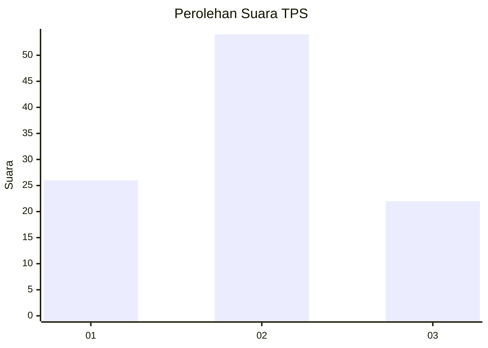
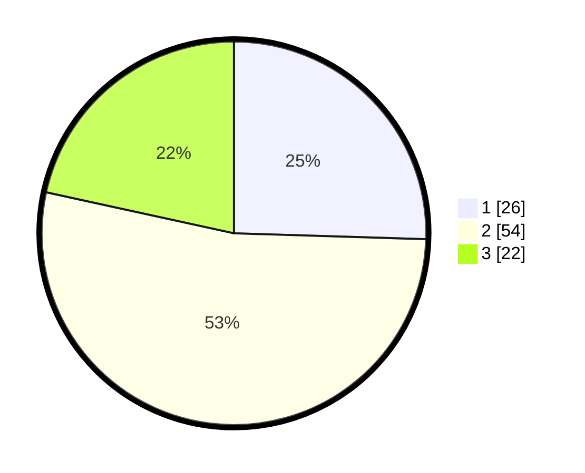

# Hasil

## Grafik

## Tabel

| No. | Nama Paslon    | Suara | Suara (raw) | Persentase |
|:--- |:-------------- | -----:| -----------:| ----------:|
| 1   | ANIES MUHAIMIN | 26    | [26][p-1]   | 25,49      |
| 2   | PRABOWO GIBRAN | 54    | [54][p-2]   | 52,94      |
| 3   | GANJAR MAHFUD  | 22    | [22][p-3]   | 21,57      |

[p-1]: https://github.com/gigit-pemilu/pemilu-2024-32-jawa-barat/blob/main/pilpres/hitung-suara/sub/32-jawa-barat/sub/15-karawang/sub/22-jayakerta/sub/2004-kertajaya/sub/017-tps/sub/paslon-1.txt
[p-2]: https://github.com/gigit-pemilu/pemilu-2024-32-jawa-barat/blob/main/pilpres/hitung-suara/sub/32-jawa-barat/sub/15-karawang/sub/22-jayakerta/sub/2004-kertajaya/sub/017-tps/sub/paslon-2.txt
[p-3]: https://github.com/gigit-pemilu/pemilu-2024-32-jawa-barat/blob/main/pilpres/hitung-suara/sub/32-jawa-barat/sub/15-karawang/sub/22-jayakerta/sub/2004-kertajaya/sub/017-tps/sub/paslon-3.txt

## Foto C Plano

https://sirekap-obj-formc.kpu.go.id/f04b/pemilu/ppwp/32/15/22/20/04/3215222004017-20240221-223015--3d8c2dcb-4803-4228-a42d-4ce316daed30.jpg

https://sirekap-obj-formc.kpu.go.id/f04b/pemilu/ppwp/32/15/22/20/04/3215222004017-20240221-223030--df65ed8b-ed4b-4520-bd57-46aee9258da1.jpg

https://sirekap-obj-formc.kpu.go.id/f04b/pemilu/ppwp/32/15/22/20/04/3215222004017-20240221-223105--0e9152e6-fdae-4780-957e-943b5339e31f.jpg

## Metadata

| Key        | Value               |
| ---------- | ------------------- |
| Time Stamp | 2024-02-21 23:00:00 |

## DATA PEMILIH TETAP

Jumlah pemilih dalam DPT: **755**.
 * L: **436**.
 * P: **620**.

## DATA PENGGUNA HAK PILIH

Jumlah pengguna hak pilih dalam DPT: **200**.
 * L: **594**.
 * P: **499**.

Jumlah pengguna hak pilih dalam DPTb: **8**.
 * L: **888**.
 * P: **828**.

Jumlah pengguna hak pilih dalam DPK: **808**.
 * L: **888**.
 * P: **248**.

Jumlah pengguna hak pilih: **200**.
 * L: **604**.
 * P: **49**.

## JUMLAH SUARA SAH DAN TIDAK SAH

JUMLAH SELURUH SUARA SAH: **892**.

JUMLAH SUARA TIDAK SAH: **7**.

JUMLAH SELURUH SUARA SAH DAN SUARA TIDAK SAH: **200**.

