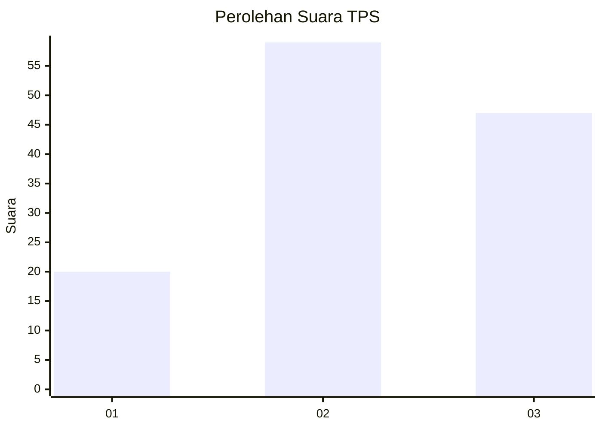
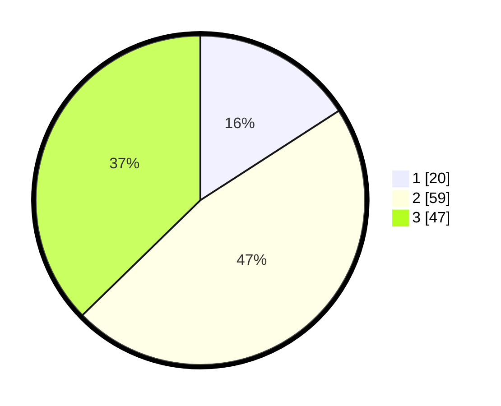

# Hasil

## Grafik

## Tabel

| No. | Nama Paslon    | Suara | Suara (raw) | Persentase |
|:--- |:-------------- | -----:| -----------:| ----------:|
| 1   | ANIES MUHAIMIN | 20    | [20][p-1]   | 15,87      |
| 2   | PRABOWO GIBRAN | 59    | [59][p-2]   | 46,83      |
| 3   | GANJAR MAHFUD  | 47    | [47][p-3]   | 37,30      |

[p-1]: https://github.com/gigit-pemilu/pemilu-2024-32-jawa-barat/blob/main/pilpres/hitung-suara/sub/32-jawa-barat/sub/15-karawang/sub/22-jayakerta/sub/2004-kertajaya/sub/020-tps/sub/paslon-1.txt
[p-2]: https://github.com/gigit-pemilu/pemilu-2024-32-jawa-barat/blob/main/pilpres/hitung-suara/sub/32-jawa-barat/sub/15-karawang/sub/22-jayakerta/sub/2004-kertajaya/sub/020-tps/sub/paslon-2.txt
[p-3]: https://github.com/gigit-pemilu/pemilu-2024-32-jawa-barat/blob/main/pilpres/hitung-suara/sub/32-jawa-barat/sub/15-karawang/sub/22-jayakerta/sub/2004-kertajaya/sub/020-tps/sub/paslon-3.txt

## Foto C Plano

https://sirekap-obj-formc.kpu.go.id/f8f7/pemilu/ppwp/32/15/22/20/04/3215222004020-20240221-223721--2b8422ed-ec9d-48be-81f0-11a44378d16b.jpg

https://sirekap-obj-formc.kpu.go.id/f8f7/pemilu/ppwp/32/15/22/20/04/3215222004020-20240221-223627--2d004f7f-0c69-482b-b8d5-9bea88b31d8a.jpg

https://sirekap-obj-formc.kpu.go.id/f8f7/pemilu/ppwp/32/15/22/20/04/3215222004020-20240221-223652--b912ddbd-ec8c-46dc-a389-e171106659b9.jpg

## Metadata

| Key        | Value               |
| ---------- | ------------------- |
| Time Stamp | 2024-02-21 23:00:00 |

## DATA PEMILIH TETAP

Jumlah pemilih dalam DPT: **258**.
 * L: **444**.
 * P: **624**.

## DATA PENGGUNA HAK PILIH

Jumlah pengguna hak pilih dalam DPT: **248**.
 * L: **620**.
 * P: **98**.

Jumlah pengguna hak pilih dalam DPTb: **8**.
 * L: **480**.
 * P: **0**.

Jumlah pengguna hak pilih dalam DPK: **0**.
 * L: **808**.
 * P: **8**.

Jumlah pengguna hak pilih: **268**.
 * L: **620**.
 * P: **98**.

## JUMLAH SUARA SAH DAN TIDAK SAH

JUMLAH SELURUH SUARA SAH: **212**.

JUMLAH SUARA TIDAK SAH: **6**.

JUMLAH SELURUH SUARA SAH DAN SUARA TIDAK SAH: **212**.

