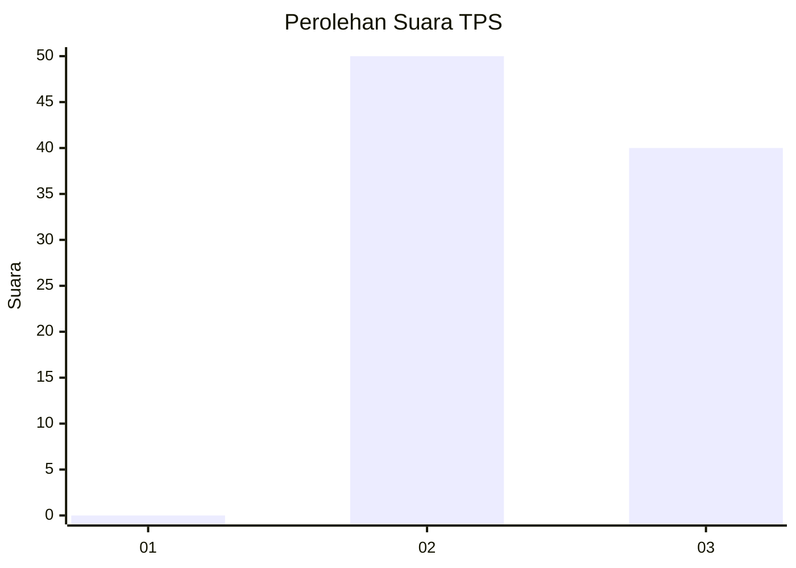
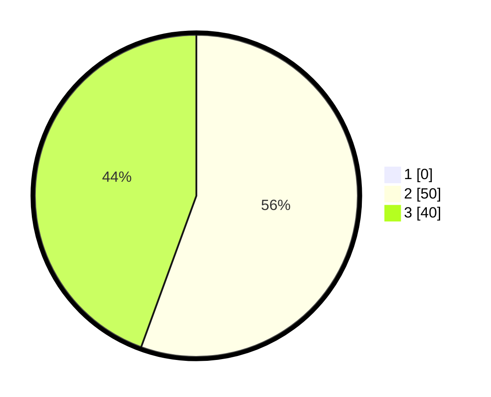

# Hasil

## Grafik

## Tabel

| No. | Nama Paslon    | Suara | Suara (raw) | Persentase |
|:--- |:-------------- | -----:| -----------:| ----------:|
| 1   | ANIES MUHAIMIN | 0     | [0][p-1]    | 0,00       |
| 2   | PRABOWO GIBRAN | 50    | [50][p-2]   | 55,56      |
| 3   | GANJAR MAHFUD  | 40    | [40][p-3]   | 44,44      |

[p-1]: https://github.com/gigit-pemilu/pemilu-2024-32-jawa-barat/blob/main/pilpres/hitung-suara/sub/32-jawa-barat/sub/15-karawang/sub/22-jayakerta/sub/2006-medangasem/sub/003-tps/sub/paslon-1.txt
[p-2]: https://github.com/gigit-pemilu/pemilu-2024-32-jawa-barat/blob/main/pilpres/hitung-suara/sub/32-jawa-barat/sub/15-karawang/sub/22-jayakerta/sub/2006-medangasem/sub/003-tps/sub/paslon-2.txt
[p-3]: https://github.com/gigit-pemilu/pemilu-2024-32-jawa-barat/blob/main/pilpres/hitung-suara/sub/32-jawa-barat/sub/15-karawang/sub/22-jayakerta/sub/2006-medangasem/sub/003-tps/sub/paslon-3.txt

## Foto C Plano

https://sirekap-obj-formc.kpu.go.id/bc1c/pemilu/ppwp/32/15/22/20/06/3215222006003-20240220-212636--b1849f26-5a98-4d22-b373-36d1f09aabb6.jpg

https://sirekap-obj-formc.kpu.go.id/bc1c/pemilu/ppwp/32/15/22/20/06/3215222006003-20240220-212748--d2b5ec34-06c1-4606-ab56-6d192e986782.jpg

https://sirekap-obj-formc.kpu.go.id/bc1c/pemilu/ppwp/32/15/22/20/06/3215222006003-20240220-213100--df9f9a39-3e7f-4980-b63f-0baabab3edf0.jpg

## Metadata

| Key        | Value               |
| ---------- | ------------------- |
| Time Stamp | 2024-02-20 22:00:00 |

## DATA PEMILIH TETAP

Jumlah pemilih dalam DPT: **352**.
 * L: **731**.
 * P: **371**.

## DATA PENGGUNA HAK PILIH

Jumlah pengguna hak pilih dalam DPT: **224**.
 * L: **225**.
 * P: **147**.

Jumlah pengguna hak pilih dalam DPTb: **844**.
 * L: **884**.
 * P: **4**.

Jumlah pengguna hak pilih dalam DPK: **883**.
 * L: **841**.
 * P: **882**.

Jumlah pengguna hak pilih: **227**.
 * L: **115**.
 * P: **111**.

## JUMLAH SUARA SAH DAN TIDAK SAH

JUMLAH SELURUH SUARA SAH: **750**.

JUMLAH SUARA TIDAK SAH: **0**.

JUMLAH SELURUH SUARA SAH DAN SUARA TIDAK SAH: **552**.

