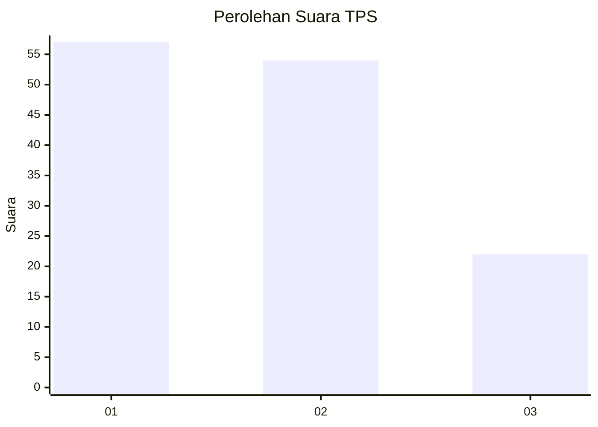
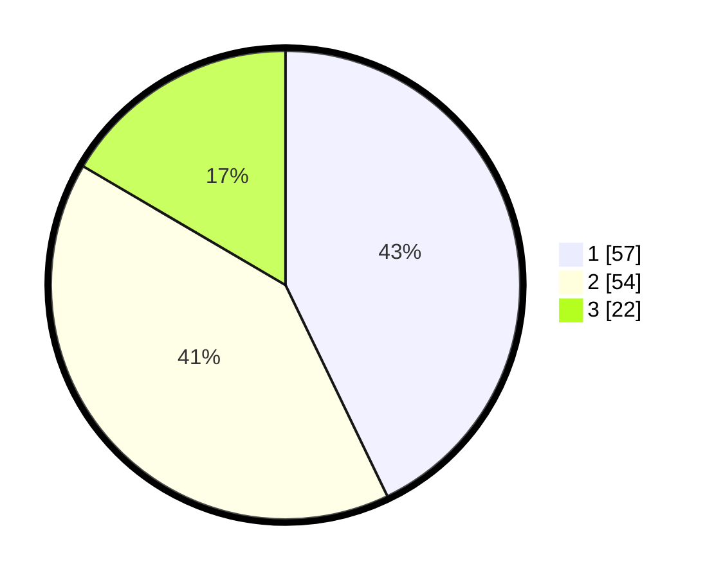

# Hasil

## Grafik

## Tabel

| No. | Nama Paslon    | Suara | Suara (raw) | Persentase |
|:--- |:-------------- | -----:| -----------:| ----------:|
| 1   | ANIES MUHAIMIN | 57    | [57][p-1]   | 42,86      |
| 2   | PRABOWO GIBRAN | 54    | [54][p-2]   | 40,60      |
| 3   | GANJAR MAHFUD  | 22    | [22][p-3]   | 16,54      |

[p-1]: https://github.com/gigit-pemilu/pemilu-2024-32-jawa-barat/blob/main/pilpres/hitung-suara/sub/32-jawa-barat/sub/15-karawang/sub/22-jayakerta/sub/2006-medangasem/sub/004-tps/sub/paslon-1.txt
[p-2]: https://github.com/gigit-pemilu/pemilu-2024-32-jawa-barat/blob/main/pilpres/hitung-suara/sub/32-jawa-barat/sub/15-karawang/sub/22-jayakerta/sub/2006-medangasem/sub/004-tps/sub/paslon-2.txt
[p-3]: https://github.com/gigit-pemilu/pemilu-2024-32-jawa-barat/blob/main/pilpres/hitung-suara/sub/32-jawa-barat/sub/15-karawang/sub/22-jayakerta/sub/2006-medangasem/sub/004-tps/sub/paslon-3.txt

## Foto C Plano

https://sirekap-obj-formc.kpu.go.id/317a/pemilu/ppwp/32/15/22/20/06/3215222006004-20240220-213538--2172718f-04de-4d68-9ae4-4475206604e7.jpg

https://sirekap-obj-formc.kpu.go.id/317a/pemilu/ppwp/32/15/22/20/06/3215222006004-20240220-213650--36891d21-b378-4ccb-aa8a-eef7994fc310.jpg

https://sirekap-obj-formc.kpu.go.id/317a/pemilu/ppwp/32/15/22/20/06/3215222006004-20240220-213749--65dd1b5b-993e-4cfa-8479-3229931af463.jpg

## Metadata

| Key        | Value               |
| ---------- | ------------------- |
| Time Stamp | 2024-02-20 22:00:00 |

## DATA PEMILIH TETAP

Jumlah pemilih dalam DPT: **71**.
 * L: **0**.
 * P: **57**.

## DATA PENGGUNA HAK PILIH

Jumlah pengguna hak pilih dalam DPT: **0**.
 * L: **575**.
 * P: **0**.

Jumlah pengguna hak pilih dalam DPTb: **255**.
 * L: **200**.
 * P: **22**.

Jumlah pengguna hak pilih dalam DPK: **502**.
 * L: **237**.
 * P: **757**.

Jumlah pengguna hak pilih: **772**.
 * L: **24**.
 * P: **955**.

## JUMLAH SUARA SAH DAN TIDAK SAH

JUMLAH SELURUH SUARA SAH: **224**.

JUMLAH SUARA TIDAK SAH: **50**.

JUMLAH SELURUH SUARA SAH DAN SUARA TIDAK SAH: **224**.

