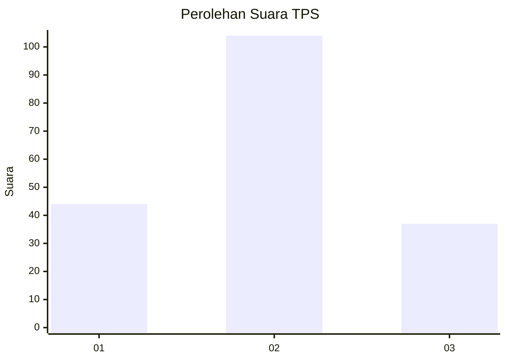
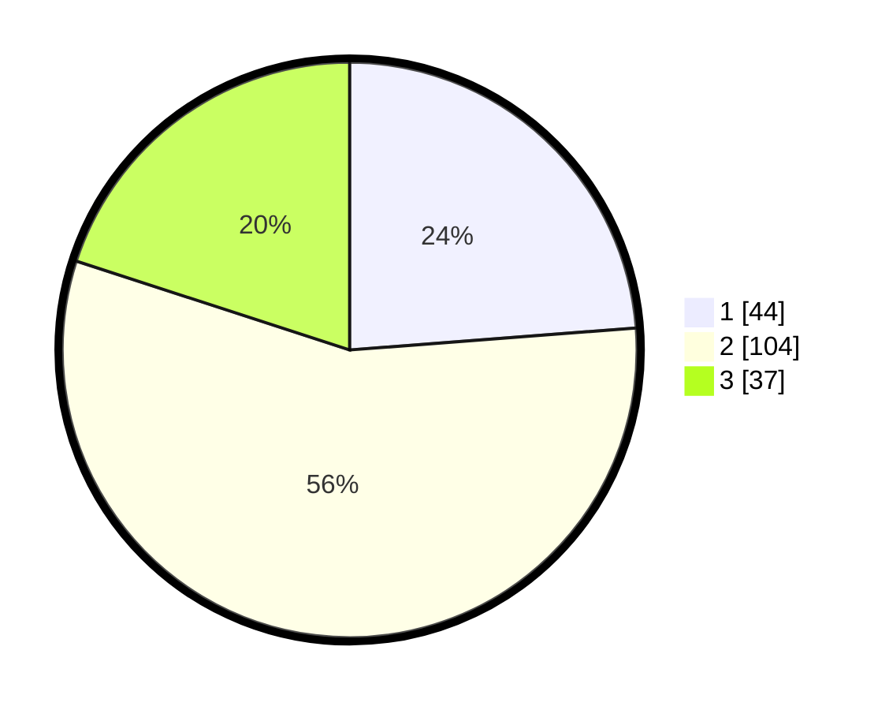

# Hasil

## Grafik

## Tabel

| No. | Nama Paslon    | Suara | Suara (raw) | Persentase |
|:--- |:-------------- | -----:| -----------:| ----------:|
| 1   | ANIES MUHAIMIN | 44    | [44][p-1]   | 23,78      |
| 2   | PRABOWO GIBRAN | 104   | [104][p-2]  | 56,22      |
| 3   | GANJAR MAHFUD  | 37    | [37][p-3]   | 20,00      |

[p-1]: https://github.com/gigit-pemilu/pemilu-2024/blob/main/pilpres/hitung-suara/sub/32-jawa-barat/sub/15-karawang/sub/22-jayakerta/sub/2006-medangasem/sub/005-tps/sub/paslon-1.txt
[p-2]: https://github.com/gigit-pemilu/pemilu-2024/blob/main/pilpres/hitung-suara/sub/32-jawa-barat/sub/15-karawang/sub/22-jayakerta/sub/2006-medangasem/sub/005-tps/sub/paslon-2.txt
[p-3]: https://github.com/gigit-pemilu/pemilu-2024/blob/main/pilpres/hitung-suara/sub/32-jawa-barat/sub/15-karawang/sub/22-jayakerta/sub/2006-medangasem/sub/005-tps/sub/paslon-3.txt

## Foto C Plano

https://sirekap-obj-formc.kpu.go.id/35f6/pemilu/ppwp/32/15/22/20/06/3215222006005-20240221-215636--1feb0cb6-ce81-43fc-8548-4f5c972ef0f1.jpg

https://sirekap-obj-formc.kpu.go.id/35f6/pemilu/ppwp/32/15/22/20/06/3215222006005-20240221-215736--bb851356-5fba-4d83-9a3e-728ffe8c99a0.jpg

https://sirekap-obj-formc.kpu.go.id/35f6/pemilu/ppwp/32/15/22/20/06/3215222006005-20240221-215950--0ca81fb0-8571-415c-b7db-f9ad45adc14d.jpg

## Metadata

| Key        | Value               |
| ---------- | ------------------- |
| Time Stamp | 2024-02-21 23:00:00 |

## DATA PEMILIH TETAP

Jumlah pemilih dalam DPT: **557**.
 * L: **577**.
 * P: **557**.

## DATA PENGGUNA HAK PILIH

Jumlah pengguna hak pilih dalam DPT: **7**.
 * L: **557**.
 * P: **557**.

Jumlah pengguna hak pilih dalam DPTb: **551**.
 * L: **727**.
 * P: **527**.

Jumlah pengguna hak pilih dalam DPK: **557**.
 * L: **777**.
 * P: **757**.

Jumlah pengguna hak pilih: **707**.
 * L: **777**.
 * P: **755**.

## JUMLAH SUARA SAH DAN TIDAK SAH

JUMLAH SELURUH SUARA SAH: **184**.

JUMLAH SUARA TIDAK SAH: **10**.

JUMLAH SELURUH SUARA SAH DAN SUARA TIDAK SAH: **175**.

