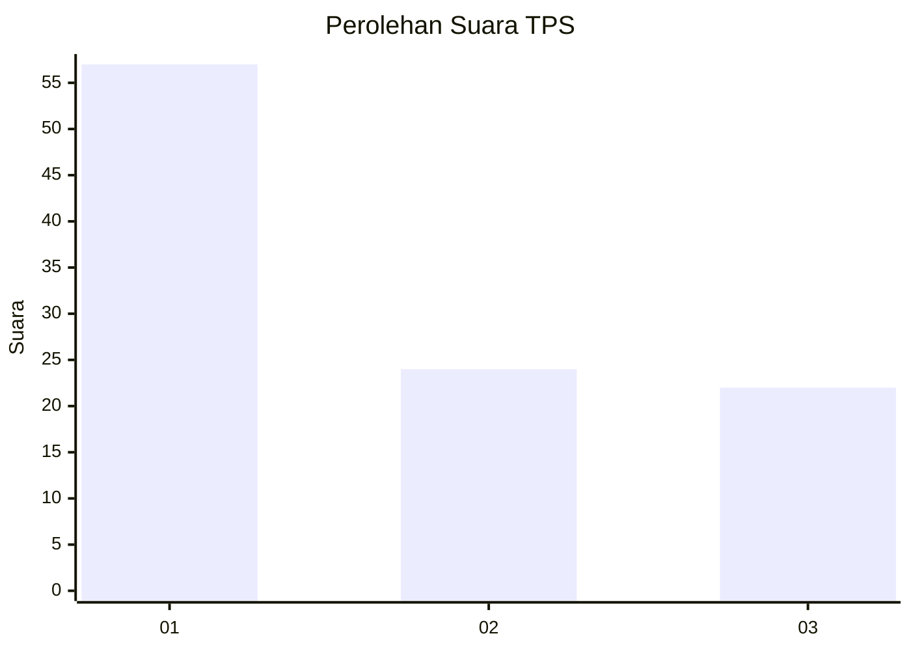
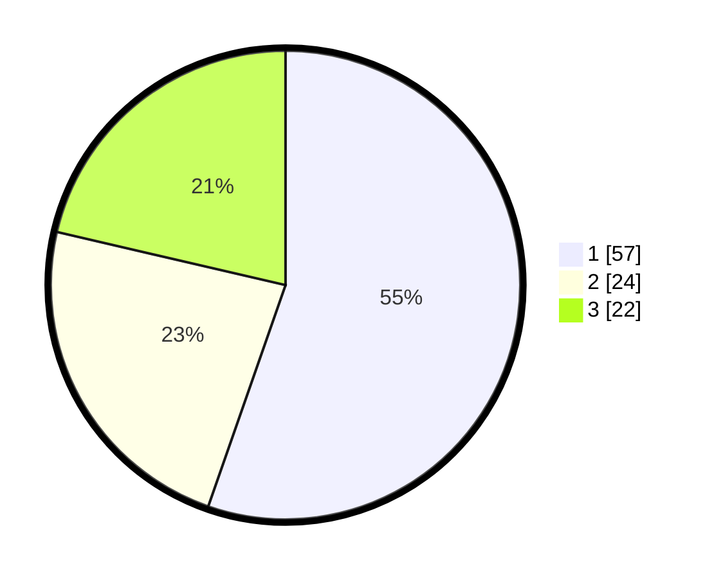

# Hasil

## Grafik

## Tabel

| No. | Nama Paslon    | Suara | Suara (raw) | Persentase |
|:--- |:-------------- | -----:| -----------:| ----------:|
| 1   | ANIES MUHAIMIN | 57    | [57][p-1]   | 55,34      |
| 2   | PRABOWO GIBRAN | 24    | [24][p-2]   | 23,30      |
| 3   | GANJAR MAHFUD  | 22    | [22][p-3]   | 21,36      |

[p-1]: https://github.com/gigit-pemilu/pemilu-2024/blob/main/pilpres/hitung-suara/sub/32-jawa-barat/sub/15-karawang/sub/22-jayakerta/sub/2006-medangasem/sub/008-tps/sub/paslon-1.txt
[p-2]: https://github.com/gigit-pemilu/pemilu-2024/blob/main/pilpres/hitung-suara/sub/32-jawa-barat/sub/15-karawang/sub/22-jayakerta/sub/2006-medangasem/sub/008-tps/sub/paslon-2.txt
[p-3]: https://github.com/gigit-pemilu/pemilu-2024/blob/main/pilpres/hitung-suara/sub/32-jawa-barat/sub/15-karawang/sub/22-jayakerta/sub/2006-medangasem/sub/008-tps/sub/paslon-3.txt

## Foto C Plano

https://sirekap-obj-formc.kpu.go.id/0fe0/pemilu/ppwp/32/15/22/20/06/3215222006008-20240220-215718--b1fcabc0-a6ab-4dd3-8581-f9202cc843fd.jpg

https://sirekap-obj-formc.kpu.go.id/0fe0/pemilu/ppwp/32/15/22/20/06/3215222006008-20240220-215829--c48442a5-bf3d-403a-8f88-9895d9a1b285.jpg

https://sirekap-obj-formc.kpu.go.id/0fe0/pemilu/ppwp/32/15/22/20/06/3215222006008-20240220-220142--54ab52cc-7e50-4e2e-99a1-49bca38ed8bd.jpg

## Metadata

| Key        | Value               |
| ---------- | ------------------- |
| Time Stamp | 2024-02-20 23:00:00 |

## DATA PEMILIH TETAP

Jumlah pemilih dalam DPT: **127**.
 * L: **853**.
 * P: **714**.

## DATA PENGGUNA HAK PILIH

Jumlah pengguna hak pilih dalam DPT: **204**.
 * L: **92**.
 * P: **205**.

Jumlah pengguna hak pilih dalam DPTb: **200**.
 * L: **0**.
 * P: **200**.

Jumlah pengguna hak pilih dalam DPK: **4**.
 * L: **201**.
 * P: **323**.

Jumlah pengguna hak pilih: **204**.
 * L: **835**.
 * P: **109**.

## JUMLAH SUARA SAH DAN TIDAK SAH

JUMLAH SELURUH SUARA SAH: **192**.

JUMLAH SUARA TIDAK SAH: **5**.

JUMLAH SELURUH SUARA SAH DAN SUARA TIDAK SAH: **208**.

