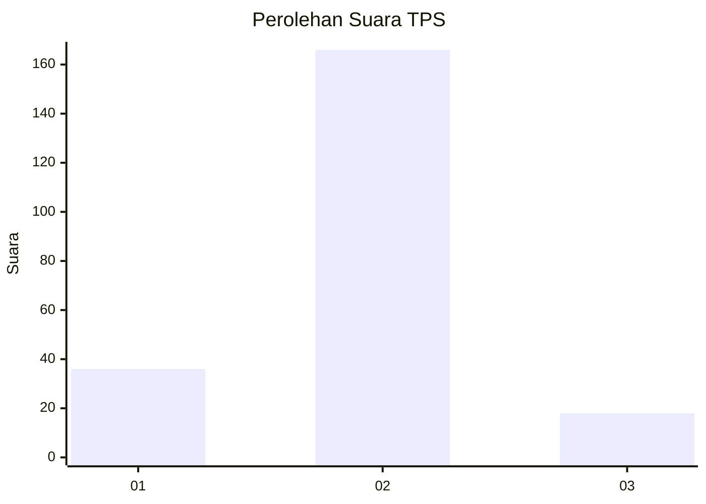
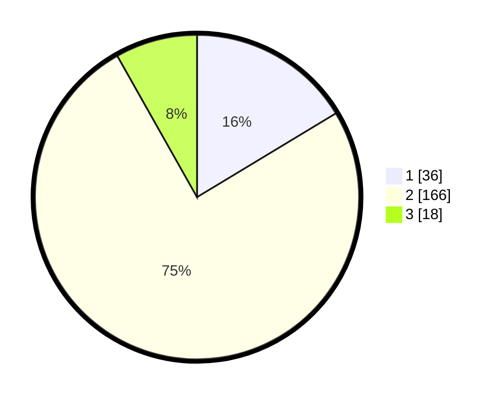

# Hasil

## Grafik

## Tabel

| No. | Nama Paslon    | Suara | Suara (raw) | Persentase |
|:--- |:-------------- | -----:| -----------:| ----------:|
| 1   | ANIES MUHAIMIN | 36    | [36][p-1]   | 16,36      |
| 2   | PRABOWO GIBRAN | 166   | [166][p-2]  | 75,45      |
| 3   | GANJAR MAHFUD  | 18    | [18][p-3]   | 8,18       |

[p-1]: https://github.com/gigit-pemilu/pemilu-2024-32-jawa-barat/blob/main/pilpres/hitung-suara/sub/32-jawa-barat/sub/15-karawang/sub/25-kota-baru/sub/2001-wancimekar/sub/001-tps/sub/paslon-1.txt
[p-2]: https://github.com/gigit-pemilu/pemilu-2024-32-jawa-barat/blob/main/pilpres/hitung-suara/sub/32-jawa-barat/sub/15-karawang/sub/25-kota-baru/sub/2001-wancimekar/sub/001-tps/sub/paslon-2.txt
[p-3]: https://github.com/gigit-pemilu/pemilu-2024-32-jawa-barat/blob/main/pilpres/hitung-suara/sub/32-jawa-barat/sub/15-karawang/sub/25-kota-baru/sub/2001-wancimekar/sub/001-tps/sub/paslon-3.txt

## Foto C Plano

https://sirekap-obj-formc.kpu.go.id/e294/pemilu/ppwp/32/15/25/20/01/3215252001001-20240226-172045--074d4993-c560-45d2-ab79-1ff55fb74c29.jpg

https://sirekap-obj-formc.kpu.go.id/e294/pemilu/ppwp/32/15/25/20/01/3215252001001-20240226-171731--f16a21da-97c0-4f7c-bf42-fd5d582f9fc3.jpg

https://sirekap-obj-formc.kpu.go.id/e294/pemilu/ppwp/32/15/25/20/01/3215252001001-20240226-172300--47dfb305-effd-4e39-be10-2cfc3db28b5a.jpg

## Metadata

| Key        | Value               |
| ---------- | ------------------- |
| Time Stamp | 2024-02-28 19:00:00 |

