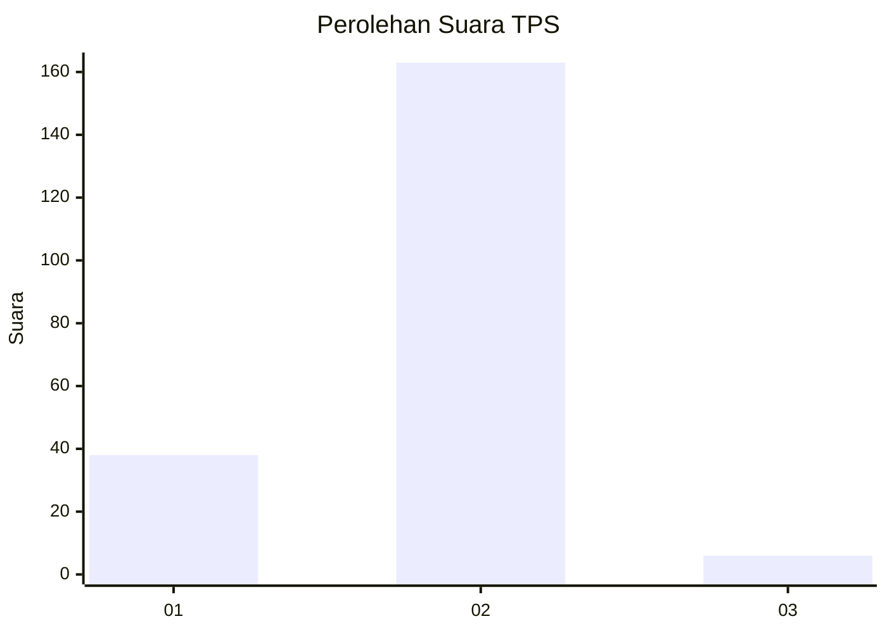
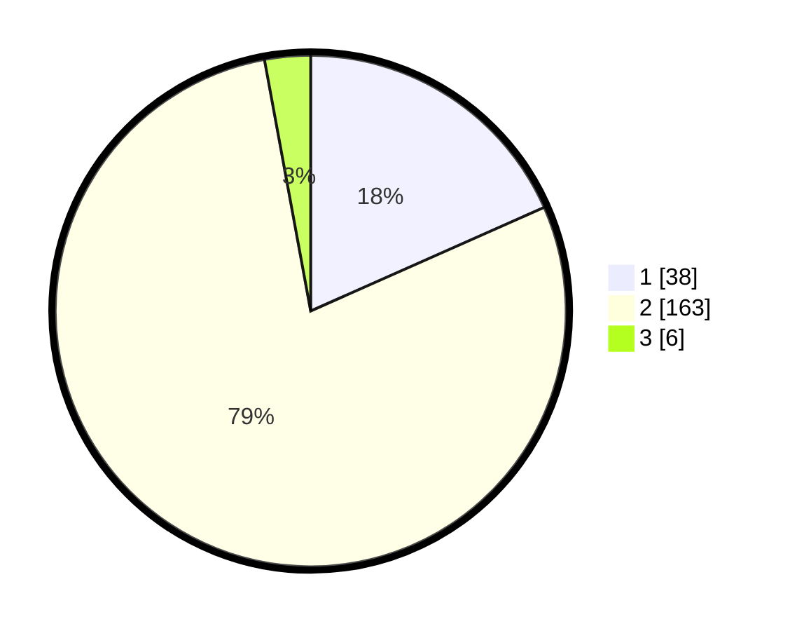

# Hasil

## Grafik

## Tabel

| No. | Nama Paslon    | Suara | Suara (raw) | Persentase |
|:--- |:-------------- | -----:| -----------:| ----------:|
| 1   | ANIES MUHAIMIN | 38    | [38][p-1]   | 18,36      |
| 2   | PRABOWO GIBRAN | 163   | [163][p-2]  | 78,74      |
| 3   | GANJAR MAHFUD  | 6     | [6][p-3]    | 2,90       |

[p-1]: https://github.com/gigit-pemilu/pemilu-2024-32-jawa-barat/blob/main/pilpres/hitung-suara/sub/32-jawa-barat/sub/15-karawang/sub/25-kota-baru/sub/2001-wancimekar/sub/005-tps/sub/paslon-1.txt
[p-2]: https://github.com/gigit-pemilu/pemilu-2024-32-jawa-barat/blob/main/pilpres/hitung-suara/sub/32-jawa-barat/sub/15-karawang/sub/25-kota-baru/sub/2001-wancimekar/sub/005-tps/sub/paslon-2.txt
[p-3]: https://github.com/gigit-pemilu/pemilu-2024-32-jawa-barat/blob/main/pilpres/hitung-suara/sub/32-jawa-barat/sub/15-karawang/sub/25-kota-baru/sub/2001-wancimekar/sub/005-tps/sub/paslon-3.txt

## Foto C Plano

https://sirekap-obj-formc.kpu.go.id/c8ce/pemilu/ppwp/32/15/25/20/01/3215252001005-20240219-211755--c0fe7413-7186-4675-ad59-9ca6a6f32bf9.jpg

https://sirekap-obj-formc.kpu.go.id/c8ce/pemilu/ppwp/32/15/25/20/01/3215252001005-20240219-211844--08ff113f-909a-42bf-9339-854c3b671ab5.jpg

https://sirekap-obj-formc.kpu.go.id/c8ce/pemilu/ppwp/32/15/25/20/01/3215252001005-20240219-213437--cc2d0be2-ae0f-4f10-ba97-3027c2dbf5a2.jpg

## Metadata

| Key        | Value               |
| ---------- | ------------------- |
| Time Stamp | 2024-02-20 12:00:00 |

