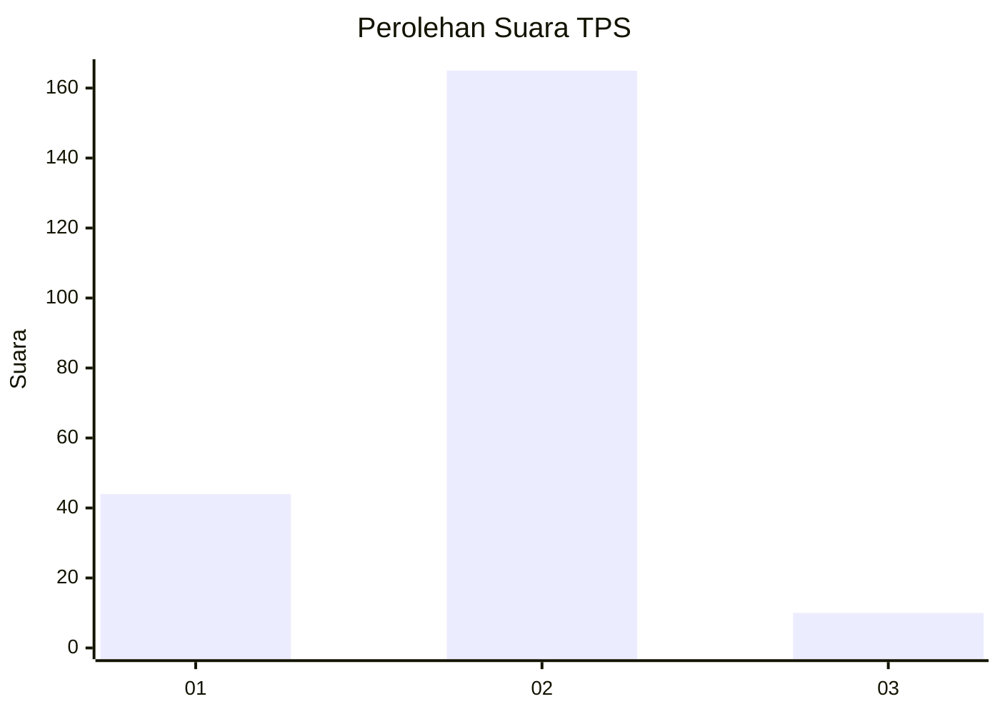
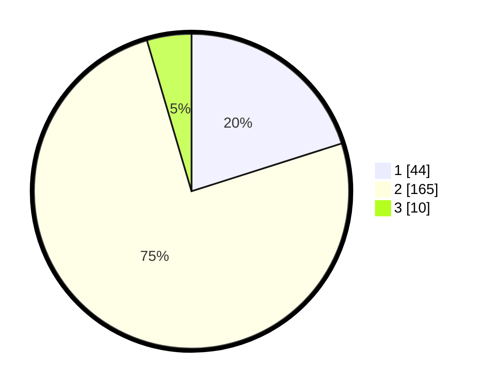

# Hasil

## Grafik

## Tabel

| No. | Nama Paslon    | Suara | Suara (raw) | Persentase |
|:--- |:-------------- | -----:| -----------:| ----------:|
| 1   | ANIES MUHAIMIN | 44    | [44][p-1]   | 20,09      |
| 2   | PRABOWO GIBRAN | 165   | [165][p-2]  | 75,34      |
| 3   | GANJAR MAHFUD  | 10    | [10][p-3]   | 4,57       |

[p-1]: https://github.com/gigit-pemilu/pemilu-2024-32-jawa-barat/blob/main/pilpres/hitung-suara/sub/32-jawa-barat/sub/15-karawang/sub/25-kota-baru/sub/2001-wancimekar/sub/006-tps/sub/paslon-1.txt
[p-2]: https://github.com/gigit-pemilu/pemilu-2024-32-jawa-barat/blob/main/pilpres/hitung-suara/sub/32-jawa-barat/sub/15-karawang/sub/25-kota-baru/sub/2001-wancimekar/sub/006-tps/sub/paslon-2.txt
[p-3]: https://github.com/gigit-pemilu/pemilu-2024-32-jawa-barat/blob/main/pilpres/hitung-suara/sub/32-jawa-barat/sub/15-karawang/sub/25-kota-baru/sub/2001-wancimekar/sub/006-tps/sub/paslon-3.txt

## Foto C Plano

https://sirekap-obj-formc.kpu.go.id/229c/pemilu/ppwp/32/15/25/20/01/3215252001006-20240220-084846--6da2c1d1-e140-4784-b0a7-e3a5ec97cc29.jpg

https://sirekap-obj-formc.kpu.go.id/229c/pemilu/ppwp/32/15/25/20/01/3215252001006-20240220-084938--fb333e57-3aae-48d2-9e32-0e0b214afd6d.jpg

https://sirekap-obj-formc.kpu.go.id/229c/pemilu/ppwp/32/15/25/20/01/3215252001006-20240220-085053--7abe1e96-52b4-413e-9600-0470293e7daf.jpg

## Metadata

| Key        | Value               |
| ---------- | ------------------- |
| Time Stamp | 2024-02-20 10:00:00 |

