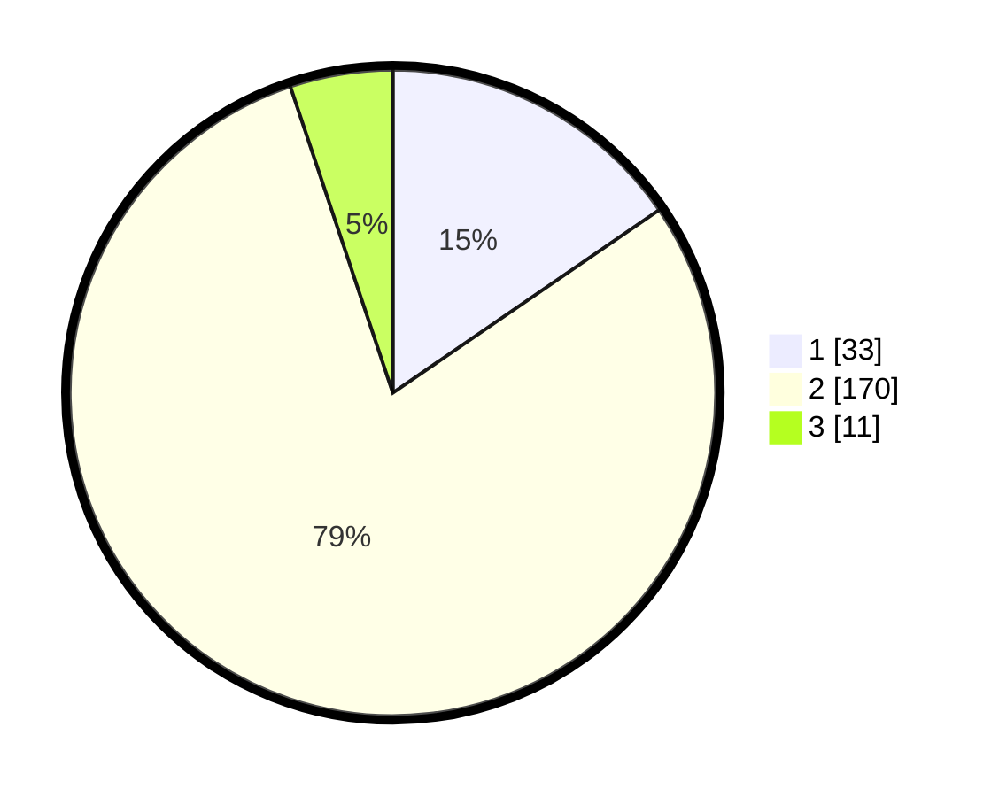

# Hasil

## Grafik

## Tabel

| No. | Nama Paslon    | Suara | Suara (raw) | Persentase |
|:--- |:-------------- | -----:| -----------:| ----------:|
| 1   | ANIES MUHAIMIN | 33    | [33][p-1]   | 15,42      |
| 2   | PRABOWO GIBRAN | 170   | [170][p-2]  | 79,44      |
| 3   | GANJAR MAHFUD  | 11    | [11][p-3]   | 5,14       |

[p-1]: https://github.com/gigit-pemilu/pemilu-2024-32-jawa-barat/blob/main/pilpres/hitung-suara/sub/32-jawa-barat/sub/15-karawang/sub/25-kota-baru/sub/2001-wancimekar/sub/009-tps/sub/paslon-1.txt
[p-2]: https://github.com/gigit-pemilu/pemilu-2024-32-jawa-barat/blob/main/pilpres/hitung-suara/sub/32-jawa-barat/sub/15-karawang/sub/25-kota-baru/sub/2001-wancimekar/sub/009-tps/sub/paslon-2.txt
[p-3]: https://github.com/gigit-pemilu/pemilu-2024-32-jawa-barat/blob/main/pilpres/hitung-suara/sub/32-jawa-barat/sub/15-karawang/sub/25-kota-baru/sub/2001-wancimekar/sub/009-tps/sub/paslon-3.txt

## Foto C Plano

https://sirekap-obj-formc.kpu.go.id/e660/pemilu/ppwp/32/15/25/20/01/3215252001009-20240215-044224--7b93ba3b-fbd4-4da1-b216-4cdc00932399.jpg

https://sirekap-obj-formc.kpu.go.id/e660/pemilu/ppwp/32/15/25/20/01/3215252001009-20240215-044156--99e0ef32-5b70-4a2b-8bbf-75fd6dd06875.jpg

https://sirekap-obj-formc.kpu.go.id/e660/pemilu/ppwp/32/15/25/20/01/3215252001009-20240215-044058--e7f89cf1-0e51-457f-8be5-13c87b280b50.jpg

## Metadata

| Key        | Value               |
| ---------- | ------------------- |
| Time Stamp | 2024-02-17 14:45:18 |

