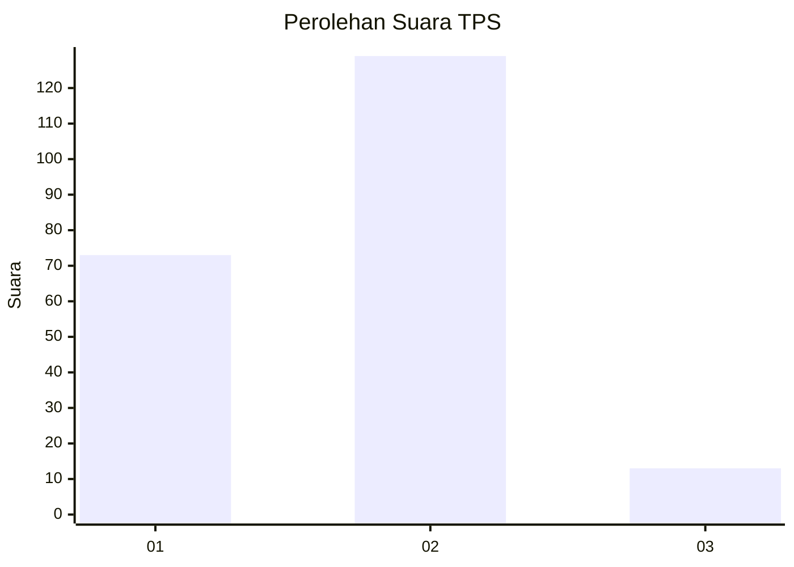
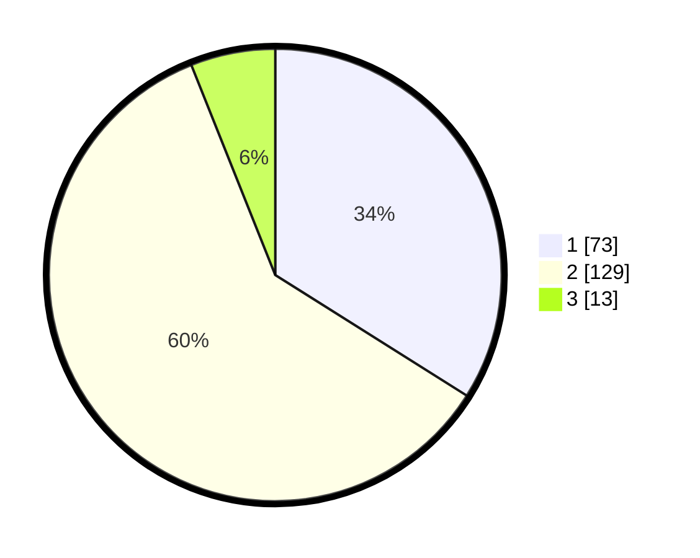

# Hasil

## Grafik

## Tabel

| No. | Nama Paslon    | Suara | Suara (raw) | Persentase |
|:--- |:-------------- | -----:| -----------:| ----------:|
| 1   | ANIES MUHAIMIN | 73    | [73][p-1]   | 33,95      |
| 2   | PRABOWO GIBRAN | 129   | [129][p-2]  | 60,00      |
| 3   | GANJAR MAHFUD  | 13    | [13][p-3]   | 6,05       |

[p-1]: https://github.com/gigit-pemilu/pemilu-2024/blob/main/pilpres/hitung-suara/sub/32-jawa-barat/sub/15-karawang/sub/25-kota-baru/sub/2001-wancimekar/sub/044-tps/sub/paslon-1.txt
[p-2]: https://github.com/gigit-pemilu/pemilu-2024/blob/main/pilpres/hitung-suara/sub/32-jawa-barat/sub/15-karawang/sub/25-kota-baru/sub/2001-wancimekar/sub/044-tps/sub/paslon-2.txt
[p-3]: https://github.com/gigit-pemilu/pemilu-2024/blob/main/pilpres/hitung-suara/sub/32-jawa-barat/sub/15-karawang/sub/25-kota-baru/sub/2001-wancimekar/sub/044-tps/sub/paslon-3.txt

## Foto C Plano

https://sirekap-obj-formc.kpu.go.id/580b/pemilu/ppwp/32/15/25/20/01/3215252001044-20240226-191459--3daad839-3cd3-4c36-869e-88dfd45e86bc.jpg

https://sirekap-obj-formc.kpu.go.id/580b/pemilu/ppwp/32/15/25/20/01/3215252001044-20240226-191540--656463c6-8db0-4643-9e68-f5ae634fae68.jpg

https://sirekap-obj-formc.kpu.go.id/580b/pemilu/ppwp/32/15/25/20/01/3215252001044-20240226-191615--6a2c75c7-e62d-4ab7-932e-6407ce297b32.jpg

## Metadata

| Key        | Value               |
| ---------- | ------------------- |
| Time Stamp | 2024-02-26 20:00:00 |

## DATA PEMILIH TETAP

Jumlah pemilih dalam DPT: **777**.
 * L: **144**.
 * P: **634**.

## DATA PENGGUNA HAK PILIH

Jumlah pengguna hak pilih dalam DPT: **277**.
 * L: **110**.
 * P: **99**.

Jumlah pengguna hak pilih dalam DPTb: **77**.
 * L: **0**.
 * P: **0**.

Jumlah pengguna hak pilih dalam DPK: **777**.
 * L: **5**.
 * P: **7**.

Jumlah pengguna hak pilih: **444**.
 * L: **115**.
 * P: **144**.

## JUMLAH SUARA SAH DAN TIDAK SAH

JUMLAH SELURUH SUARA SAH: **15**.

JUMLAH SUARA TIDAK SAH: **777**.

JUMLAH SELURUH SUARA SAH DAN SUARA TIDAK SAH: **757**.

