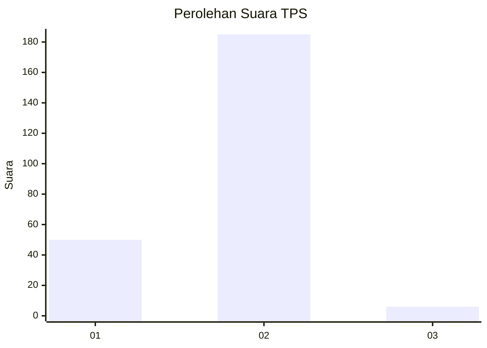
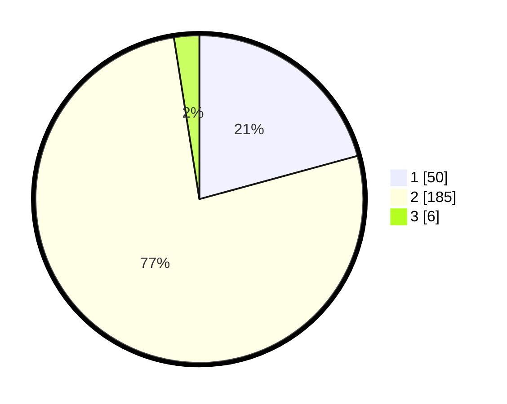

# Hasil

## Grafik

## Tabel

| No. | Nama Paslon    | Suara | Suara (raw) | Persentase |
|:--- |:-------------- | -----:| -----------:| ----------:|
| 1   | ANIES MUHAIMIN | 50    | [50][p-1]   | 20,75      |
| 2   | PRABOWO GIBRAN | 185   | [185][p-2]  | 76,76      |
| 3   | GANJAR MAHFUD  | 6     | [6][p-3]    | 2,49       |

[p-1]: https://github.com/gigit-pemilu/pemilu-2024/blob/main/pilpres/hitung-suara/sub/32-jawa-barat/sub/15-karawang/sub/25-kota-baru/sub/2002-pangulah-selatan/sub/008-tps/sub/paslon-1.txt
[p-2]: https://github.com/gigit-pemilu/pemilu-2024/blob/main/pilpres/hitung-suara/sub/32-jawa-barat/sub/15-karawang/sub/25-kota-baru/sub/2002-pangulah-selatan/sub/008-tps/sub/paslon-2.txt
[p-3]: https://github.com/gigit-pemilu/pemilu-2024/blob/main/pilpres/hitung-suara/sub/32-jawa-barat/sub/15-karawang/sub/25-kota-baru/sub/2002-pangulah-selatan/sub/008-tps/sub/paslon-3.txt

## Foto C Plano

https://sirekap-obj-formc.kpu.go.id/8030/pemilu/ppwp/32/15/25/20/02/3215252002008-20240215-025058--15a73c32-285d-40c3-83a0-5aec22f16346.jpg

https://sirekap-obj-formc.kpu.go.id/8030/pemilu/ppwp/32/15/25/20/02/3215252002008-20240215-025158--7bd56e4f-8775-47b7-b88b-e58e8ffd9a88.jpg

https://sirekap-obj-formc.kpu.go.id/8030/pemilu/ppwp/32/15/25/20/02/3215252002008-20240215-025255--7d2ab589-dec6-4f29-8b1d-50ee2611c9e0.jpg

## Metadata

| Key        | Value               |
| ---------- | ------------------- |
| Time Stamp | 2024-02-16 06:30:27 |

## DATA PEMILIH TETAP

Jumlah pemilih dalam DPT: **770**.
 * L: **50**.
 * P: **5**.

## DATA PENGGUNA HAK PILIH

Jumlah pengguna hak pilih dalam DPT: **751**.
 * L: **0**.
 * P: **7**.

Jumlah pengguna hak pilih dalam DPTb: **0**.
 * L: **77**.
 * P: **770**.

Jumlah pengguna hak pilih dalam DPK: **0**.
 * L: **700**.
 * P: **0**.

Jumlah pengguna hak pilih: **74**.
 * L: **711**.
 * P: **117**.

## JUMLAH SUARA SAH DAN TIDAK SAH

JUMLAH SELURUH SUARA SAH: **241**.

JUMLAH SUARA TIDAK SAH: **0**.

JUMLAH SELURUH SUARA SAH DAN SUARA TIDAK SAH: **241**.

