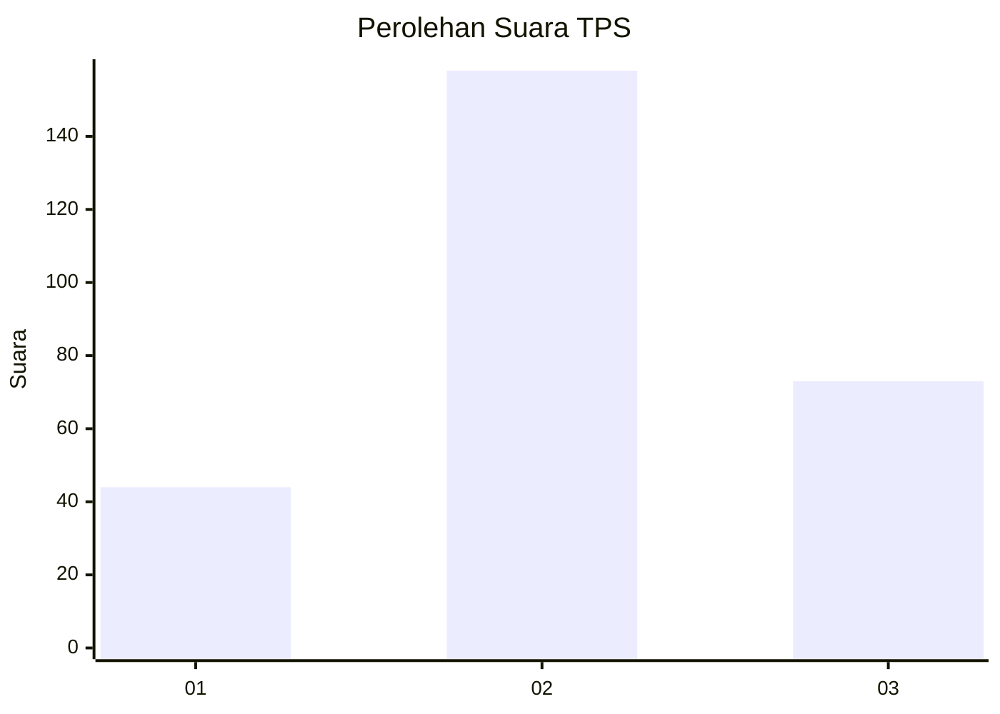
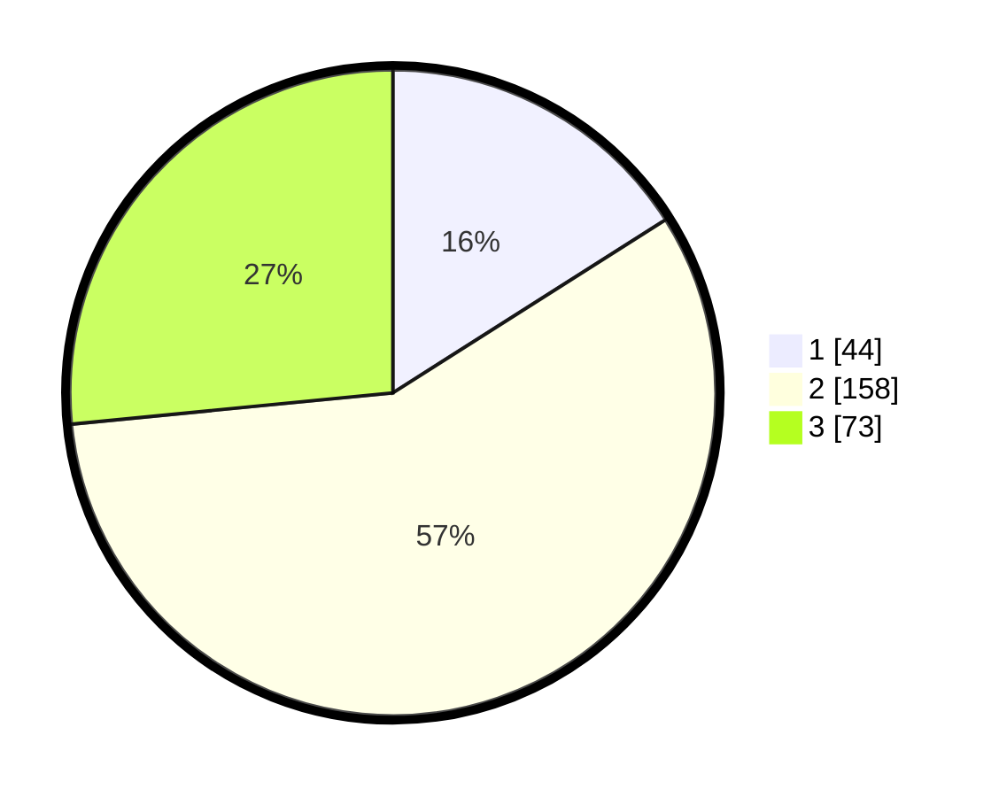

# Hasil

## Grafik

## Tabel

| No. | Nama Paslon    | Suara | Suara (raw) | Persentase |
|:--- |:-------------- | -----:| -----------:| ----------:|
| 1   | ANIES MUHAIMIN | 44    | [44][p-1]   | 16,00      |
| 2   | PRABOWO GIBRAN | 158   | [158][p-2]  | 57,45      |
| 3   | GANJAR MAHFUD  | 73    | [73][p-3]   | 26,55      |

[p-1]: https://github.com/gigit-pemilu/pemilu-2024/blob/main/pilpres/hitung-suara/sub/32-jawa-barat/sub/15-karawang/sub/25-kota-baru/sub/2005-pucung/sub/032-tps/sub/paslon-1.txt
[p-2]: https://github.com/gigit-pemilu/pemilu-2024/blob/main/pilpres/hitung-suara/sub/32-jawa-barat/sub/15-karawang/sub/25-kota-baru/sub/2005-pucung/sub/032-tps/sub/paslon-2.txt
[p-3]: https://github.com/gigit-pemilu/pemilu-2024/blob/main/pilpres/hitung-suara/sub/32-jawa-barat/sub/15-karawang/sub/25-kota-baru/sub/2005-pucung/sub/032-tps/sub/paslon-3.txt

## Foto C Plano

https://sirekap-obj-formc.kpu.go.id/320f/pemilu/ppwp/32/15/25/20/05/3215252005032-20240214-213015--58a9eb78-3b25-4723-8a9a-898661c6ea3c.jpg

https://sirekap-obj-formc.kpu.go.id/320f/pemilu/ppwp/32/15/25/20/05/3215252005032-20240214-213020--7046223f-b0f1-498c-9b29-8e99513f2bb6.jpg

https://sirekap-obj-formc.kpu.go.id/320f/pemilu/ppwp/32/15/25/20/05/3215252005032-20240214-213025--da2e3221-a693-4b8f-820c-16649f6d474d.jpg

## Metadata

| Key        | Value               |
| ---------- | ------------------- |
| Time Stamp | 2024-02-15 15:00:29 |

