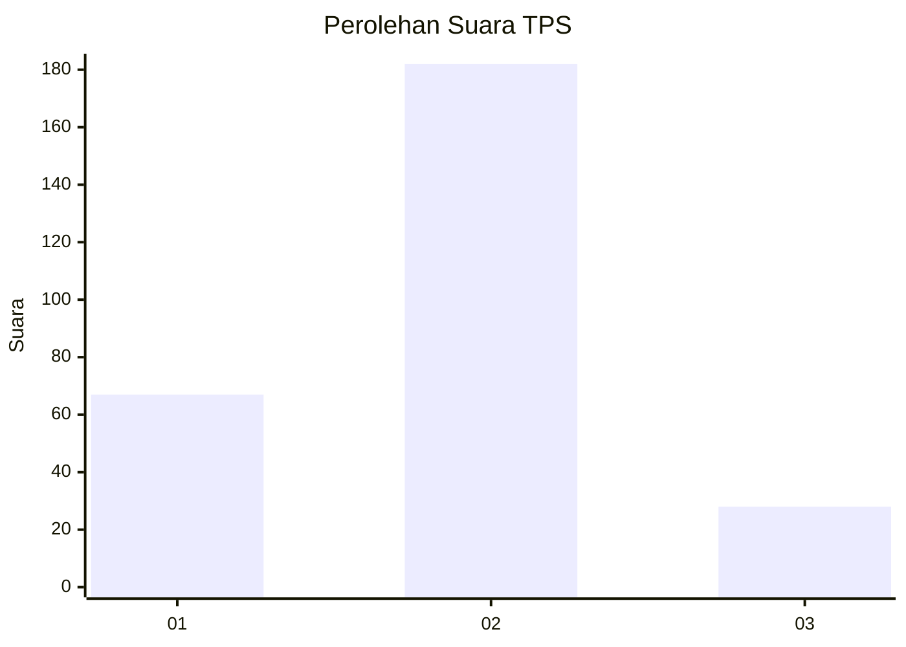

# Hasil

## Grafik

## Tabel

| No. | Nama Paslon    | Suara | Suara (raw) | Persentase |
|:--- |:-------------- | -----:| -----------:| ----------:|
| 1   | ANIES MUHAIMIN | 67    | [67][p-1]   | 24,19      |
| 2   | PRABOWO GIBRAN | 182   | [182][p-2]  | 65,70      |
| 3   | GANJAR MAHFUD  | 28    | [28][p-3]   | 10,11      |

[p-1]: https://github.com/gigit-pemilu/pemilu-2024/blob/main/pilpres/hitung-suara/sub/32-jawa-barat/sub/15-karawang/sub/25-kota-baru/sub/2005-pucung/sub/033-tps/sub/paslon-1.txt
[p-2]: https://github.com/gigit-pemilu/pemilu-2024/blob/main/pilpres/hitung-suara/sub/32-jawa-barat/sub/15-karawang/sub/25-kota-baru/sub/2005-pucung/sub/033-tps/sub/paslon-2.txt
[p-3]: https://github.com/gigit-pemilu/pemilu-2024/blob/main/pilpres/hitung-suara/sub/32-jawa-barat/sub/15-karawang/sub/25-kota-baru/sub/2005-pucung/sub/033-tps/sub/paslon-3.txt

## Foto C Plano

https://sirekap-obj-formc.kpu.go.id/e147/pemilu/ppwp/32/15/25/20/05/3215252005033-20240214-212859--7d637bbb-62fd-4abd-b259-a5b35aa058a9.jpg

https://sirekap-obj-formc.kpu.go.id/e147/pemilu/ppwp/32/15/25/20/05/3215252005033-20240214-193011--7ae2c9cc-b821-4bd1-8655-c013c4327001.jpg

https://sirekap-obj-formc.kpu.go.id/e147/pemilu/ppwp/32/15/25/20/05/3215252005033-20240214-193115--c86153b9-8676-4620-900a-de8f9ded7d49.jpg

## Metadata

| Key        | Value               |
| ---------- | ------------------- |
| Time Stamp | 2024-02-17 14:45:18 |

