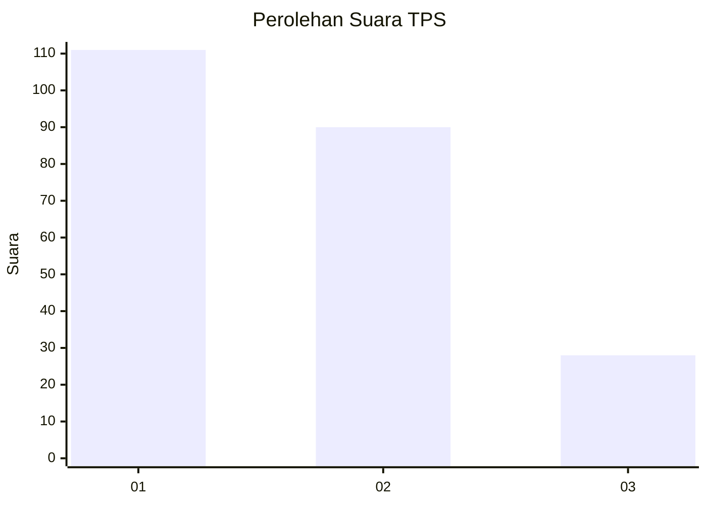
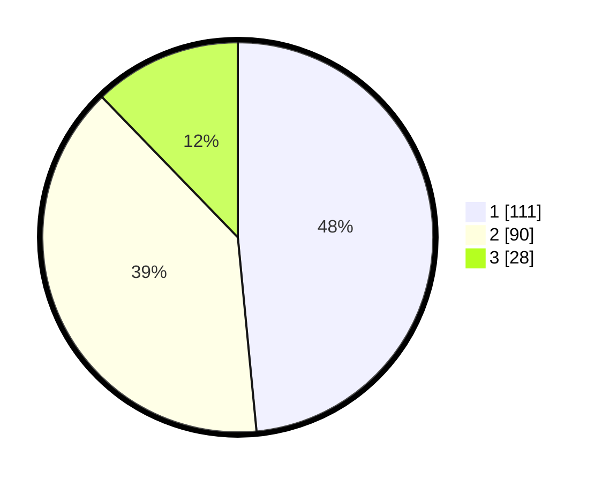

# Hasil

## Grafik

## Tabel

| No. | Nama Paslon    | Suara | Suara (raw) | Persentase |
|:--- |:-------------- | -----:| -----------:| ----------:|
| 1   | ANIES MUHAIMIN | 111   | [111][p-1]  | 48,47      |
| 2   | PRABOWO GIBRAN | 90    | [90][p-2]   | 39,30      |
| 3   | GANJAR MAHFUD  | 28    | [28][p-3]   | 12,23      |

[p-1]: https://github.com/gigit-pemilu/pemilu-2024/blob/main/pilpres/hitung-suara/sub/32-jawa-barat/sub/15-karawang/sub/25-kota-baru/sub/2007-jomin-barat/sub/023-tps/sub/paslon-1.txt
[p-2]: https://github.com/gigit-pemilu/pemilu-2024/blob/main/pilpres/hitung-suara/sub/32-jawa-barat/sub/15-karawang/sub/25-kota-baru/sub/2007-jomin-barat/sub/023-tps/sub/paslon-2.txt
[p-3]: https://github.com/gigit-pemilu/pemilu-2024/blob/main/pilpres/hitung-suara/sub/32-jawa-barat/sub/15-karawang/sub/25-kota-baru/sub/2007-jomin-barat/sub/023-tps/sub/paslon-3.txt

## Foto C Plano

https://sirekap-obj-formc.kpu.go.id/b973/pemilu/ppwp/32/15/25/20/07/3215252007023-20240226-224410--7b9f05f1-0e9d-48e5-b960-76fe5503bdb6.jpg

https://sirekap-obj-formc.kpu.go.id/b973/pemilu/ppwp/32/15/25/20/07/3215252007023-20240226-224514--30654793-7886-4ab7-91e7-59449af44cd5.jpg

https://sirekap-obj-formc.kpu.go.id/b973/pemilu/ppwp/32/15/25/20/07/3215252007023-20240226-224728--3af9e7d1-5ed0-4eee-a4d6-e0ac8f205966.jpg

## Metadata

| Key        | Value               |
| ---------- | ------------------- |
| Time Stamp | 2024-02-27 22:00:00 |

## DATA PEMILIH TETAP

Jumlah pemilih dalam DPT: **267**.
 * L: **525**.
 * P: **138**.

## DATA PENGGUNA HAK PILIH

Jumlah pengguna hak pilih dalam DPT: **162**.
 * L: **27**.
 * P: **51**.

Jumlah pengguna hak pilih dalam DPTb: **570**.
 * L: **555**.
 * P: **555**.

Jumlah pengguna hak pilih dalam DPK: **4**.
 * L: **60**.
 * P: **656**.

Jumlah pengguna hak pilih: **235**.
 * L: **170**.
 * P: **125**.

## JUMLAH SUARA SAH DAN TIDAK SAH

JUMLAH SELURUH SUARA SAH: **229**.

JUMLAH SUARA TIDAK SAH: **6**.

JUMLAH SELURUH SUARA SAH DAN SUARA TIDAK SAH: **235**.

