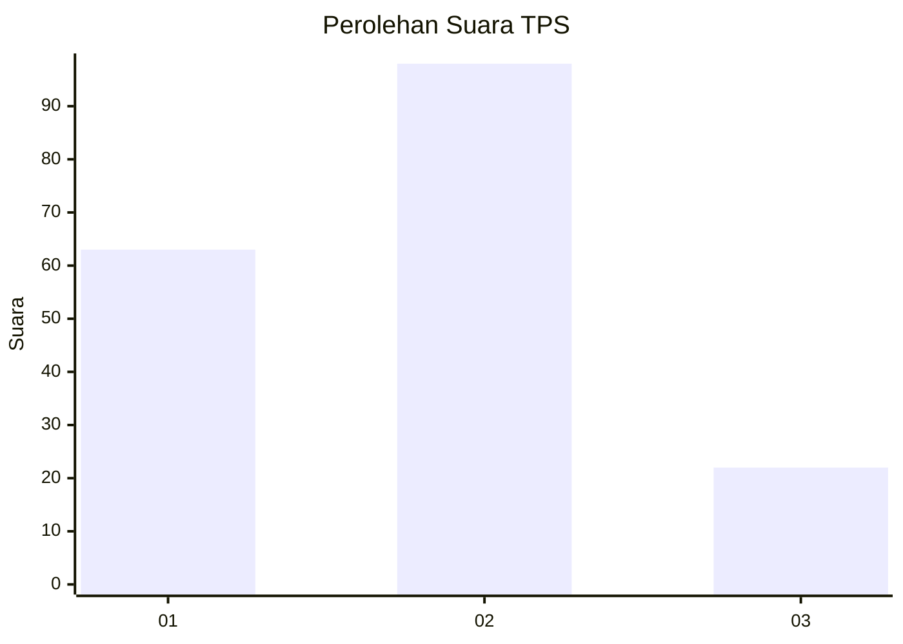
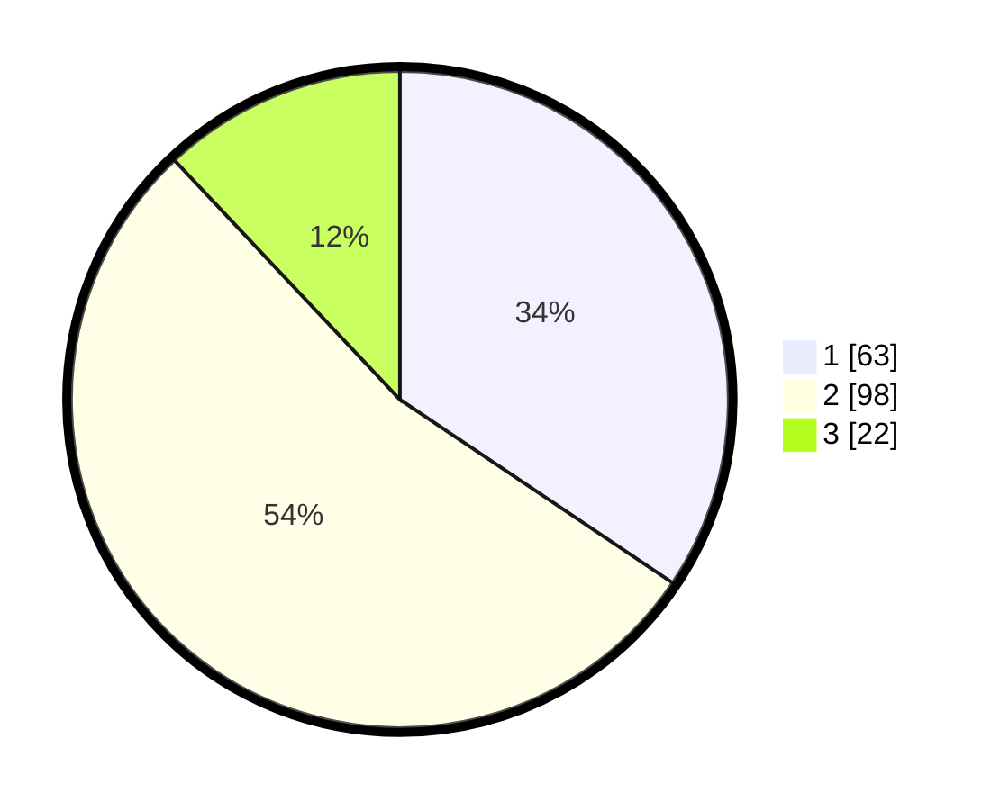

# Hasil

## Grafik

## Tabel

| No. | Nama Paslon    | Suara | Suara (raw) | Persentase |
|:--- |:-------------- | -----:| -----------:| ----------:|
| 1   | ANIES MUHAIMIN | 63    | [63][p-1]   | 34,43      |
| 2   | PRABOWO GIBRAN | 98    | [98][p-2]   | 53,55      |
| 3   | GANJAR MAHFUD  | 22    | [22][p-3]   | 12,02      |

[p-1]: https://github.com/gigit-pemilu/pemilu-2024-32-jawa-barat/blob/main/pilpres/hitung-suara/sub/32-jawa-barat/sub/15-karawang/sub/26-karawang-timur/sub/1001-karawang-wetan/sub/007-tps/sub/paslon-1.txt
[p-2]: https://github.com/gigit-pemilu/pemilu-2024-32-jawa-barat/blob/main/pilpres/hitung-suara/sub/32-jawa-barat/sub/15-karawang/sub/26-karawang-timur/sub/1001-karawang-wetan/sub/007-tps/sub/paslon-2.txt
[p-3]: https://github.com/gigit-pemilu/pemilu-2024-32-jawa-barat/blob/main/pilpres/hitung-suara/sub/32-jawa-barat/sub/15-karawang/sub/26-karawang-timur/sub/1001-karawang-wetan/sub/007-tps/sub/paslon-3.txt

## Foto C Plano

https://sirekap-obj-formc.kpu.go.id/9c37/pemilu/ppwp/32/15/26/10/01/3215261001007-20240214-221558--1bf13ce4-1942-4808-9bf2-b5bc32b5741e.jpg

https://sirekap-obj-formc.kpu.go.id/9c37/pemilu/ppwp/32/15/26/10/01/3215261001007-20240214-220845--b2124685-e469-41f8-bae9-a8dd08a7497b.jpg

https://sirekap-obj-formc.kpu.go.id/9c37/pemilu/ppwp/32/15/26/10/01/3215261001007-20240214-220854--d0531600-4708-43ec-8849-c925c54bee33.jpg

## Metadata

| Key        | Value               |
| ---------- | ------------------- |
| Time Stamp | 2024-02-17 13:37:34 |

