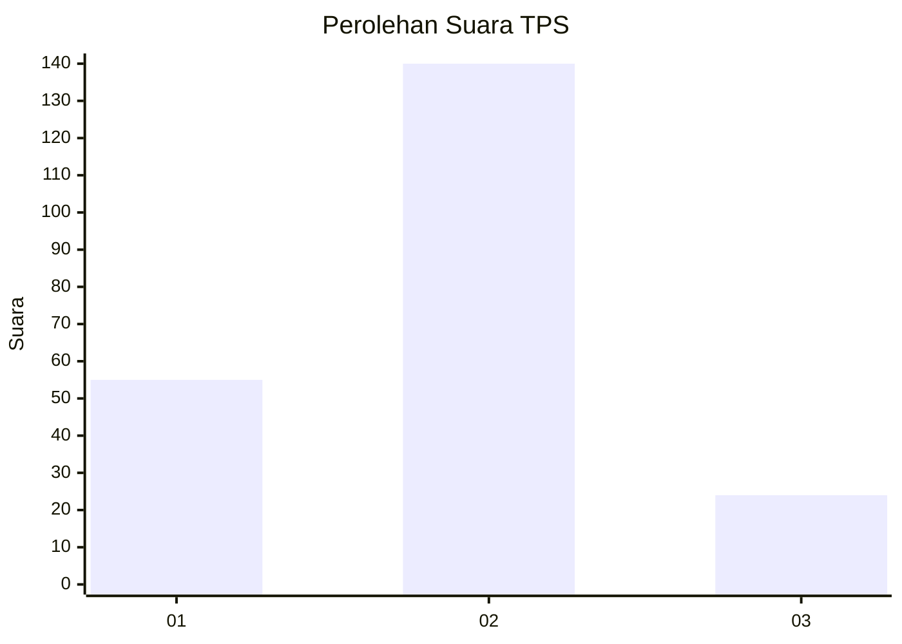
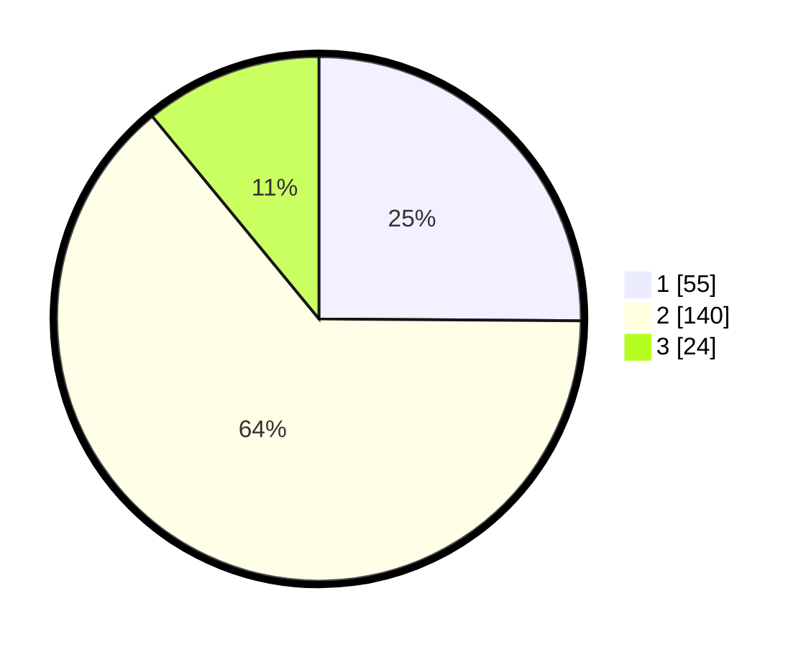

# Hasil

## Grafik

## Tabel

| No. | Nama Paslon    | Suara | Suara (raw) | Persentase |
|:--- |:-------------- | -----:| -----------:| ----------:|
| 1   | ANIES MUHAIMIN | 55    | [55][p-1]   | 25,11      |
| 2   | PRABOWO GIBRAN | 140   | [140][p-2]  | 63,93      |
| 3   | GANJAR MAHFUD  | 24    | [24][p-3]   | 10,96      |

[p-1]: https://github.com/gigit-pemilu/pemilu-2024-32-jawa-barat/blob/main/pilpres/hitung-suara/sub/32-jawa-barat/sub/15-karawang/sub/26-karawang-timur/sub/1001-karawang-wetan/sub/018-tps/sub/paslon-1.txt
[p-2]: https://github.com/gigit-pemilu/pemilu-2024-32-jawa-barat/blob/main/pilpres/hitung-suara/sub/32-jawa-barat/sub/15-karawang/sub/26-karawang-timur/sub/1001-karawang-wetan/sub/018-tps/sub/paslon-2.txt
[p-3]: https://github.com/gigit-pemilu/pemilu-2024-32-jawa-barat/blob/main/pilpres/hitung-suara/sub/32-jawa-barat/sub/15-karawang/sub/26-karawang-timur/sub/1001-karawang-wetan/sub/018-tps/sub/paslon-3.txt

## Foto C Plano

https://sirekap-obj-formc.kpu.go.id/296f/pemilu/ppwp/32/15/26/10/01/3215261001018-20240220-045809--1f43bcaf-8a7c-475a-992a-14c32d3b4b7b.jpg

https://sirekap-obj-formc.kpu.go.id/296f/pemilu/ppwp/32/15/26/10/01/3215261001018-20240220-045911--db2cfcb0-dc4a-48b6-98c7-635a23652ecf.jpg

https://sirekap-obj-formc.kpu.go.id/296f/pemilu/ppwp/32/15/26/10/01/3215261001018-20240214-222736--229bb332-2e14-4dce-bb3e-804d6d32f2a6.jpg

## Metadata

| Key        | Value               |
| ---------- | ------------------- |
| Time Stamp | 2024-02-20 12:00:00 |

