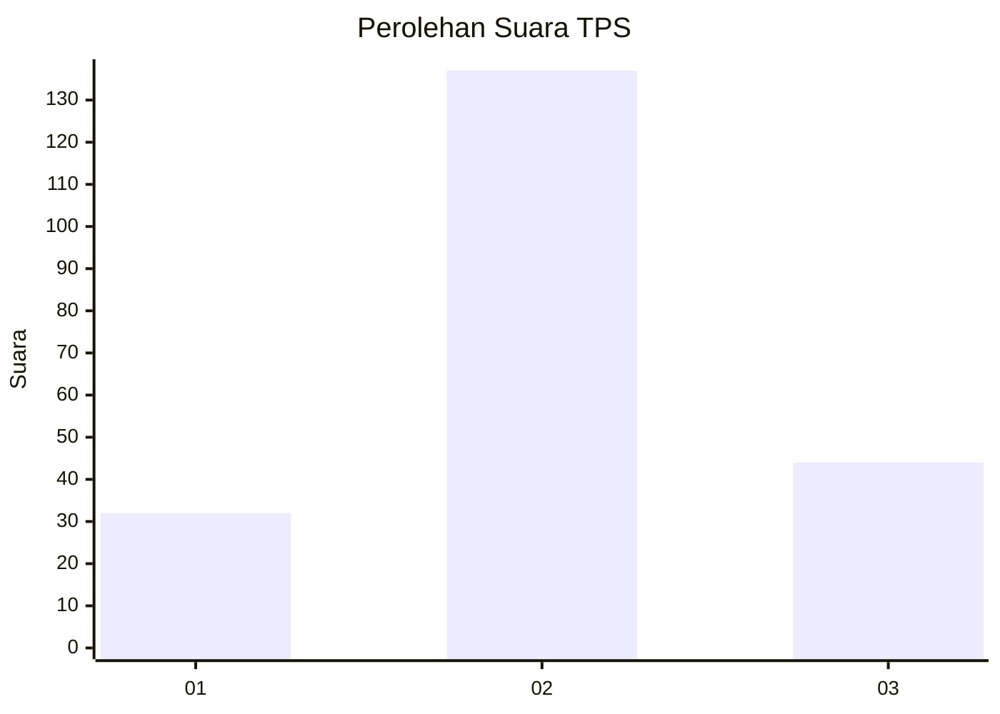
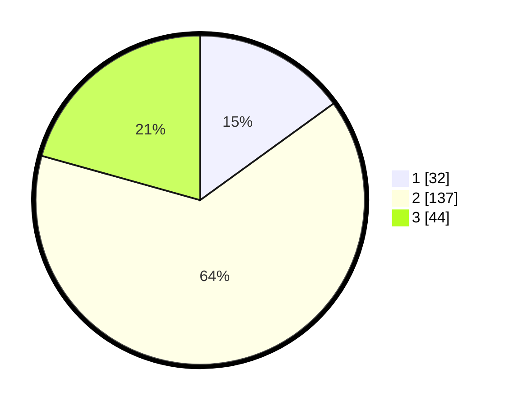

# Hasil

## Grafik

## Tabel

| No. | Nama Paslon    | Suara | Suara (raw) | Persentase |
|:--- |:-------------- | -----:| -----------:| ----------:|
| 1   | ANIES MUHAIMIN | 32    | [32][p-1]   | 15,02      |
| 2   | PRABOWO GIBRAN | 137   | [137][p-2]  | 64,32      |
| 3   | GANJAR MAHFUD  | 44    | [44][p-3]   | 20,66      |

[p-1]: https://github.com/gigit-pemilu/pemilu-2024-32-jawa-barat/blob/main/pilpres/hitung-suara/sub/32-jawa-barat/sub/15-karawang/sub/26-karawang-timur/sub/1001-karawang-wetan/sub/019-tps/sub/paslon-1.txt
[p-2]: https://github.com/gigit-pemilu/pemilu-2024-32-jawa-barat/blob/main/pilpres/hitung-suara/sub/32-jawa-barat/sub/15-karawang/sub/26-karawang-timur/sub/1001-karawang-wetan/sub/019-tps/sub/paslon-2.txt
[p-3]: https://github.com/gigit-pemilu/pemilu-2024-32-jawa-barat/blob/main/pilpres/hitung-suara/sub/32-jawa-barat/sub/15-karawang/sub/26-karawang-timur/sub/1001-karawang-wetan/sub/019-tps/sub/paslon-3.txt

## Foto C Plano

https://sirekap-obj-formc.kpu.go.id/75f6/pemilu/ppwp/32/15/26/10/01/3215261001019-20240214-200358--50d9fd5a-62c1-4ca8-9f66-c628d2c48538.jpg

https://sirekap-obj-formc.kpu.go.id/75f6/pemilu/ppwp/32/15/26/10/01/3215261001019-20240214-202920--77b9fc24-3e4a-45a9-ba8e-9a6e621d9c6f.jpg

https://sirekap-obj-formc.kpu.go.id/75f6/pemilu/ppwp/32/15/26/10/01/3215261001019-20240214-201353--3ce132b0-647b-4a51-be56-2a6afc635db6.jpg

## Metadata

| Key        | Value               |
| ---------- | ------------------- |
| Time Stamp | 2024-02-17 13:37:34 |

