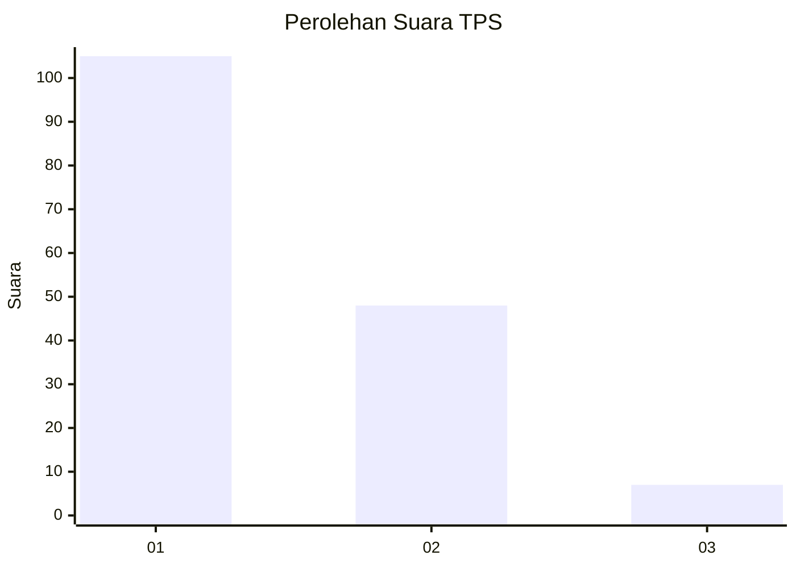
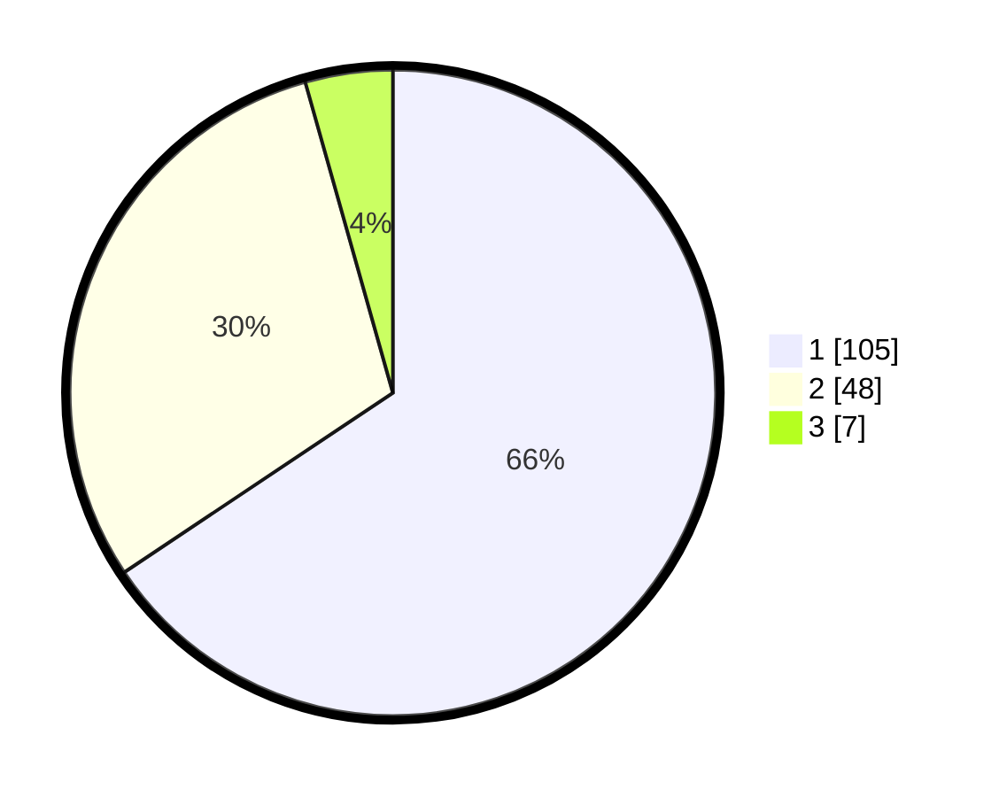

# Hasil

## Grafik

## Tabel

| No. | Nama Paslon    | Suara | Suara (raw) | Persentase |
|:--- |:-------------- | -----:| -----------:| ----------:|
| 1   | ANIES MUHAIMIN | 105   | [105][p-1]  | 65,63      |
| 2   | PRABOWO GIBRAN | 48    | [48][p-2]   | 30,00      |
| 3   | GANJAR MAHFUD  | 7     | [7][p-3]    | 4,38       |

[p-1]: https://github.com/gigit-pemilu/pemilu-2024/blob/main/pilpres/hitung-suara/sub/32-jawa-barat/sub/15-karawang/sub/26-karawang-timur/sub/1001-karawang-wetan/sub/060-tps/sub/paslon-1.txt
[p-2]: https://github.com/gigit-pemilu/pemilu-2024/blob/main/pilpres/hitung-suara/sub/32-jawa-barat/sub/15-karawang/sub/26-karawang-timur/sub/1001-karawang-wetan/sub/060-tps/sub/paslon-2.txt
[p-3]: https://github.com/gigit-pemilu/pemilu-2024/blob/main/pilpres/hitung-suara/sub/32-jawa-barat/sub/15-karawang/sub/26-karawang-timur/sub/1001-karawang-wetan/sub/060-tps/sub/paslon-3.txt

## Foto C Plano

https://sirekap-obj-formc.kpu.go.id/5f26/pemilu/ppwp/32/15/26/10/01/3215261001060-20240214-210051--4c76bac7-2aab-4bf4-9580-69253bea7d89.jpg

https://sirekap-obj-formc.kpu.go.id/5f26/pemilu/ppwp/32/15/26/10/01/3215261001060-20240214-210122--f679b194-d3f3-49eb-838e-6c42d78ff417.jpg

https://sirekap-obj-formc.kpu.go.id/5f26/pemilu/ppwp/32/15/26/10/01/3215261001060-20240214-222224--b4af53c6-850c-418a-955e-d716fa493957.jpg

## Metadata

| Key        | Value               |
| ---------- | ------------------- |
| Time Stamp | 2024-02-15 00:41:44 |

