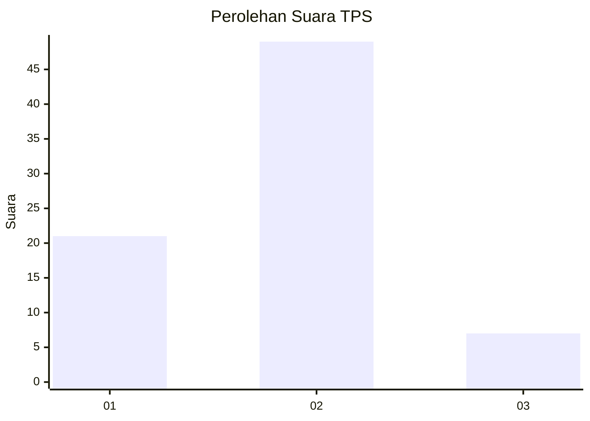
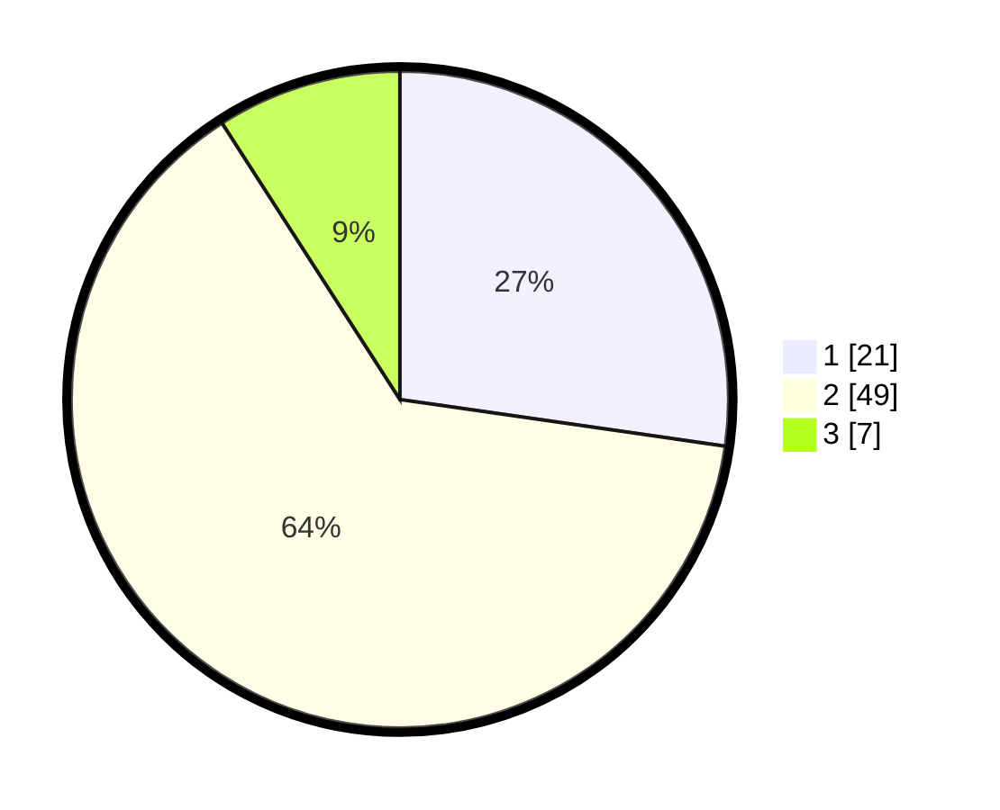

# Hasil

## Grafik

## Tabel

| No. | Nama Paslon    | Suara | Suara (raw) | Persentase |
|:--- |:-------------- | -----:| -----------:| ----------:|
| 1   | ANIES MUHAIMIN | 21    | [21][p-1]   | 27,27      |
| 2   | PRABOWO GIBRAN | 49    | [49][p-2]   | 63,64      |
| 3   | GANJAR MAHFUD  | 7     | [7][p-3]    | 9,09       |

[p-1]: https://github.com/gigit-pemilu/pemilu-2024-32-jawa-barat/blob/main/pilpres/hitung-suara/sub/32-jawa-barat/sub/15-karawang/sub/26-karawang-timur/sub/1001-karawang-wetan/sub/092-tps/sub/paslon-1.txt
[p-2]: https://github.com/gigit-pemilu/pemilu-2024-32-jawa-barat/blob/main/pilpres/hitung-suara/sub/32-jawa-barat/sub/15-karawang/sub/26-karawang-timur/sub/1001-karawang-wetan/sub/092-tps/sub/paslon-2.txt
[p-3]: https://github.com/gigit-pemilu/pemilu-2024-32-jawa-barat/blob/main/pilpres/hitung-suara/sub/32-jawa-barat/sub/15-karawang/sub/26-karawang-timur/sub/1001-karawang-wetan/sub/092-tps/sub/paslon-3.txt

## Foto C Plano

https://sirekap-obj-formc.kpu.go.id/18c0/pemilu/ppwp/32/15/26/10/01/3215261001092-20240215-131808--a218dbb0-b669-4cf9-bf10-228916f51df7.jpg

https://sirekap-obj-formc.kpu.go.id/18c0/pemilu/ppwp/32/15/26/10/01/3215261001092-20240221-153852--8a331e3b-6ab9-4590-b82f-10bf15fdd87a.jpg

https://sirekap-obj-formc.kpu.go.id/18c0/pemilu/ppwp/32/15/26/10/01/3215261001092-20240221-153754--5a354152-124a-41c3-8393-c018d3167e23.jpg

## Metadata

| Key        | Value               |
| ---------- | ------------------- |
| Time Stamp | 2024-02-21 16:00:00 |

