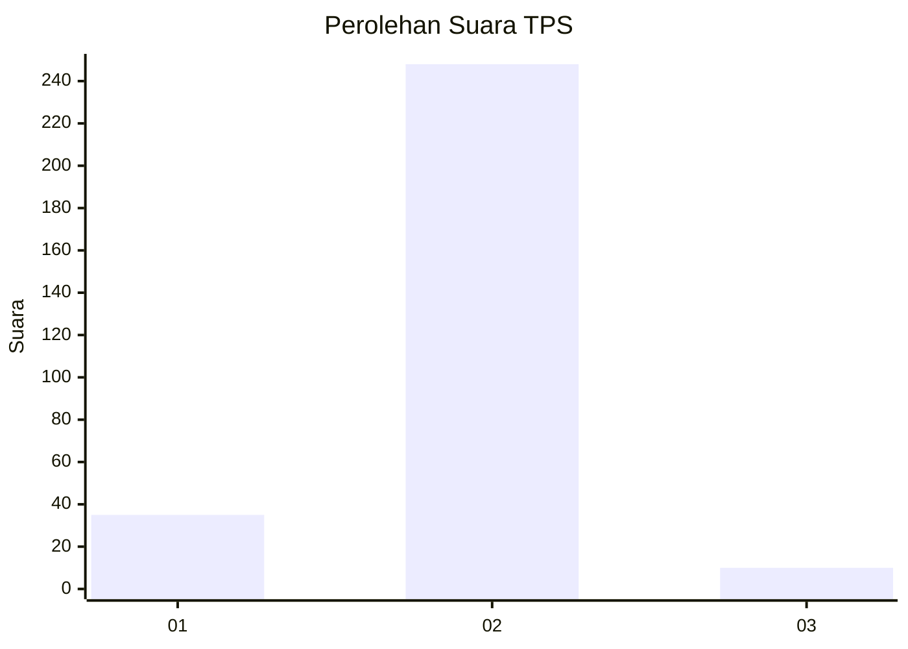
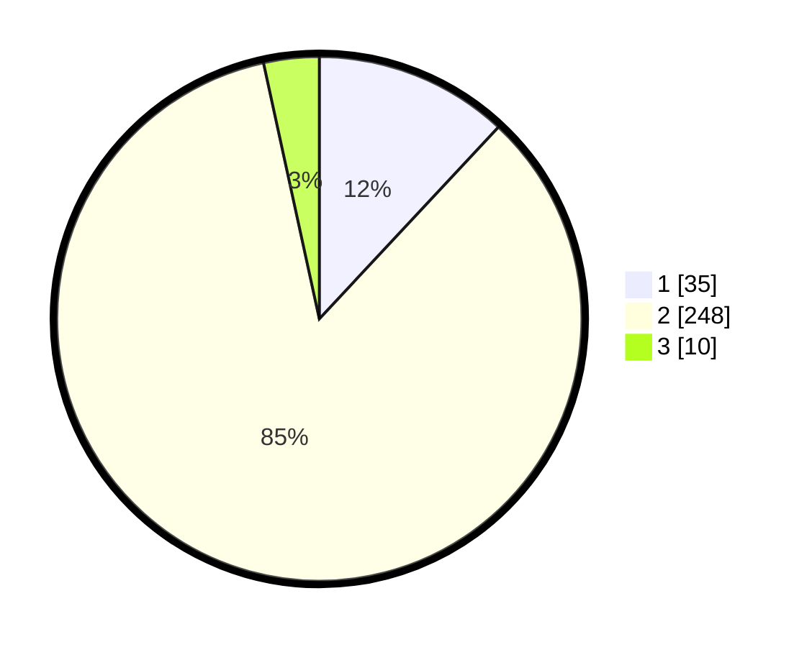

# Hasil

## Grafik

## Tabel

| No. | Nama Paslon    | Suara | Suara (raw) | Persentase |
|:--- |:-------------- | -----:| -----------:| ----------:|
| 1   | ANIES MUHAIMIN | 35    | [35][p-1]   | 11,95      |
| 2   | PRABOWO GIBRAN | 248   | [248][p-2]  | 84,64      |
| 3   | GANJAR MAHFUD  | 10    | [10][p-3]   | 3,41       |

[p-1]: https://github.com/gigit-pemilu/pemilu-2024/blob/main/pilpres/hitung-suara/sub/32-jawa-barat/sub/15-karawang/sub/26-karawang-timur/sub/1003-palumbonsari/sub/021-tps/sub/paslon-1.txt
[p-2]: https://github.com/gigit-pemilu/pemilu-2024/blob/main/pilpres/hitung-suara/sub/32-jawa-barat/sub/15-karawang/sub/26-karawang-timur/sub/1003-palumbonsari/sub/021-tps/sub/paslon-2.txt
[p-3]: https://github.com/gigit-pemilu/pemilu-2024/blob/main/pilpres/hitung-suara/sub/32-jawa-barat/sub/15-karawang/sub/26-karawang-timur/sub/1003-palumbonsari/sub/021-tps/sub/paslon-3.txt

## Foto C Plano

https://sirekap-obj-formc.kpu.go.id/716b/pemilu/ppwp/32/15/26/10/03/3215261003021-20240220-042258--b0c70f16-1dfb-4aa4-9bfb-196786a3bad1.jpg

https://sirekap-obj-formc.kpu.go.id/716b/pemilu/ppwp/32/15/26/10/03/3215261003021-20240220-042347--ebea43af-076d-47fa-a0f5-e3f4679beaf0.jpg

https://sirekap-obj-formc.kpu.go.id/716b/pemilu/ppwp/32/15/26/10/03/3215261003021-20240220-042416--63641512-382a-42bc-9db9-731262e9abbb.jpg

## Metadata

| Key        | Value               |
| ---------- | ------------------- |
| Time Stamp | 2024-02-20 16:00:00 |

