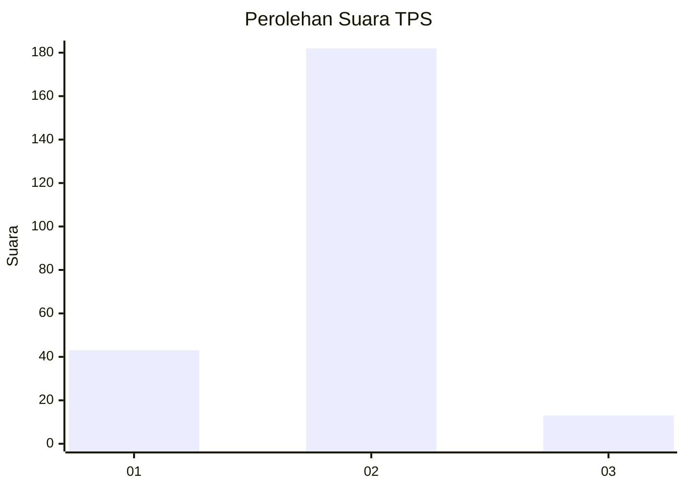
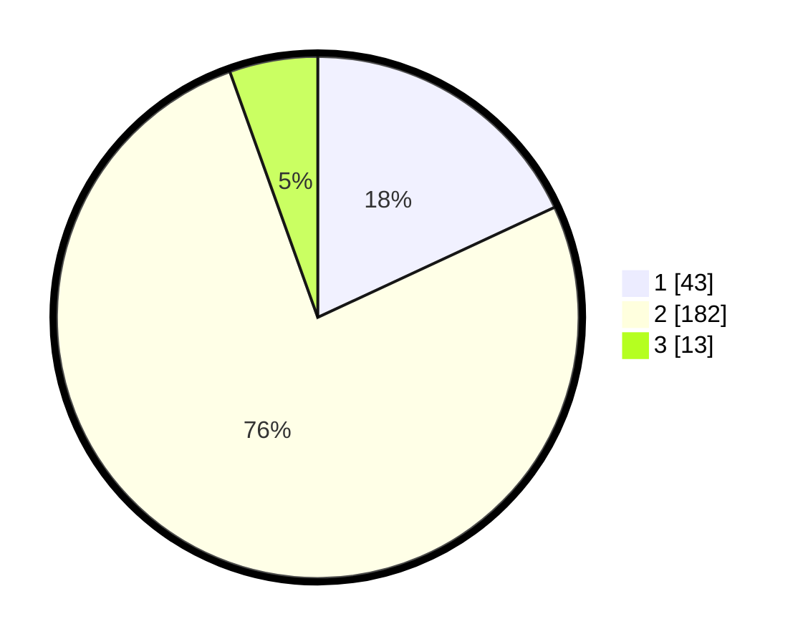

# Hasil

## Grafik

## Tabel

| No. | Nama Paslon    | Suara | Suara (raw) | Persentase |
|:--- |:-------------- | -----:| -----------:| ----------:|
| 1   | ANIES MUHAIMIN | 43    | [43][p-1]   | 18,07      |
| 2   | PRABOWO GIBRAN | 182   | [182][p-2]  | 76,47      |
| 3   | GANJAR MAHFUD  | 13    | [13][p-3]   | 5,46       |

[p-1]: https://github.com/gigit-pemilu/pemilu-2024/blob/main/pilpres/hitung-suara/sub/32-jawa-barat/sub/15-karawang/sub/27-telukjambe-barat/sub/2001-margakaya/sub/006-tps/sub/paslon-1.txt
[p-2]: https://github.com/gigit-pemilu/pemilu-2024/blob/main/pilpres/hitung-suara/sub/32-jawa-barat/sub/15-karawang/sub/27-telukjambe-barat/sub/2001-margakaya/sub/006-tps/sub/paslon-2.txt
[p-3]: https://github.com/gigit-pemilu/pemilu-2024/blob/main/pilpres/hitung-suara/sub/32-jawa-barat/sub/15-karawang/sub/27-telukjambe-barat/sub/2001-margakaya/sub/006-tps/sub/paslon-3.txt

## Foto C Plano

https://sirekap-obj-formc.kpu.go.id/3189/pemilu/ppwp/32/15/27/20/01/3215272001006-20240215-032342--2f834e40-697b-476b-98d0-2ef68773c645.jpg

https://sirekap-obj-formc.kpu.go.id/3189/pemilu/ppwp/32/15/27/20/01/3215272001006-20240215-032112--54e73fe2-4780-4177-8131-051998a8e0ab.jpg

https://sirekap-obj-formc.kpu.go.id/3189/pemilu/ppwp/32/15/27/20/01/3215272001006-20240215-032610--97ee9b49-a56b-4278-b62e-9cf8cd7bee10.jpg

## Metadata

| Key        | Value               |
| ---------- | ------------------- |
| Time Stamp | 2024-02-16 16:25:10 |

