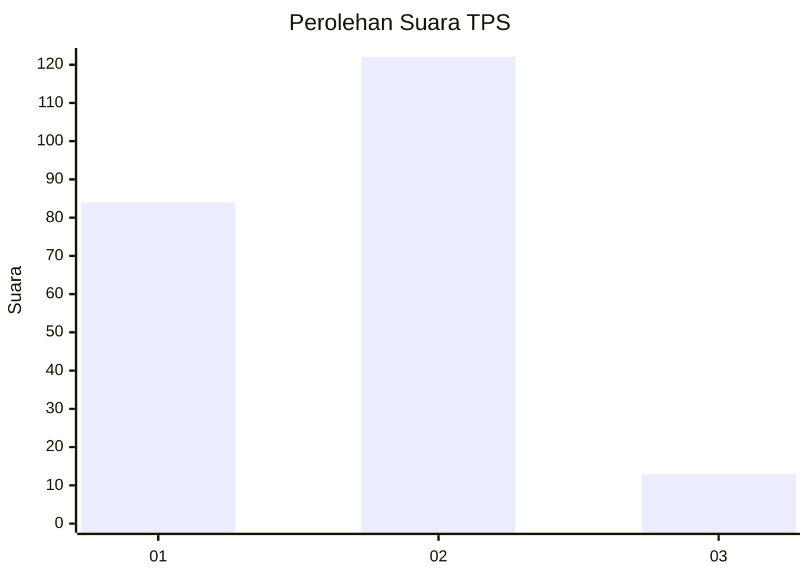
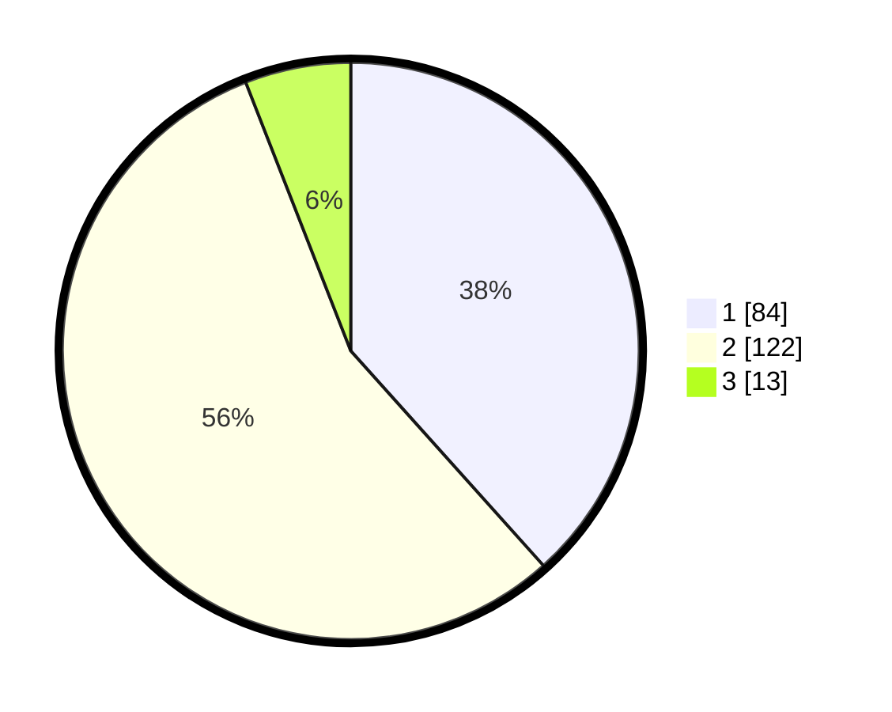

# Hasil

## Grafik

## Tabel

| No. | Nama Paslon    | Suara | Suara (raw) | Persentase |
|:--- |:-------------- | -----:| -----------:| ----------:|
| 1   | ANIES MUHAIMIN | 84    | [84][p-1]   | 38,36      |
| 2   | PRABOWO GIBRAN | 122   | [122][p-2]  | 55,71      |
| 3   | GANJAR MAHFUD  | 13    | [13][p-3]   | 5,94       |

[p-1]: https://github.com/gigit-pemilu/pemilu-2024-32-jawa-barat/blob/main/pilpres/hitung-suara/sub/32-jawa-barat/sub/15-karawang/sub/28-tegalwaru/sub/2001-cigunungsari/sub/002-tps/sub/paslon-1.txt
[p-2]: https://github.com/gigit-pemilu/pemilu-2024-32-jawa-barat/blob/main/pilpres/hitung-suara/sub/32-jawa-barat/sub/15-karawang/sub/28-tegalwaru/sub/2001-cigunungsari/sub/002-tps/sub/paslon-2.txt
[p-3]: https://github.com/gigit-pemilu/pemilu-2024-32-jawa-barat/blob/main/pilpres/hitung-suara/sub/32-jawa-barat/sub/15-karawang/sub/28-tegalwaru/sub/2001-cigunungsari/sub/002-tps/sub/paslon-3.txt

## Foto C Plano

https://sirekap-obj-formc.kpu.go.id/9632/pemilu/ppwp/32/15/28/20/01/3215282001002-20240214-210355--ff3ac962-1a3e-4548-972b-33772efed115.jpg

https://sirekap-obj-formc.kpu.go.id/9632/pemilu/ppwp/32/15/28/20/01/3215282001002-20240214-210240--e9649518-9a7b-4b4b-8b11-584a3485a635.jpg

https://sirekap-obj-formc.kpu.go.id/9632/pemilu/ppwp/32/15/28/20/01/3215282001002-20240214-210318--430ad4d1-e55e-4812-8d7e-f3eb439b87f2.jpg

## Metadata

| Key        | Value               |
| ---------- | ------------------- |
| Time Stamp | 2024-02-16 16:25:10 |

