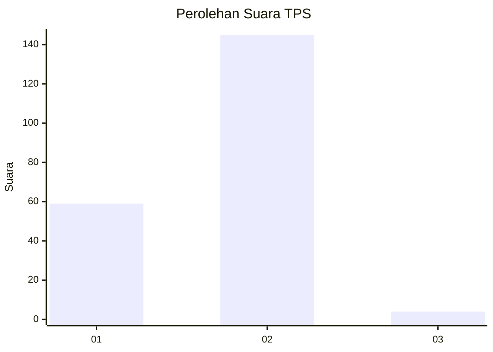
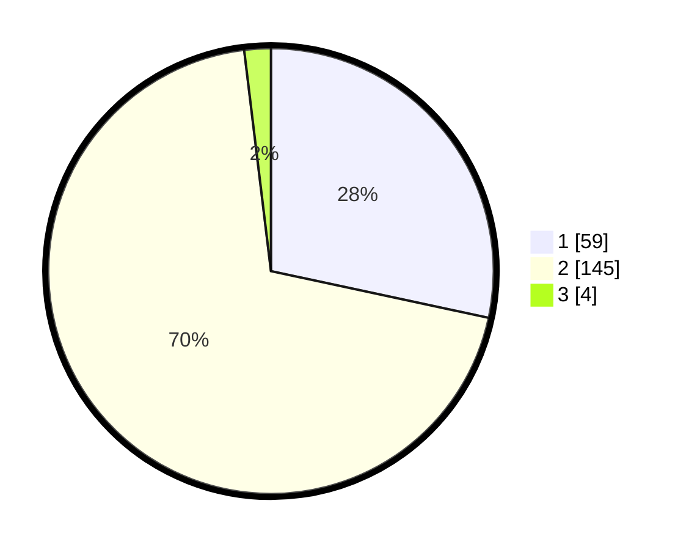

# Hasil

## Grafik

## Tabel

| No. | Nama Paslon    | Suara | Suara (raw) | Persentase |
|:--- |:-------------- | -----:| -----------:| ----------:|
| 1   | ANIES MUHAIMIN | 59    | [59][p-1]   | 28,37      |
| 2   | PRABOWO GIBRAN | 145   | [145][p-2]  | 69,71      |
| 3   | GANJAR MAHFUD  | 4     | [4][p-3]    | 1,92       |

[p-1]: https://github.com/gigit-pemilu/pemilu-2024/blob/main/pilpres/hitung-suara/sub/32-jawa-barat/sub/15-karawang/sub/28-tegalwaru/sub/2001-cigunungsari/sub/007-tps/sub/paslon-1.txt
[p-2]: https://github.com/gigit-pemilu/pemilu-2024/blob/main/pilpres/hitung-suara/sub/32-jawa-barat/sub/15-karawang/sub/28-tegalwaru/sub/2001-cigunungsari/sub/007-tps/sub/paslon-2.txt
[p-3]: https://github.com/gigit-pemilu/pemilu-2024/blob/main/pilpres/hitung-suara/sub/32-jawa-barat/sub/15-karawang/sub/28-tegalwaru/sub/2001-cigunungsari/sub/007-tps/sub/paslon-3.txt

## Foto C Plano

https://sirekap-obj-formc.kpu.go.id/8763/pemilu/ppwp/32/15/28/20/01/3215282001007-20240215-135548--977dfbb1-05a4-415d-ac7e-0e67612639d2.jpg

https://sirekap-obj-formc.kpu.go.id/8763/pemilu/ppwp/32/15/28/20/01/3215282001007-20240215-135608--f47bcf80-4748-41bb-9c53-17b9a9455dca.jpg

https://sirekap-obj-formc.kpu.go.id/8763/pemilu/ppwp/32/15/28/20/01/3215282001007-20240215-135612--41c190aa-3364-414a-b0b3-7e7dd3ead848.jpg

## Metadata

| Key        | Value               |
| ---------- | ------------------- |
| Time Stamp | 2024-02-16 13:30:32 |

